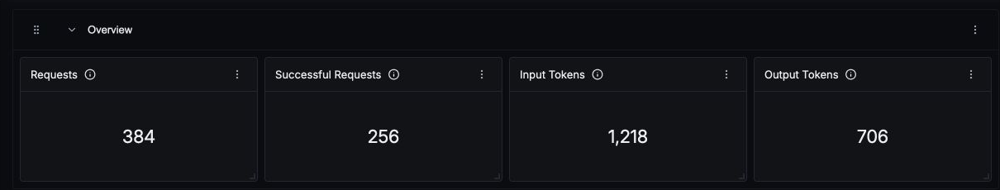
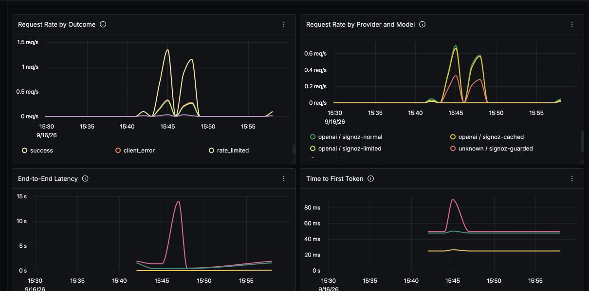
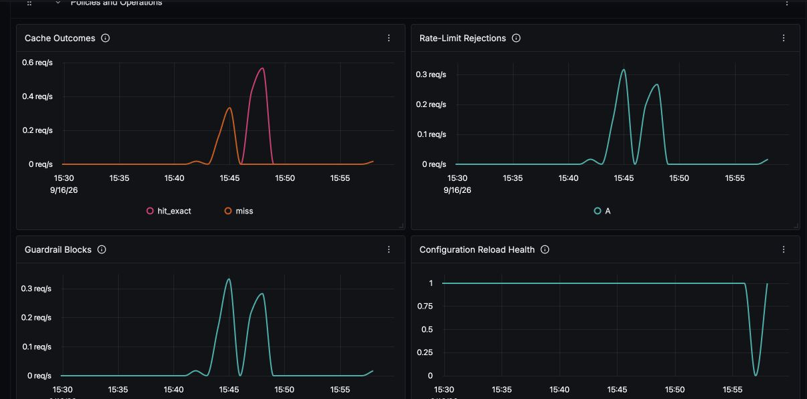
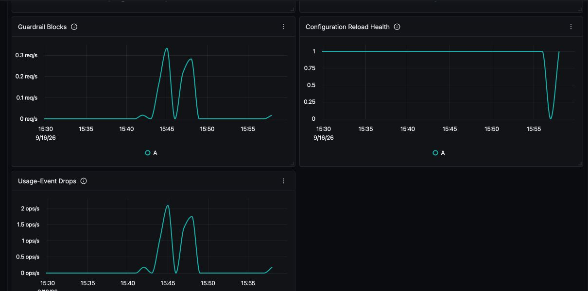

# AISIX AI Gateway Dashboard - Prometheus

This dashboard provides an operational view of [AISIX AI Gateway](https://github.com/api7/aisix) using the Prometheus metrics exposed by the open-source gateway. It covers caller-visible traffic outcomes, model and provider distribution, token usage, end-to-end latency, time to first token, cache behavior, policy rejections, configuration reload health, and usage-event queue drops.

The dashboard was validated with AISIX 1.2.0 and a self-hosted SigNoz deployment created with Foundry. It uses only SigNoz Query Builder queries.

## Metrics ingestion

Enable the AISIX Prometheus endpoint in `config.yaml`:

```yaml
observability:
  metrics:
    prometheus:
      enabled: true
      path: /metrics
      addr: 0.0.0.0:9090
```

The metrics listener is unauthenticated by design. Keep it on a private network and allow access only from your telemetry collector.

Add a Prometheus receiver to the OpenTelemetry Collector used by SigNoz. Replace `aisix:9090` with the address that the collector can use to reach the gateway:

```yaml
receivers:
  prometheus:
    config:
      scrape_configs:
        - job_name: aisix
          scrape_interval: 15s
          static_configs:
            - targets: [aisix:9090]
              labels:
                environment: production

service:
  pipelines:
    metrics:
      receivers: [prometheus]
      processors: [batch]
      exporters: [signozclickhousemetrics]
```

Merge this fragment into the existing collector configuration instead of replacing unrelated receivers or pipelines. The exporter name above is used by the self-hosted SigNoz collector; keep the exporter configured for your own deployment.

Generate at least one request through AISIX after starting the collector. Traffic-dependent metric families are registered on first observation.

## Import

Import [`aisix-ai-gateway-prometheus-v1.json`](aisix-ai-gateway-prometheus-v1.json) from the SigNoz Dashboards page. Select the `environment` value that matches the label added by the collector.

## Variables

- `environment`: deployment environment added by the Prometheus scrape configuration. It is multi-select and supports an all-environments view.

## Dashboard panels

### Overview

- **Requests** and **Successful Requests** use `aisix_llm_requests_total` to show caller-visible model requests and successful outcomes.
- **Input Tokens** and **Output Tokens** use the corresponding `aisix_llm_*_tokens_total` counters reported from upstream model responses.



### Traffic and performance

- **Request Rate by Outcome** separates success, client errors, rate limiting, and upstream errors.
- **Request Rate by Provider and Model** shows the configured traffic distribution using bounded provider and model labels.
- **End-to-End Latency** shows p50, p95, and p99 from `aisix_request_e2e_latency_seconds`.
- **Time to First Token** shows p50, p95, and p99 for streaming requests. No data is expected when there is no streaming traffic.



### Policies and operations

- **Cache Outcomes** shows semantic-cache results. No data is expected when the cache is disabled.
- **Rate-Limit Rejections** and **Guardrail Blocks** show policy enforcement rates.
- **Configuration Reload Health** reports whether the most recent configuration reload succeeded.
- **Usage-Event Drops** shows events that could not enter the delivery queue because the sink was disabled or the queue was full or closed. It does not count exporter failures after queue acceptance.





## References

- [AISIX AI Gateway repository](https://github.com/api7/aisix)
- [AISIX metrics and usage events](https://docs.api7.ai/ai-gateway/observability/metrics-and-usage-events)
- [AISIX metric labels and variables](https://docs.api7.ai/ai-gateway/reference/metric-labels)
- [Install SigNoz with Docker](https://signoz.io/docs/install/docker/)
- [SigNoz Query Builder](https://signoz.io/docs/userguide/query-builder/)
