# Antigravity CLI Dashboard

## Details

This dashboard offers a clear view into Antigravity CLI (`agy`) usage and spend. It covers weekly Gemini quota burn-down, tool activity, loop invocations, model mix, and turn outcomes. Antigravity has no native OpenTelemetry export, so every panel is fed by a hook-based exporter registered in its own hooks system.

To start sending Antigravity CLI telemetry to SigNoz, follow the [Antigravity CLI monitoring guide](https://signoz.io/docs/antigravity-cli-monitoring/).

## Dashboard panels

### Sections

### Gemini Quota Remaining

Fraction of the weekly Gemini allowance still available, sampled at the end of every turn. The slope is the burn rate, and the vertical jump back to full is the weekly window rolling over. Quota is the spend signal on this dashboard rather than tokens: Antigravity is flat-rate and exposes per-token counts only to scripted `--output-format stream-json` runs, never to an interactive session, so quota consumption is the closest available proxy for token cost.

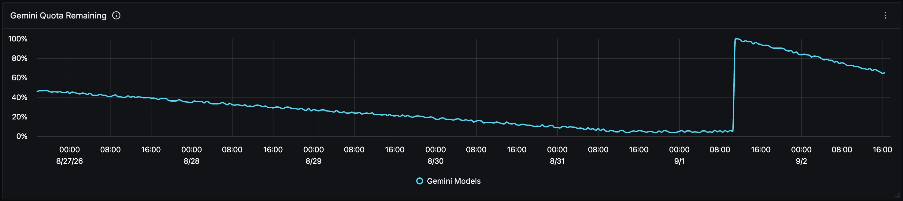

### Current Gemini Quota

The latest remaining fraction as a single figure, for when the curve above is too busy to read off. Scoped to the `gemini-weekly` bucket, which meters Gemini models only. Claude Sonnet, Claude Opus and GPT-OSS are metered in a separate `3p-weekly` bucket and will not show up here, so a Gemini bucket sitting near full does not mean nothing has been spent.

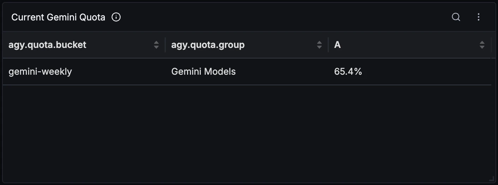

### Time to Gemini Quota Reset

How long until the weekly window rolls over. Read it next to the burn-down curve rather than alone: twenty percent remaining is comfortable with a day to go and a problem with six.

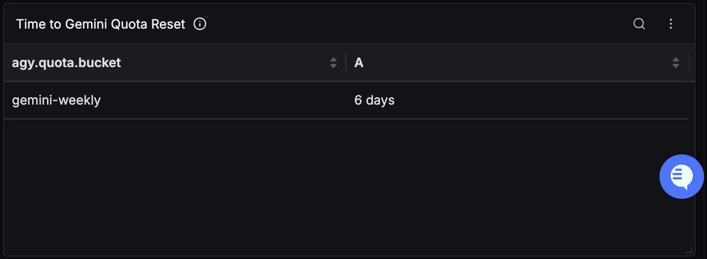

### Tool Calls Over Time

Tool executions per interval, split by tool. Sourced from `PostToolUse` hook spans only, which is why the filter is there: anyone also running the optional scripted wrapper alongside the hooks doubles every count, because the wrapper emits its own span for the same tool call in a different trace.

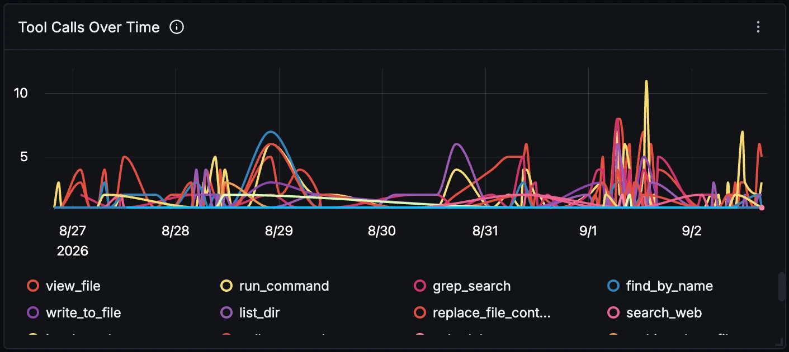

### Top Tools

Which tools the agent actually reaches for, and how many distinct conversations each one turns up in. The second column is the interesting one: a tool with many calls spread over few conversations is one session hammering it rather than a habit. There is no latency column because hook spans carry no duration at all, so frequency is the only thing on offer.

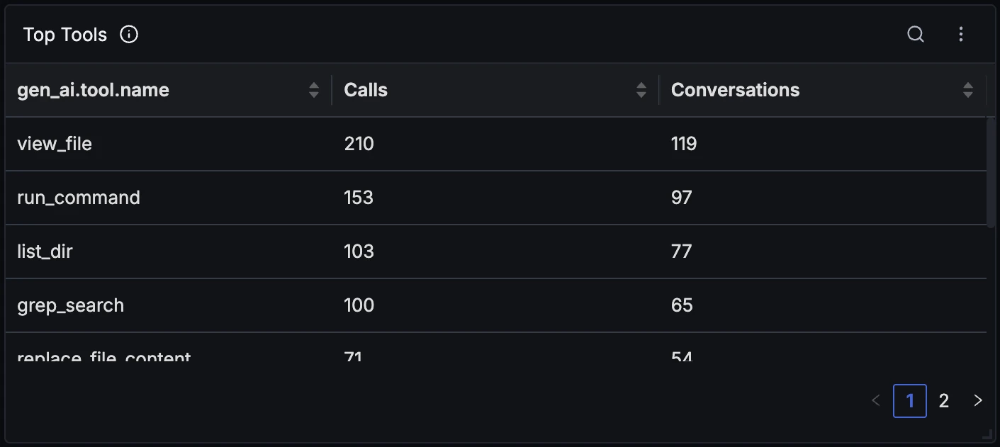

### Agent Loop Invocations

`PostInvocation` fires once per pass of the agent loop, not once per prompt, so a single turn commonly produces six or more. Compare it against Turns Completed Over Time to read the cost of a turn: a sustained climb here while the turn count stays flat is the runaway-loop signal.

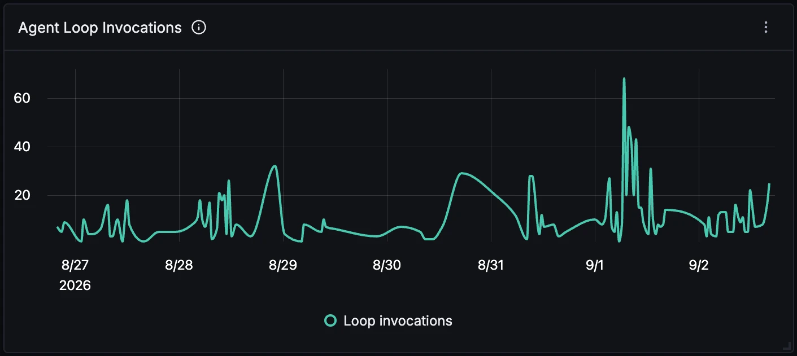

### Requests by Model

Share of model requests per model, counted from loop invocations rather than turns, since one turn issues several requests. Note that `gen_ai.request.model` reports what Antigravity actually ran, not what was asked for: request `gemini-3.1-pro-high` and it surfaces here under the internal id `gemini-pro-agent`.

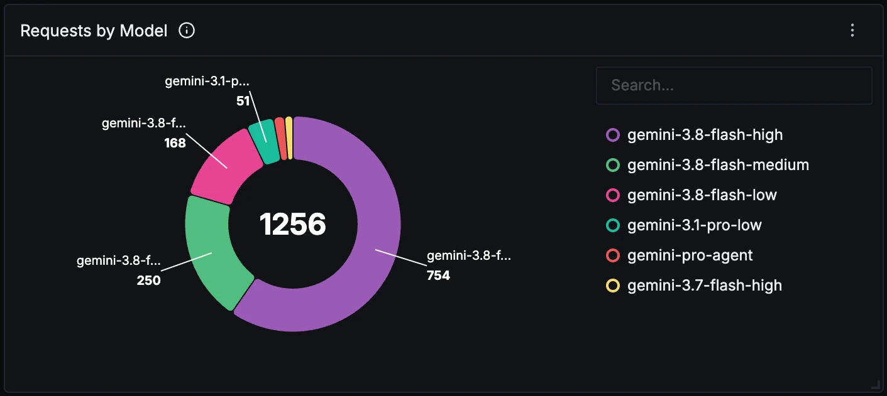

### Conversations

Distinct conversation ids across every hook span in the window. Read it next to Tool Calls Over Time to tell a lot of short one-shot questions apart from a few long working sessions.

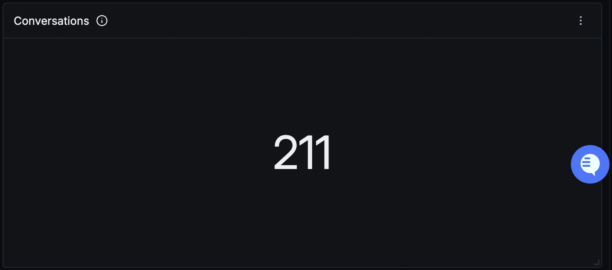

### Why Turns Ended

Distribution of `agy.termination_reason` on `Stop` spans, and the closest thing to a failure signal this agent gives. There is deliberately no error-rate panel next to it: Antigravity reports no error for a failed tool, so `run_command` exiting non-zero still records an empty `error` and `status: SUCCESS`, and an error-rate panel would read zero and imply health that is not there. Watch the `ERROR` slice here instead, along with `MAX_INVOCATIONS` and `MAX_TOKEN_BUDGET_EXCEEDED`.

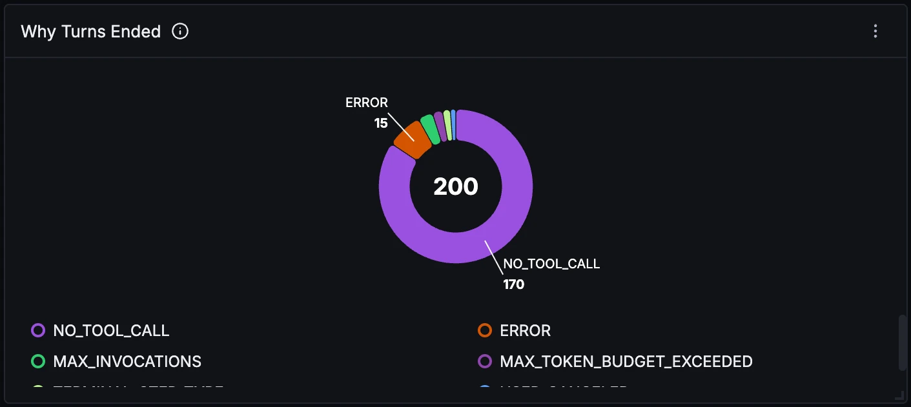

### Turns Completed Over Time

One `Stop` span per completed turn, broken out by model. Flat here while Agent Loop Invocations spikes means turns are getting more expensive rather than more numerous, which is usually a prompt or context problem rather than more work arriving.

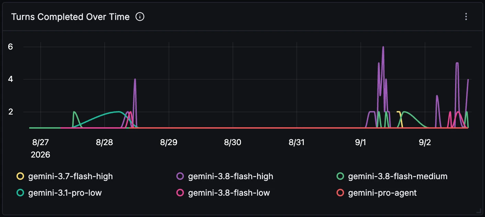

### Recent Turn Endings

The most recent turns with their termination reason, model and conversation id. The conversation id is the pivot point: take it into the trace explorer to pull up every tool call and loop invocation that led to that ending.

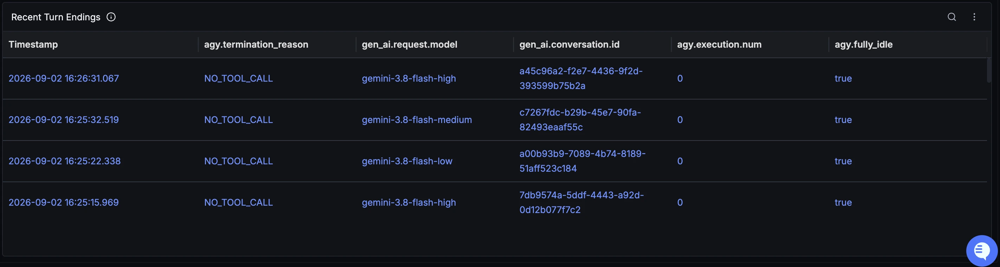
