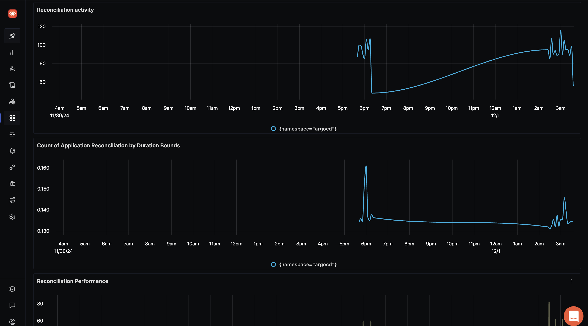
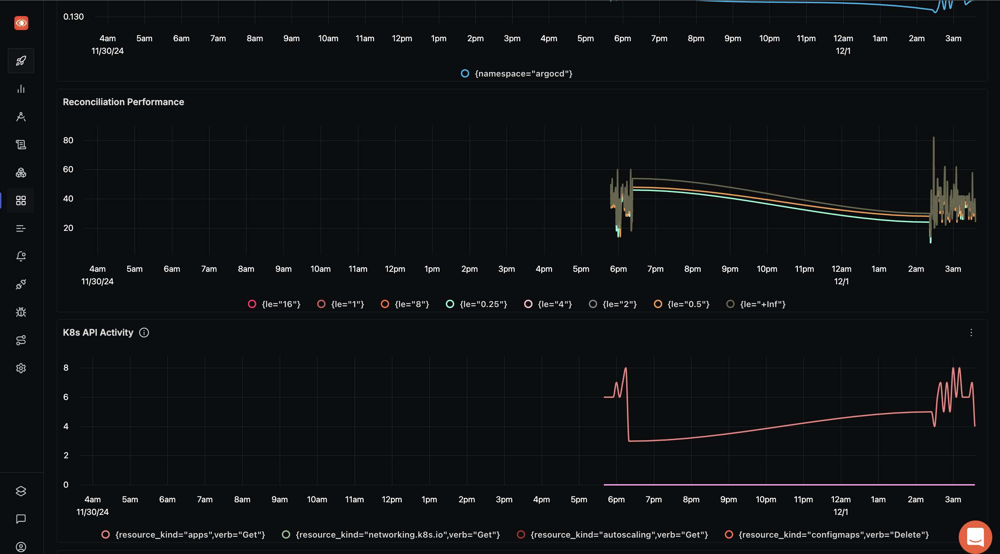
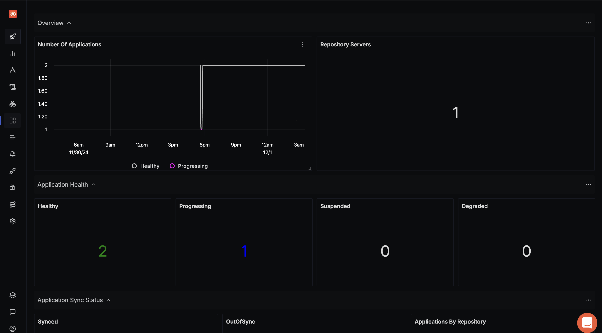

# AWS SQS Dashboard - Prometheus

## Metrics Ingestion

### Argocd Dashboard
Argo CD exposes different sets of Prometheus metrics per server. The metrics are available at `/metrics` endpoint.
1. Metrics about applications. Scraped at the argocd-metrics:8082/metrics endpoint.
2. Metrics about API Server API request and response activity (request totals, response codes, etc...). Scraped at the argocd-server-metrics:8083/metrics endpoint.

3. Metrics about the Repo Server. Scraped at the argocd-repo-server:8084/metrics endpoint.


### Configure OpenTelemetry Collector

1. Add prometheus receiver to the `receivers:` section:

```yaml
  prometheus:
    config:
      global:
        scrape_interval: 60s
      scrape_configs:
        - job_name: argocd-metrics
          metrics_path: /metrics
          scheme: http
          static_configs:
            - targets:
              - localhost:8082
              - localhost:8083
              - localhost:8084
```

2. Complete Configuration Example
Below is a complete `otel-config.yaml` example:

```yaml
receivers:
  otlp:
    protocols:
      grpc:
        endpoint: 0.0.0.0:4317
      http:
        endpoint: 0.0.0.0:4318
  hostmetrics:
    collection_interval: 60s
    scrapers:
      cpu: {}
      disk: {}
      load: {}
      filesystem: {}
      memory: {}
      network: {}
      paging: {}
      process:
        mute_process_name_error: true
        mute_process_exe_error: true
        mute_process_io_error: true
      processes: {}
  prometheus:
    config:
      global:
        scrape_interval: 60s
      scrape_configs:
        - job_name: otel-collector-binary
          static_configs:
            - targets:
              - localhost:8888
        - job_name: argocd-metrics
          metrics_path: /metrics
          scheme: http
          static_configs:
            - targets:
              - localhost:8082
              - localhost:8083
              - localhost:8084

processors:
  batch:
    send_batch_size: 1000
    timeout: 10s
  # Ref: https://github.com/open-telemetry/opentelemetry-collector-contrib/blob/main/processor/resourcedetectionprocessor/README.md
  resourcedetection:
    detectors: [env, system] # Before system detector, include ec2 for AWS, gcp for GCP and azure for Azure.
    # Using OTEL_RESOURCE_ATTRIBUTES envvar, env detector adds custom labels.
    timeout: 2s
    system:
      hostname_sources: [os] # alternatively, use [dns,os] for setting FQDN as host.name and os as fallback
  resource/env:
    attributes:
    - key: deployment.environment
      value: stagging
      action: upsert


extensions:
  health_check: {}
  zpages: {}

exporters:
  otlp:
    endpoint: "ingest.{region}.signoz.cloud:443"
    tls:
      insecure: false
    headers:
      "signoz-access-token": "your-ingestion-key"
  logging:
    verbosity: normal

service:
  telemetry:
    metrics:
      address: 0.0.0.0:8888
  extensions: [health_check, zpages]
  pipelines:
    metrics:
      receivers: [otlp]
      processors: [resource/env, batch]
      exporters: [otlp]
    metrics/internal:
      receivers: [prometheus, hostmetrics]
      processors: [resource/env, resourcedetection, batch]
      exporters: [otlp]
    traces:
      receivers: [otlp]
      processors: [resource/env, batch]
      exporters: [otlp]
    logs:
      receivers: [otlp]
      processors: [resource/env, batch]
      exporters: [otlp]
```

## Variables

- `{{namespace}}`: Namespace of the application
- `{{health.status}}`: Health status of the application
- `{{repo}}`: Name of the repository

## Dashboard Panels






*Overview of the Argocd monitoring dashboard*
