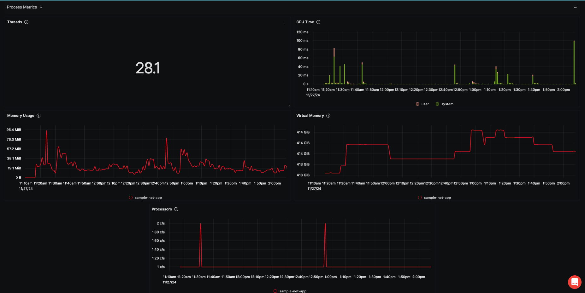

# ASP .NET Metrics Dashboard

> [!NOTE]
> The entire project includes the following packages to be able to send the telemetry data to SigNoz:
```bash
$ dotnet add package --prerelease OpenTelemetry.Instrumentation.AspNet 
$ dotnet add package --prerelease OpenTelemetry.Instrumentation.Process
$ dotnet add package OpenTelemetry
$ dotnet add package OpenTelemetry.Exporter.OpenTelemetryProtocol 
$ dotnet add package OpenTelemetry.Extensions.Hosting
$ dotnet add package OpenTelemetry.Instrumentation.Runtime
$ dotnet add package OpenTelemetry.Instrumentation.AspNetCore 
$ dotnet add package OpenTelemetry.AutoInstrumentation
```

## Data Ingestion

### Receivers:
- The OTLP receiver listens for metrics on both gRPC (port 4317) and HTTP (port 4318).
- This allows the ASP.NET Core application to send metrics using either protocol.

```yaml
receivers:
  otlp:
    protocols:
      grpc:
        endpoint: 0.0.0.0:4317
      http:
        endpoint: 0.0.0.0:4318
```

### Exporters:
- Configure the OTLP exporter to send metrics to SigNoz using the gRPC protocol.
- Ensure that the SigNoz endpoint and access token are correctly configured.

```yaml
exporters:
  otlp:
    endpoint: "https://ingest.{your-region-code}.signoz.cloud:443" # replace {region} with your region if you are using signoz cloud, otherwise use localhost:4317 or wherever your collector is running
    headers:
      signoz-access-token: "{signoz-token}" # Obtain from https://{your-signoz-url}/settings/ingestion-settings (signoz-token is only required for signoz cloud)
    tls:
      insecure: false
```

### Pipelines:
- Receivers: To receive metrics and trace data.
- Processors: To batch the data.
- Exporters: To send collected data to SigNoz.

```yaml
service:
  telemetry:
    metrics:
      address: 0.0.0.0:8888

  pipelines:
    traces:
      receivers: [otlp]
      processors: [batch]
      exporters: [otlp]
    metrics:
      receivers: [otlp]
      processors: [batch]
      exporters: [otlp]
```

Here is the sample `otel-config.yaml`:

```yaml
receivers:
  otlp:
    protocols:
      grpc:
        endpoint: 0.0.0.0:4317
      http:
        endpoint: 0.0.0.0:4318

processors:
  batch:
    timeout: 10s
    send_batch_size: 1000

exporters:
  otlp:
    endpoint: "https://ingest.{your-region-code}.signoz.cloud:443" # replace {region} with your region if you are using signoz cloud, otherwise use localhost:4317 or wherever your collector is running
    headers:
      signoz-access-token: "{signoz-token}" # Obtain from https://{your-signoz-url}/settings/ingestion-settings (signoz-token is only required for signoz cloud)
    tls:
      insecure: false

service:
  telemetry:
    metrics:
      address: 0.0.0.0:8888

  pipelines:
    traces:
      receivers: [otlp]
      processors: [batch]
      exporters: [otlp]
    metrics:
      receivers: [otlp]
      processors: [batch]
      exporters: [otlp]

```

The below code snippet configures OpenTelemetry for an `ASP.NET` application to collect metrics and traces and export them to SigNoz.

Firstly, **OpenTelemetry Services** is registered to be used by the application. This sets up tracing and metrics collection for the app

```cs
var builder = WebApplication.CreateBuilder(args);
string environment = Environment.GetEnvironmentVariable("ASPNETCORE_ENVIRONMENT");
builder.Services.AddOpenTelemetry().ConfigureResource(resource =>
        resource.AddService(serviceName: "sample-net-app").AddAttributes(new Dictionary<string, object>{
            {"deployment.environment", environment}
        }))
...
```

In the above code block, the `ConfigureResource()` method plays a role in defining metadata including the service name that will be monitored. The **attributes** identify whether the service runs in **Staging** or **Production**. This is necessary to define an environment variable in the SigNoz Dashboard. 

##### Tracing Configuration

```cs
    .WithTracing(tracing => tracing
        .AddAspNetCoreInstrumentation()
        .AddOtlpExporter(ConfigureOtlpOptions))
```
This code block configures **tracing instrumentation** to collect telemetry for the application. The `AddAspNetCoreInstrumentation()` method automatically collects traces for **HTTP requests, responses, and exceptions**. The `AddOtlpExporter(ConfigureOtlpOptions)` configues an OTLP ([OpenTelemetry Protocol Exporter](https://opentelemetry.io/docs/specs/otel/protocol/exporter/)) exporter to send trace data to **SigNoz Cloud**.

##### Metrics Configuration
```cs
.WithMetrics(metric => metric
        .AddAspNetCoreInstrumentation()
        .AddProcessInstrumentation() // Add Process Instrumentation
        .AddOtlpExporter(ConfigureOtlpOptions));
```
This code block configures **metrics instrumentation** to collect telemetry for the application. The `AddAspNetCoreInstrumentation()` method automatically collects traces for **request latency, error rates, and request counts**. The `AddProcessInstrumentation()` collects process-level metrics, such as CPU usage, memory consumption, and thread counts. 
The `AddOtlpExporter(ConfigureOtlpOptions)` configues an OTLP ([OpenTelemetry Protocol Exporter](https://opentelemetry.io/docs/specs/otel/protocol/exporter/)) exporter to send trace data to **SigNoz Cloud**.

Below is the setup of **OTLP**
```cs
...
void ConfigureOtlpOptions(OtlpExporterOptions otlpOptions)
{
    //SigNoz Cloud Endpoint 
    otlpOptions.Endpoint = new Uri("http://localhost:4317");

    otlpOptions.Protocol = OtlpExportProtocol.Grpc;
}
...
```
The collected telemetry data will be sent to the `https://ingest.{your-region-code}.signoz.cloud:443`

## Dashboard panels

### Variables
- {{deployment_environment}}: Deployment Environment (Staging or Production)

### Sections
- **Application Performance**: Displays general performance metrics for the ASP .NET application.
    - CPU Usage - Displays current CPU usage of the application instance - `process_cpu_time`
    - Memory Usage - Shows memory consumption of the ASP .NET application process - `process_memory_usage`
    - Request Rate - Tracks the number of incoming requests per second - `http_server_request_duration_count`


- **Request and Response**: Provides insights into the behavior and performance of requests and responses.
    - Request Latency - Measures the time taken to serve requests - `signoz_latency_sum`
    - Error Rate - Tracks the number of error responses (HTTP 4xx/5xx) - `http_server_request_duration_count` WHERE `http_response_status_code >= 400`
    - Active Requests - Displays the number of active requests being processed - `http_server_active_requests`


- **Process Metric**: Provides panels based on process metrics
    - CPU Usage - Displays current CPU usage of the application instance - `process_cpu_time`
    - Memory Usage - Shows memory consumption of the ASP .NET application process - `process_memory_usage`
    - Threads - Process the threads count - `process_thread_count`
    - Virtual Memory - Displays the amount of committed virtual memory for this process - `process_memory_virtual`
    - Processors - Displays the number of processors (CPU cores) available to the current process - `process_cpu_count`



## More Information
- [ASP.NET Instrumentation for OpenTelemetry](https://github.com/open-telemetry/opentelemetry-dotnet-contrib/blob/Instrumentation.AspNet-1.9.0-beta.1/src/OpenTelemetry.Instrumentation.AspNet/README.md)
- [Process Instrumentation for OpenTelemetry .NET](https://github.com/open-telemetry/opentelemetry-dotnet-contrib/blob/Instrumentation.Process-0.5.0-beta.6/src/OpenTelemetry.Instrumentation.Process/README.md)
- [Manage Variables in SigNoz](https://signoz.io/docs/userguide/manage-variables/)
- [.NET OpenTelemetry Instrumentation](https://signoz.io/docs/instrumentation/opentelemetry-dotnet/)


