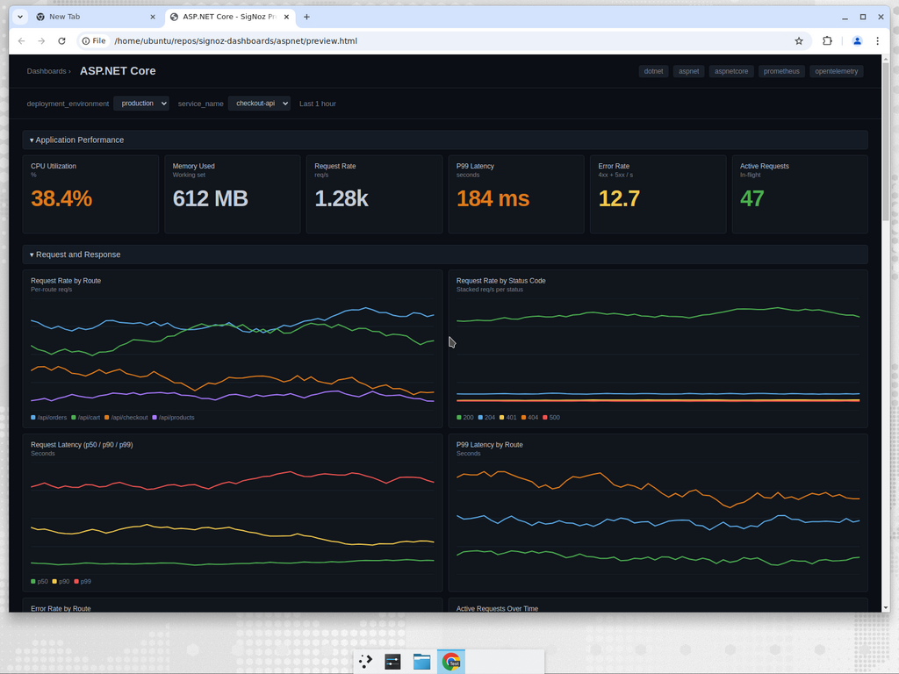

# ASP.NET Core Dashboard - Prometheus

Monitors ASP.NET Core applications using metrics from the [OpenTelemetry .NET automatic instrumentation](https://opentelemetry.io/docs/zero-code/net/instrumentations/#metrics-instrumentations). Covers HTTP server latency, Kestrel, GC and thread pool, and process metrics.

## Metrics Ingestion

Instrument the ASP.NET Core service with the [OpenTelemetry .NET auto-instrumentation](https://github.com/open-telemetry/opentelemetry-dotnet-instrumentation) and export metrics via Prometheus. Two common setups:

### Option A - OTLP directly to SigNoz

```bash
export OTEL_SERVICE_NAME=my-aspnet-app
export OTEL_RESOURCE_ATTRIBUTES="deployment.environment=production"
export OTEL_EXPORTER_OTLP_ENDPOINT=https://ingest.{region}.signoz.cloud:443
export OTEL_EXPORTER_OTLP_HEADERS="signoz-access-token=<your-ingestion-key>"
export OTEL_METRICS_EXPORTER=otlp
export OTEL_DOTNET_AUTO_METRICS_ADDITIONAL_SOURCES="System.Net.Http,Microsoft.AspNetCore.Hosting,Microsoft.AspNetCore.Server.Kestrel,Microsoft.AspNetCore.Routing,Microsoft.AspNetCore.Diagnostics,OpenTelemetry.Instrumentation.Runtime,OpenTelemetry.Instrumentation.Process"
```

### Option B - Prometheus scrape

Expose a Prometheus endpoint with the OpenTelemetry Prometheus exporter (port `9464` by default) and scrape it with the OpenTelemetry Collector:

```yaml
receivers:
  prometheus:
    config:
      global:
        scrape_interval: 15s
      scrape_configs:
        - job_name: aspnet
          static_configs:
            - targets: ["my-aspnet-app:9464"]
          metric_relabel_configs:
            - source_labels: [exported_service_name]
              target_label: service_name
            - source_labels: [exported_deployment_environment]
              target_label: deployment_environment

processors:
  batch:
    send_batch_size: 1000
    timeout: 10s

exporters:
  otlp:
    endpoint: "ingest.{region}.signoz.cloud:443"
    tls:
      insecure: false
    headers:
      "signoz-access-token": "<your-ingestion-key>"

service:
  pipelines:
    metrics/aspnet:
      receivers: [prometheus]
      processors: [batch]
      exporters: [otlp]
```

## Variables

- `{{deployment_environment}}`: Environment label (production, staging, etc.).
- `{{service_name}}`: ASP.NET service name from `OTEL_SERVICE_NAME` / `service.name`.

## Sections

### Application Performance
- CPU Utilization - `process_cpu_utilization_ratio`
- Memory Used - `process_memory_usage_bytes`
- Request Rate - `http_server_request_duration_seconds_count`
- P99 Latency - `http_server_request_duration_seconds_bucket`
- Error Rate (4xx/5xx) - `http_server_request_duration_seconds_count`
- Active Requests - `http_server_active_requests`

### Request and Response
- Request Rate by Route / Status Code
- Request Latency p50 / p90 / p99
- P99 Latency by Route
- Error Rate by Route
- Active Requests Over Time

### Kestrel
- Active Connections - `kestrel_active_connections`
- Queued Connections / Requests - `kestrel_queued_connections`, `kestrel_queued_requests`
- Connection Duration p99 - `kestrel_connection_duration_seconds_bucket`
- Rejected Connections - `kestrel_rejected_connections_total`

### .NET Runtime
- GC Heap Size by Generation - `process_runtime_dotnet_gc_heap_size_bytes`
- GC Collections / sec - `process_runtime_dotnet_gc_collections_count_total`
- Thread Pool Threads - `process_runtime_dotnet_thread_pool_threads_count`
- Exceptions / sec - `process_runtime_dotnet_exceptions_count_total`
- Monitor Lock Contention / sec - `process_runtime_dotnet_monitor_lock_contention_count_total`
- JIT Compilation Time / sec - `process_runtime_dotnet_jit_compilation_time_seconds_total`

### Process
- CPU Time by State - `process_cpu_time_seconds_total`
- Process Memory (working set + virtual) - `process_memory_usage_bytes`, `process_memory_virtual_bytes`
- Process Threads - `process_threads`
- Open Handles - `process_open_handles`

## Screenshots


