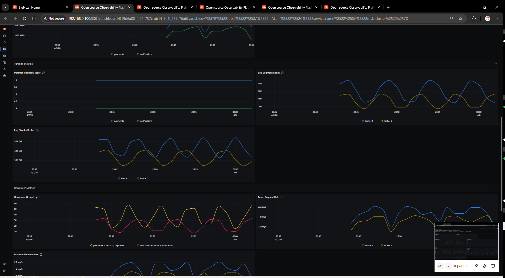
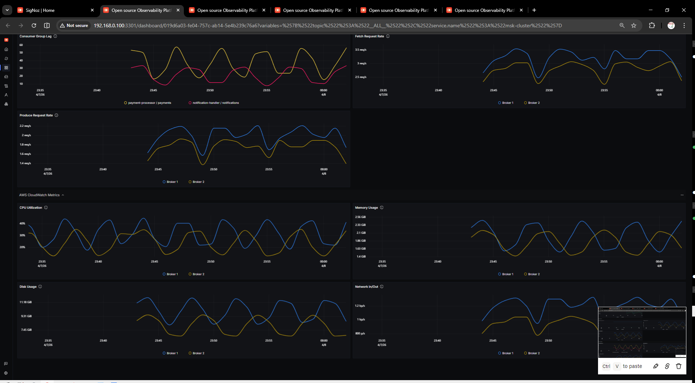

# AWS MSK Cluster Monitoring Dashboard - Prometheus

Comprehensive monitoring dashboard for Amazon Managed Streaming for Apache Kafka (MSK) clusters. Combines JMX Exporter metrics (via MSK Open Monitoring) with AWS CloudWatch metrics for complete cluster visibility.

## Metrics Ingestion

### Prerequisites

1. **Enable Open Monitoring** on your MSK cluster with Prometheus support
2. **Deploy Prometheus** to scrape metrics from MSK brokers
3. **Configure OTel Collector** to forward metrics to SigNoz

### Prometheus Scrape Configuration

Add the following to your Prometheus configuration to scrape MSK JMX metrics:

```yaml
scrape_configs:
  - job_name: 'msk-jmx'
    scrape_interval: 60s
    metrics_path: '/metrics'
    static_configs:
      - targets:
          - '<broker-1-endpoint>:11001'
          - '<broker-2-endpoint>:11001'
          - '<broker-3-endpoint>:11001'
    tls_config:
      insecure_skip_verify: true
    basic_auth:
      username: ''
      password: ''
```

### OTel Collector Configuration

```yaml
receivers:
  prometheus:
    config:
      scrape_configs:
        - job_name: 'msk-jmx'
          scrape_interval: 60s
          metrics_path: '/metrics'
          static_configs:
            - targets:
                - '<broker-1-endpoint>:11001'
                - '<broker-2-endpoint>:11001'
                - '<broker-3-endpoint>:11001'
          tls_config:
            insecure_skip_verify: true

processors:
  resourcedetection:
    detectors: [env, system]
  attributes:
    actions:
      - key: deployment.environment
        value: "${DEPLOYMENT_ENV}"
        action: upsert
      - key: service.name
        value: "aws-msk"
        action: upsert

exporters:
  otlphttp:
    endpoint: "https://<signoz-endpoint>"
    headers:
      "signoz-access-token": "<your-token>"

service:
  pipelines:
    metrics:
      receivers: [prometheus]
      processors: [resourcedetection, attributes]
      exporters: [otlphttp]
```

### MSK Ports Reference

| Port | Purpose |
|------|---------|
| 11001 | JMX Exporter (Kafka broker metrics) |
| 11002 | Node Exporter (OS-level metrics) |

## Variables

- **`$deployment.environment`**: Select deployment environment (production, staging, etc.)
- **`$cluster.name`**: Select MSK cluster name
- **`$broker.id`**: Select specific broker(s) to filter metrics
- **`$topic`**: Select topic name(s) for topic-level metrics
- **`$group`**: Select consumer group(s) for consumer lag metrics
- **`$service.name`**: Select service name for filtering

## Dashboard Panels

### Broker Metrics

| Panel | Metric | Description |
|-------|--------|-------------|
| Active Controller Count | `aws_Kafka_ActiveControllerCount_count` | Number of active controllers (should be 1) |
| Offline Partitions | `aws_Kafka_OfflinePartitionsCount_count` | Partitions with no leader |
| Under-Replicated Partitions | `aws_Kafka_UnderReplicatedPartitions_count` | Partitions below replication factor |
| Leader Count | `aws_Kafka_LeaderCount_count` | Leader partitions per broker |
| Broker CPU Usage | `aws_Kafka_CpuIdle_sum` | CPU utilization per broker |
| Broker Memory Usage | `aws_Kafka_MemoryUsed_sum` | Memory consumption per broker |
| Broker Disk Usage | `aws_Kafka_DiskUsage` | Disk space used per broker |
| Broker Disk Throughput | `aws_Kafka_LogFlushRateOneLogInterval_count` | Disk flush rate per broker |

### Topic Metrics

| Panel | Metric | Description |
|-------|--------|-------------|
| Messages In Per Second | `aws_Kafka_MessagesInPerSec_count` | Messages produced per topic/second |
| Messages Out Per Second | `aws_Kafka_BytesOutPerSec_count` | Messages consumed per topic/second |
| Bytes In Per Second | `aws_Kafka_BytesInPerSec_sum` | Data produced per topic/second |
| Bytes Out Per Second | `aws_Kafka_BytesOutPerSec_sum` | Data consumed per topic/second |
| Produce Failed Rate | `aws_Kafka_ProduceFailedPerSec_count` | Failed produce request rate |
| Fetch Failed Rate | `aws_Kafka_FetchFailedPerSec_count` | Failed fetch request rate |

### Partition Metrics

| Panel | Metric | Description |
|-------|--------|-------------|
| Under-Replicated Partitions (TS) | `aws_Kafka_UnderReplicatedPartitions_count` | Time series of under-replicated partitions |
| Offline Partitions (TS) | `aws_Kafka_OfflinePartitionsCount_count` | Time series of offline partitions |
| Partition Count | `aws_Kafka_PartitionCount` | Total partitions per topic |
| Partition ISR | `aws_Kafka_IsrExpandRate_count` | In-sync replica count per broker |
| Leader Election Rate | `aws_Kafka_LeaderElectionRate_count` | Leader elections per second |

### Consumer Metrics

| Panel | Metric | Description |
|-------|--------|-------------|
| Consumer Lag | `aws_Kafka_MaxOffsetLag_sum` | Consumer group lag per topic |
| Consumer Error Rate | `aws_Kafka_ConsumeFailedPerSec_count` | Consumer error rate per group |
| Max Offset Lag Per Topic | `aws_Kafka_MaxOffsetLag_count` | Maximum offset lag per topic |

### AWS CloudWatch Metrics

| Panel | Metric | Description |
|-------|--------|-------------|
| CPU Credit Usage | `aws_Kafka_CpuCreditUsage_sum` | CPU credits consumed per broker |
| CPU Credit Balance | `aws_Kafka_CpuCreditBalance_sum` | Remaining CPU credits per broker |
| Burst Balance | `aws_Kafka_BurstBalance_sum` | CPU burst balance percentage |
| Network I/O | `aws_Kafka_BytesInPerSec_sum` / `aws_Kafka_BytesOutPerSec_sum` | Network throughput per broker |

## Screenshots

### Broker Overview


### Topic & Partition Metrics



### Consumer & CloudWatch Metrics



## References

- [AWS MSK Documentation](https://docs.aws.amazon.com/msk/)
- [SigNoz AWS MSK Integration](https://signoz.io/docs/integrations/aws/msk/)
- [Apache Kafka JMX Metrics](https://kafka.apache.org/documentation/#monitoring)
- [GitHub Issue #6036](https://github.com/SigNoz/signoz/issues/6036)
