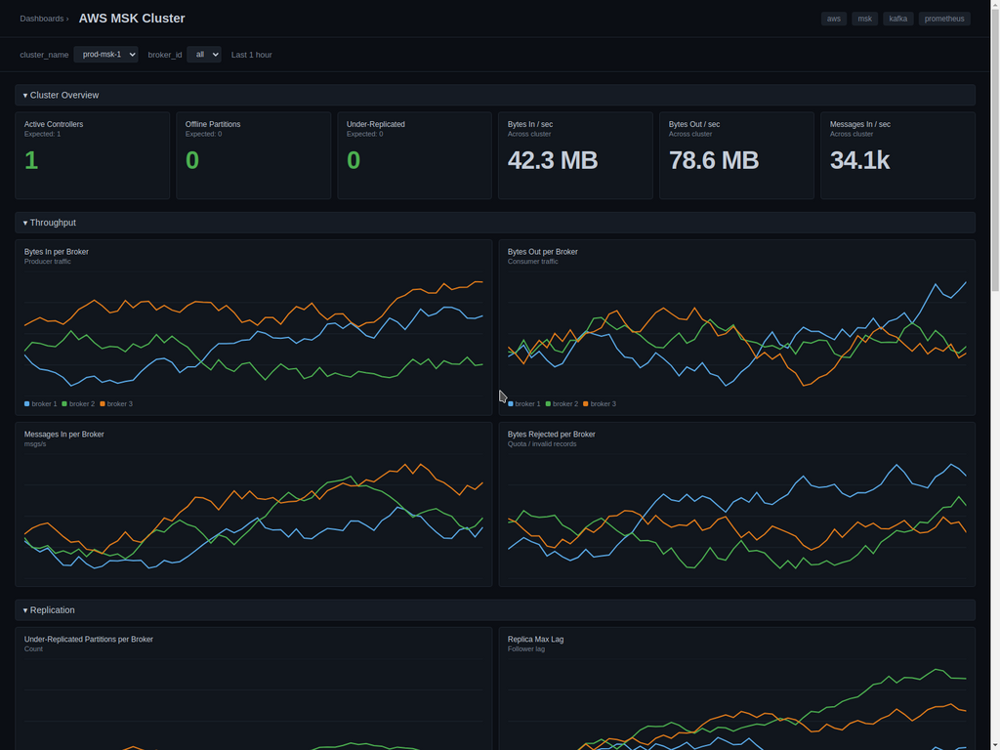

# AWS MSK Cluster Dashboard - Prometheus

Monitors an Amazon MSK (Managed Streaming for Apache Kafka) cluster using the [Open Monitoring with Prometheus](https://docs.aws.amazon.com/msk/latest/developerguide/open-monitoring.html) feature.

## Metrics Ingestion

Enable Open Monitoring on the MSK cluster — this exposes JMX Exporter on port `11001` and Node Exporter on port `11002` on every broker. Scrape both with the OpenTelemetry Collector's `prometheus` receiver and forward to SigNoz.

Discover brokers using AWS SD or a static list of broker endpoints.

### OpenTelemetry Collector configuration

```yaml
receivers:
  prometheus:
    config:
      global:
        scrape_interval: 30s
        external_labels:
          cluster_name: my-msk-cluster
      scrape_configs:
        - job_name: msk-jmx
          static_configs:
            - targets:
                - b-1.my-msk-cluster.abcd.c2.kafka.us-east-1.amazonaws.com:11001
                - b-2.my-msk-cluster.abcd.c2.kafka.us-east-1.amazonaws.com:11001
                - b-3.my-msk-cluster.abcd.c2.kafka.us-east-1.amazonaws.com:11001
          relabel_configs:
            - source_labels: [__address__]
              regex: "b-(\\d+)\\..*"
              target_label: broker_id
              replacement: "$1"

        - job_name: msk-node
          static_configs:
            - targets:
                - b-1.my-msk-cluster.abcd.c2.kafka.us-east-1.amazonaws.com:11002
                - b-2.my-msk-cluster.abcd.c2.kafka.us-east-1.amazonaws.com:11002
                - b-3.my-msk-cluster.abcd.c2.kafka.us-east-1.amazonaws.com:11002
          relabel_configs:
            - source_labels: [__address__]
              regex: "b-(\\d+)\\..*"
              target_label: broker_id
              replacement: "$1"

processors:
  batch:
    send_batch_size: 1000
    timeout: 10s

exporters:
  otlp:
    endpoint: "ingest.{region}.signoz.cloud:443"
    tls:
      insecure: false
    headers:
      "signoz-access-token": "<your-ingestion-key>"

service:
  pipelines:
    metrics/msk:
      receivers: [prometheus]
      processors: [batch]
      exporters: [otlp]
```

## Variables

- `{{cluster_name}}`: Selects the MSK cluster (set via Prometheus `external_labels` or relabel rule).
- `{{broker_id}}`: Selects a subset of brokers in the cluster.

## Sections

### Cluster Overview
- Active Controllers — `kafka_controller_kafkacontroller_activecontrollercount`
- Offline Partitions — `kafka_controller_kafkacontroller_offlinepartitionscount`
- Under-Replicated Partitions — `kafka_server_replicamanager_underreplicatedpartitions`
- Bytes In / Out / Messages In per second — `kafka_server_brokertopicmetrics_*`

### Throughput
- Bytes In / Out per Broker
- Messages In per Broker
- Bytes Rejected per Broker

### Replication
- Under-Replicated Partitions per Broker
- ISR Shrinks / Expands per second — `kafka_server_replicamanager_isr*`
- Replica Max Lag — `kafka_server_replicafetchermanager_maxlag`

### Request Latency
- Produce / FetchConsumer total time p99 — `kafka_network_requestmetrics_totaltimems`
- Request Queue Time p99 — `kafka_network_requestmetrics_requestqueuetimems`
- Request Handler Idle % — `kafka_server_requesthandlerpool_requesthandleravgidlepercent`

### Broker Host Resources
- CPU / Memory / Disk / Network — `node_cpu_seconds_total`, `node_memory_*`, `node_filesystem_*`, `node_network_*`

### JVM
- Heap Used — `jvm_memory_bytes_used`
- GC Time — `jvm_gc_collection_seconds_sum`

## Screenshots


