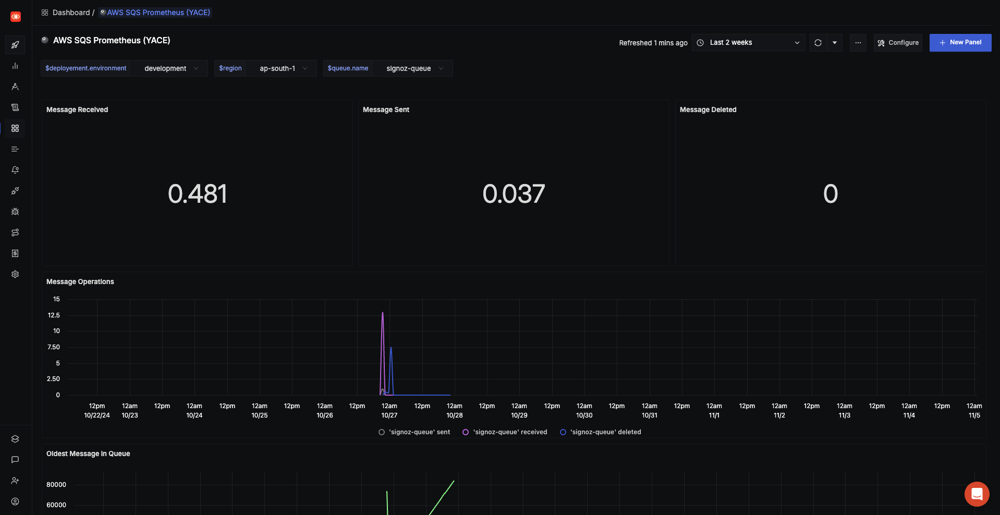

# AWS SQS Dashboard - Prometheus

## Metrics Ingestion

### Configure AWS SQS Prometheus Exporter 
For more details about the exporter, visit [nerdswords/yet-another-cloudwatch-exporter](https://github.com/nerdswords/yet-another-cloudwatch-exporter) on GitHub.\
1. First write the configuration for yace. for more details about yace configuration visit [here].(https://github.com/nerdswords/yet-another-cloudwatch-exporter/blob/master/docs/configuration.md)
```yaml
apiVersion: v1alpha1
sts-region: ap-south-1
static:
  - namespace: "AWS/SQS"
    name: "signoz-queue-yace"
    regions:
      - ap-south-1
    dimensions:
      - name: QueueName
        value: "signoz-queue"
    metrics:
      - name: ApproximateAgeOfOldestMessage
        statistics:
          - Maximum
        period: 300
        length: 300
      - name: ApproximateNumberOfMessagesDelayed
        statistics:
          - Average
        period: 300
        length: 300
      - name: ApproximateNumberOfMessagesNotVisible
        statistics:
          - Average
        period: 300
        length: 300
      - name: ApproximateNumberOfMessagesVisible
        statistics:
          - Average
        period: 300
        length: 300
      - name: NumberOfEmptyReceives
        statistics:
          - Sum
        period: 300
        length: 300
      - name: NumberOfMessagesDeleted
        statistics:
          - Sum
        period: 300
        length: 300
      - name: NumberOfMessagesReceived
        statistics:
          - Sum
        period: 300
        length: 300
      - name: NumberOfMessagesSent
        statistics:
          - Sum
        period: 300
        length: 300
      - name: SentMessageSize
        statistics:
          - Sum
          - Average
        period: 300
        length: 300
```

2. You will also need to supply the credentials for an AWS IAM account to the CloudWatch exporter.
```text
# CREDENTIALS FOR AWS ACCOUNT
aws_region = us-east-1
aws_access_key_id = AKIAQ33BWUG3BLXXXXX
aws_secret_access_key = bXXXXXXXXXXXXXXXXXXXXXXXXXXXXXXXXX
```
3. Run the yace exporter
```bash
docker run -d --rm -v $PWD/credentials:/exporter/.aws/credentials -v $PWD/config.yaml:/tmp/config.yml -p 5000:5000 --name yace ghcr.io/nerdswords/yet-another-cloudwatch-exporter:v0.61.2 
```


### Configure OpenTelemetry Collector

1. Add prometheus receiver to the `receivers:` section:

```yaml
  prometheus:
    config:
      global:
        scrape_interval: 60s
      scrape_configs:
        - job_name: aws-sqs
          metrics_path: /metrics
          scheme: http
          static_configs:
            - targets:
              - 127.0.0.1:5000  # Assuming you're running the AWS SQS exporter on this port
```

2. Add prometheus receiver to the `pipelines:` section:

```yaml
service:
  pipelines:
    metrics/internal:
      receivers: [prometheus]
```

3. Complete Configuration Example
Below is a complete `otel-config.yaml` example:

```yaml
receivers:
  otlp:
    protocols:
      grpc:
        endpoint: 0.0.0.0:4317
      http:
        endpoint: 0.0.0.0:4318
  hostmetrics:
    collection_interval: 60s
    scrapers:
      cpu: {}
      disk: {}
      load: {}
      filesystem: {}
      memory: {}
      network: {}
      paging: {}
      process:
        mute_process_name_error: true
        mute_process_exe_error: true
        mute_process_io_error: true
      processes: {}
  prometheus:
    config:
      global:
        scrape_interval: 60s
      scrape_configs:
        - job_name: otel-collector-binary
          static_configs:
            - targets:
              - localhost:8888
        - job_name: aws-sqs
          metrics_path: /metrics
          scheme: http
          static_configs:
            - targets:
              - localhost:9384  # Assuming you're running the AWS SQS exporter on this port

processors:
  batch:
    send_batch_size: 1000
    timeout: 10s
  # Ref: https://github.com/open-telemetry/opentelemetry-collector-contrib/blob/main/processor/resourcedetectionprocessor/README.md
  resourcedetection:
    detectors: [env, ec2, system] # Before system detector, include ec2 for AWS, gcp for GCP and azure for Azure.
    # Using OTEL_RESOURCE_ATTRIBUTES envvar, env detector adds custom labels.
    timeout: 2s
    system:
      hostname_sources: [os] # alternatively, use [dns,os] for setting FQDN as host.name and os as fallback
  resource/env:
    attributes:
    - key: deployment.environment
      value: stagging
      action: upsert


extensions:
  health_check: {}
  zpages: {}

exporters:
  otlp:
    endpoint: "ingest.{region}.signoz.cloud:443"
    tls:
      insecure: false
    headers:
      "signoz-access-token": "your-ingestion-key"
  logging:
    verbosity: normal

service:
  telemetry:
    metrics:
      address: 0.0.0.0:8888
  extensions: [health_check, zpages]
  pipelines:
    metrics:
      receivers: [otlp]
      processors: [resource/env, batch]
      exporters: [otlp]
    metrics/internal:
      receivers: [prometheus, hostmetrics]
      processors: [resource/env, resourcedetection, batch]
      exporters: [otlp]
    traces:
      receivers: [otlp]
      processors: [resource/env, batch]
      exporters: [otlp]
    logs:
      receivers: [otlp]
      processors: [resource/env, batch]
      exporters: [otlp]
```

## Variables

- `{{deployment.environment}}`: Deployment environment (e.g., staging, production)
- `{{region}}`: AWS region where your SQS queues are located (e.g., us-east-1)
- `{{queue.name}}`: Name of the SQS queue being monitored

## Dashboard Panels

### Queue Metrics
- **Approximate Age of Oldest Message**: The approximate age of the oldest non-deleted message in the queue
  - Metric: `aws_sqs_approximate_age_of_oldest_message_maximum`
  - Helps identify potential processing delays or stuck messages

- **Approximate Number of Messages Visible**: Approximate number of visible messages in a queue
  - Metric: `aws_sqs_approximate_number_of_messages_visible_average`
  - The number of messages available for retrieval from the queue

- **Approximate Number Of Messages Delayed**: Approximate number of messages that are delayed and not yet available for reading
  - Metric: `aws_sqs_approximate_number_of_messages_delayed_average`
  - This can happen when the queue is configured as a delay queue or when a message has been sent with a delay parameter

- **Approximate Number Of Messages Not Visible**: Approximate number of messages that have not timed-out and aren't deleted
  - Metric: `aws_sqs_approximate_number_of_messages_not_visible_average`
  - Messages are considered in flight if they have been sent to a client but have not yet been deleted or have not yet reached the end of their visibility window

- **Number of Empty Receives**: Number of ReceiveMessage API calls that returned no messages
  - Metric: `aws_sqs_number_of_empty_receives_sum`
  - Useful for identifying potential polling inefficiencies

- **Number of Messages Deleted**: Number of messages deleted from the queue
  - Metric: `aws_sqs_number_of_messages_deleted_sum`
  - Tracks successful message processing and cleanup

- **Number of Messages Received**: Number of messages returned by calls to the ReceiveMessage API
  - Metric: `aws_sqs_number_of_messages_received_sum`
  - Measures queue consumption rate

- **Number of Messages Sent**: Number of messages added to the queue
  - Metric: `aws_sqs_number_of_messages_sent_sum`
  - Tracks queue ingestion rate

- **Sent Message Size**: Size of messages added to the queue
  - Average Metric: `aws_sqs_sent_message_size_average`
  - Sum Metric: `aws_sqs_sent_message_size_sum`
  - Useful for monitoring queue storage usage and identifying unusually large messages

### Screenshots


*Overview of the AWS SQS monitoring dashboard showing queue metrics*


# AWS SQS Dashboard - Prometheus

## Metrics Ingestion

### Configure AWS SQS Prometheus Exporter 
For more details about the exporter, visit [nerdswords/yet-another-cloudwatch-exporter](https://github.com/nerdswords/yet-another-cloudwatch-exporter) on GitHub.

1. First write the configuration for yace. for more details about yace configuration visit [here](https://github.com/nerdswords/yet-another-cloudwatch-exporter/blob/master/docs/configuration.md)
```yaml
apiVersion: v1alpha1
sts-region: ap-south-1
static:
  - namespace: "AWS/SQS"
    name: "signoz-queue-yace"
    regions:
      - ap-south-1
    dimensions:
      - name: QueueName
        value: "signoz-queue"
    metrics:
      - name: ApproximateAgeOfOldestMessage
        statistics:
          - Maximum
        period: 300
        length: 300
      - name: ApproximateNumberOfMessagesDelayed
        statistics:
          - Average
        period: 300
        length: 300
      - name: ApproximateNumberOfMessagesNotVisible
        statistics:
          - Average
        period: 300
        length: 300
      - name: ApproximateNumberOfMessagesVisible
        statistics:
          - Average
        period: 300
        length: 300
      - name: NumberOfEmptyReceives
        statistics:
          - Sum
        period: 300
        length: 300
      - name: NumberOfMessagesDeleted
        statistics:
          - Sum
        period: 300
        length: 300
      - name: NumberOfMessagesReceived
        statistics:
          - Sum
        period: 300
        length: 300
      - name: NumberOfMessagesSent
        statistics:
          - Sum
        period: 300
        length: 300
      - name: SentMessageSize
        statistics:
          - Sum
          - Average
        period: 300
        length: 300
```

2. You will also need to supply the credentials for an AWS IAM account to the CloudWatch exporter.
```text
# CREDENTIALS FOR AWS ACCOUNT
aws_region = us-east-1
aws_access_key_id = AKIAQ33BWUG3BLXXXXX
aws_secret_access_key = bXXXXXXXXXXXXXXXXXXXXXXXXXXXXXXXXX
```

3. Run the yace exporter
```bash
docker run -d --rm -v $PWD/credentials:/exporter/.aws/credentials -v $PWD/config.yaml:/tmp/config.yml -p 5000:5000 --name yace ghcr.io/nerdswords/yet-another-cloudwatch-exporter:v0.61.2 
```

### Configure OpenTelemetry Collector

[OTEL configuration section remains the same as in the original document]

## Variables

- `{{deployment.environment}}`: Deployment environment (e.g., staging, production)
- `{{region}}`: AWS region where your SQS queues are located (e.g., us-east-1)
- `{{queue.name}}`: Name of the SQS queue being monitored

## Dashboard Panels


### Screenshots


*Overview of the AWS SQS monitoring dashboard showing queue metrics*