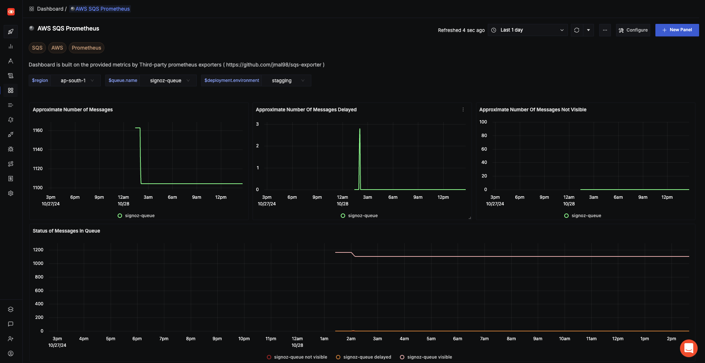

# AWS SQS Dashboard - Prometheus

## Metrics Ingestion

### Configure AWS SQS Prometheus Exporter 
For more details about the exporter, visit [jmal98/sqs-exporter](https://github.com/jmal98/sqs-exporter) on GitHub. The AWS SQS exporter is listed in the [official Prometheus third-party exporters documentation](https://prometheus.io/docs/instrumenting/exporters/#third-party-exporters) under the APIs section.


```bash
docker run -d -p 9384:9384 -e AWS_ACCESS_KEY_ID=<access key> -e AWS_SECRET_ACCESS_KEY=<secret key> -e AWS_REGION=<region>  jmal98/sqs-exporter:0.2.0
```

### Configure OpenTelemetry Collector

1. Add prometheus receiver to the `receivers:` section:

```yaml
  prometheus:
    config:
      global:
        scrape_interval: 60s
      scrape_configs:
        - job_name: aws-sqs
          metrics_path: /metrics
          scheme: http
          static_configs:
            - targets:
              - 127.0.0.1:9384  # Assuming you're running the AWS SQS exporter on this port
```

2. Add prometheus receiver to the `pipelines:` section:

```yaml
service:
  pipelines:
    metrics/internal:
      receivers: [prometheus]
```

3. Complete Configuration Example
Below is a complete `otel-config.yaml` example:

```yaml
receivers:
  otlp:
    protocols:
      grpc:
        endpoint: 0.0.0.0:4317
      http:
        endpoint: 0.0.0.0:4318
  hostmetrics:
    collection_interval: 60s
    scrapers:
      cpu: {}
      disk: {}
      load: {}
      filesystem: {}
      memory: {}
      network: {}
      paging: {}
      process:
        mute_process_name_error: true
        mute_process_exe_error: true
        mute_process_io_error: true
      processes: {}
  prometheus:
    config:
      global:
        scrape_interval: 60s
      scrape_configs:
        - job_name: otel-collector-binary
          static_configs:
            - targets:
              - localhost:8888
        - job_name: aws-sqs
          metrics_path: /metrics
          scheme: http
          static_configs:
            - targets:
              - localhost:9384  # Assuming you're running the AWS SQS exporter on this port

processors:
  batch:
    send_batch_size: 1000
    timeout: 10s
  # Ref: https://github.com/open-telemetry/opentelemetry-collector-contrib/blob/main/processor/resourcedetectionprocessor/README.md
  resourcedetection:
    detectors: [env, ec2, system] # Before system detector, include ec2 for AWS, gcp for GCP and azure for Azure.
    # Using OTEL_RESOURCE_ATTRIBUTES envvar, env detector adds custom labels.
    timeout: 2s
    system:
      hostname_sources: [os] # alternatively, use [dns,os] for setting FQDN as host.name and os as fallback
  resource/env:
    attributes:
    - key: deployment.environment
      value: stagging
      action: upsert


extensions:
  health_check: {}
  zpages: {}

exporters:
  otlp:
    endpoint: "ingest.{region}.signoz.cloud:443"
    tls:
      insecure: false
    headers:
      "signoz-access-token": "your-ingestion-key"
  logging:
    verbosity: normal

service:
  telemetry:
    metrics:
      address: 0.0.0.0:8888
  extensions: [health_check, zpages]
  pipelines:
    metrics:
      receivers: [otlp]
      processors: [resource/env, batch]
      exporters: [otlp]
    metrics/internal:
      receivers: [prometheus, hostmetrics]
      processors: [resource/env, resourcedetection, batch]
      exporters: [otlp]
    traces:
      receivers: [otlp]
      processors: [resource/env, batch]
      exporters: [otlp]
    logs:
      receivers: [otlp]
      processors: [resource/env, batch]
      exporters: [otlp]
```

## Variables

- `{{deployment.environment}}`: Deployment environment (e.g., staging, production)
- `{{region}}`: AWS region where your SQS queues are located (e.g., us-east-1)
- `{{queue.name}}`: Name of the SQS queue being monitored

## Dashboard Panels

### Queue Metrics
- **Approximate Number of Messages**: Approximate number of visible messages in a queue
  - Metric: `sqs_approximatenumberofmessages`
  - The number of messages available for retrieval from the queue.

- **Approximate Number Of Messages Delayed**: Approximate number of messages that are delayed and not yet available for reading
  - Metric: `sqs_approximatenumberofmessagesdelayed`
  - This can happen when the queue is configured as a delay queue or when a message has been sent with a delay parameter.

- **Approximate Number Of Messages Not Visible**:  Approximate number of messages that have not timed-out and aren't deleted
  - Metric: `sqs_approximatenumberofmessagesnotvisible`
  - Messages are considered in flight if they have been sent to a client but have not yet been deleted or have not yet reached the end of their visibility window

### Screenshots


*Overview of the AWS SQS monitoring dashboard showing queue metrics*
