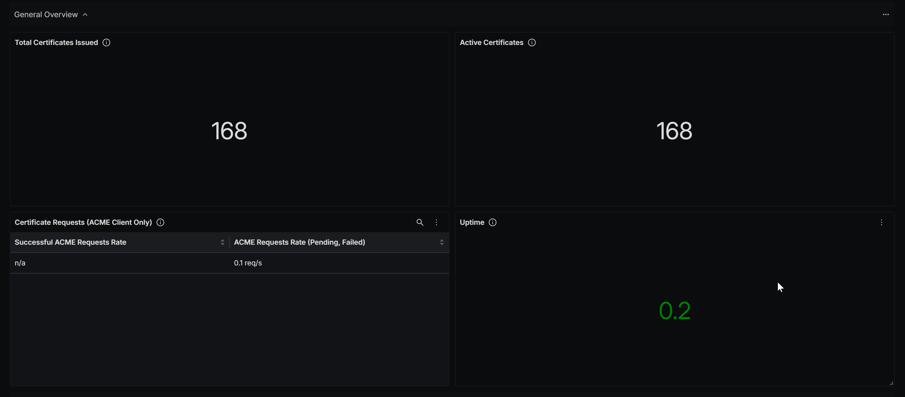
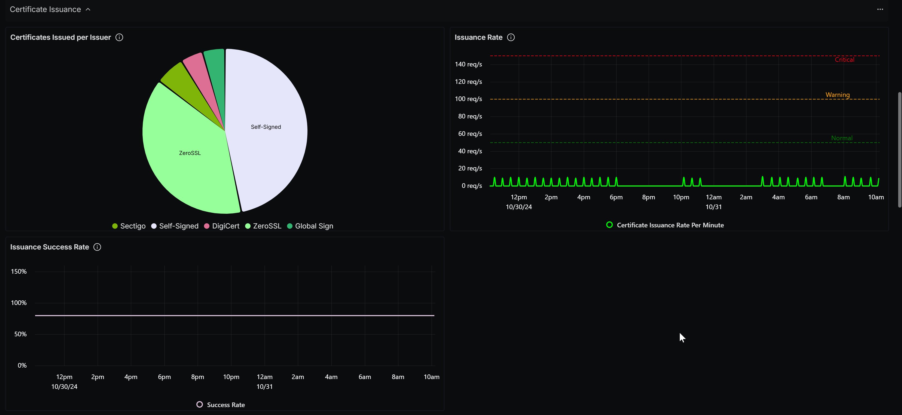
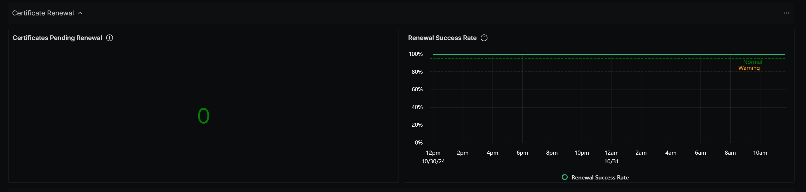
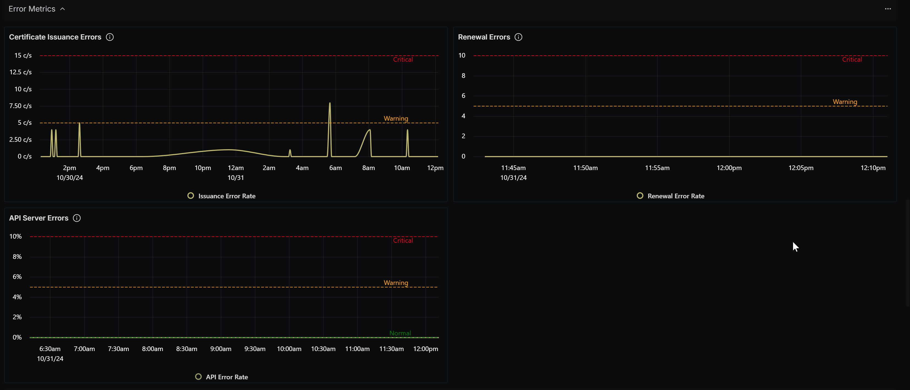
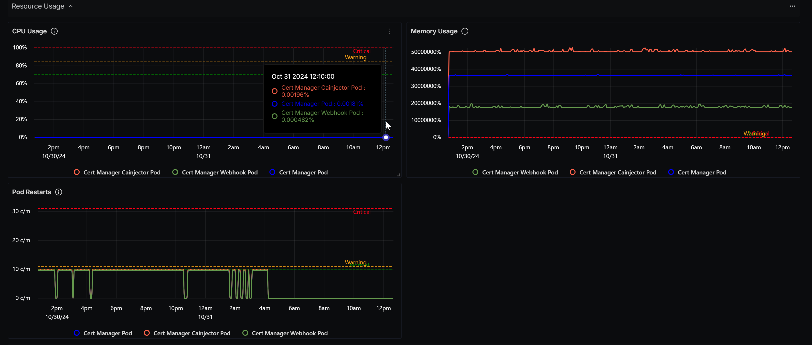
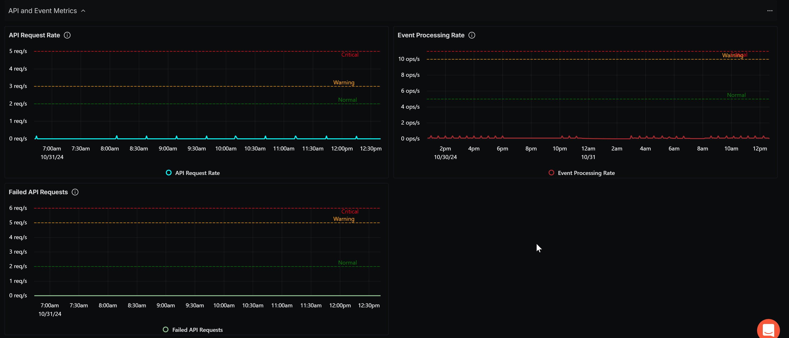

# Cert-Manager Dashboard - Prometheus

## Metrics Ingestion

### Prerequisites

> **Note:**
> A running Kubernetes Cluster is required (local or cloud). On local, you can
> install it on Minikube or any other cluster manager tool.

1. Install Cert Manager

```bash
    helm repo add jetstack https://charts.jetstack.io
    helm repo update
    helm install cert-manager jetstack/cert-manager --namespace cert-manager --create-namespace --version v1.10.1

```

2. Start your local Kubernetes node.

```bash
    minikube start
```

### Install Custom OpenTelemetry Collector For SigNoz

To ingest metrics for the **Cert-Manager Dashboard - Prometheus**, create a `otel-config.yaml` configuration file and follow the steps below:

1. **Set up Prometheus Receiver:**
   - Define a `prometheus` receiver to collect metrics.
   - Specify `scrape_configs` to target cert-manager services in Kubernetes.

   ```yaml
   receivers:
     prometheus:
       config:
         scrape_configs:
           - job_name: 'cert-manager'
             static_configs:
               - targets:
                   - 'cert-manager.cert-manager.svc.cluster.local:9402'
                   - 'cert-manager-webhook.cert-manager.svc.cluster.local:9402'
                   - 'cert-manager-cainjector.cert-manager.svc.cluster.local:9402'
   ```

2. **Filter Metrics:** 
   - Use `metric_relabel_configs` to limit scraped data to metrics beginning with `certmanager_`.

   ```yaml
   metric_relabel_configs:
     - source_labels: [__name__]
       regex: 'certmanager_.*'
       action: keep
   ```

3. **Configure Processors:**
   - Use `batch` to group metrics and `filter` to specify included metric names.

   ```yaml
   processors:
     batch:
       timeout: 10s
       send_batch_size: 1000
     filter:
       metrics:
         include:
           match_type: regexp
           metric_names:
             - "certmanager_.*"
             - "controller_runtime_.*"
   ```

4. **Set Up OTLP Exporter with Access Token:**
   - Define the `otlp` exporter with the endpoint `ingest.in.signoz.cloud:443`.
   - Store the access token in a Kubernetes secret named `signoz-token`.
   - Load the secret into the environment using `extraEnvs`, which allows the collector to access the `SIGNOZ_ACCESS_TOKEN` during deployment.

   ```yaml
   exporters:
     otlp:
       endpoint: "ingest.{region}.signoz.cloud:443"
       headers:
         "signoz-access-token": "${SIGNOZ_ACCESS_TOKEN}"
       tls:
         insecure: false
   ```

   ```yaml
   extraEnvs:
     - name: SIGNOZ_ACCESS_TOKEN
       valueFrom:
         secretKeyRef:
           name: signoz-token
           key: access-token
   ```

5. **Define the Metrics Pipeline:**
   - Link `prometheus` as the receiver, `filter` and `batch` as processors, and `otlp` as the exporter.

   ```yaml
   service:
     pipelines:
       metrics:
         receivers: [prometheus]
         processors: [filter, batch]
         exporters: [otlp]
   ```

> [!Note]
> - **Local Deployment:** The setup has been deployed locally using a single-cluster configuration.
> - **Multi-Cluster Support:** You can extend this setup to support a multi-cluster environment if needed.

### Full Configuration

Below is the complete configuration file (`otel-config.yaml`):

```yaml
mode: deployment

serviceAccount:
  name: my-otel-collector

image:
  repository: "otel/opentelemetry-collector-contrib"
  tag: "0.93.0"  

nameOverride: "otel-collector"

config:
  receivers:
    prometheus:
      config:
        scrape_configs:
          - job_name: 'cert-manager'
            static_configs:
              - targets:
                  - 'cert-manager.cert-manager.svc.cluster.local:9402'
                  - 'cert-manager-webhook.cert-manager.svc.cluster.local:9402'
                  - 'cert-manager-cainjector.cert-manager.svc.cluster.local:9402'
            metrics_path: /metrics
            metric_relabel_configs:
              - source_labels: [__name__]
                regex: 'certmanager_.*'
                action: keep

  processors:
    batch:
      timeout: 10s
      send_batch_size: 1000
    filter:
      metrics:
        include:
          match_type: regexp
          metric_names:
            - "certmanager_.*"
            - "controller_runtime_.*"

  exporters:
    otlp:
      endpoint: "ingest.in.signoz.cloud:443"
      headers:
        "signoz-access-token": "${SIGNOZ_ACCESS_TOKEN}"
      tls:
        insecure: false

  service:
    telemetry:
      logs:
        level: "debug"
    pipelines:
      metrics:
        receivers: [prometheus]
        processors: [filter, batch]
        exporters: [otlp]

resources:
  requests:
    memory: "512Mi"
    cpu: "250m"
  limits:
    memory: "1Gi"
    cpu: "500m"

extraEnvs:
  - name: SIGNOZ_ACCESS_TOKEN
    valueFrom:
      secretKeyRef:
        name: signoz-token
        key: access-token
```

This setup securely collects and exports metrics with the access token loaded via `extraEnvs`.

## Variables

- `{{namespace}}`: Filters metrics based on the Kubernetes namespace where cert-manager is deployed.
- `{{issuer}}`: Selects specific certificate issuers (e.g., Let’s Encrypt, HashiCorp Vault) to filter metrics.
- `{{certificate_name}}`: Filters metrics based on specific certificate names.
- `{{cluster}}`: For multi-cluster setups, filters metrics based on the Kubernetes cluster.
- `{{deployment.environment}}`: Specifies the deployment environment (e.g., `staging`, `production`).

## Sections

### General Overview

This section provides a high-level overview of the cert-manager's health and performance metrics, allowing for a quick assessment of the system's current state.

- Total Certificates Issued - `certmanager_certificate_expiration_timestamp_seconds`
- Active Certificates - `certmanager_certificate_ready_status`
- Certificate Requests - `certmanager_http_acme_client_request_count`
- Uptime - `certmanager_clock_time_seconds`



### Certificate Issuance

This section focuses on the metrics related to the issuance of certificates, helping monitor the creation and provisioning of TLS certificates.

- Certificates Issued per Issuer - `certmanager_certificate_ready_status`
- Issuance Rate - `certmanager_controller_sync_call_count` (Filter: `controller = certificates-issuing`)
- Issuance Success Rate - `certmanager_certificate_ready_status`



### Certificate Renewal
This section provides insights into the certificate renewal process, ensuring that certificates are renewed in a timely manner to maintain security.

- Certificates Pending Renewal - `certmanager_certificate_expiration_timestamp_seconds` and `certmanager_certificate_renewal_timestamp_seconds`
- Renewal Success Rate - `certmanager_controller_sync_call_count` and `certmanager_controller_sync_error_count`



### Error Metrics

This section monitors errors and failures within cert-manager operations, aiding in the troubleshooting and resolution of issues.

- Certificate Issuance Errors - `certmanager_controller_sync_error_count` (Filter: `controller = orders`)
- Renewal Errors - `certmanager_controller_sync_error_count` (Filter: `controller = certificates-trigger`)
- API Server Errors - `certmanager_controller_sync_error_count` (Filter: `controller = certificates-readiness`)



### Resource Usage

This section provides insights into the resource consumption of the cert-manager, helping ensure it operates efficiently within the Kubernetes cluster.

 - CPU Usage - `container_cpu_utilization`
 - Memory Usage - `container_memory_usage`
 - Pod Restarts - `k8s_container_restarts`

 

### API and Event Metrics

This section tracks API requests and events handled by cert-manager, providing visibility into its interactions within the Kubernetes ecosystem.

- API Request Rate - `certmanager_controller_sync_call_count` (Filter: `controller = certificates-readiness`)
- Event Processing Rate - `certmanager_controller_sync_call_count`
- Failed API Requests - `certmanager_controller_sync_error_count`(Filter: `controller = certificates-readiness`)

