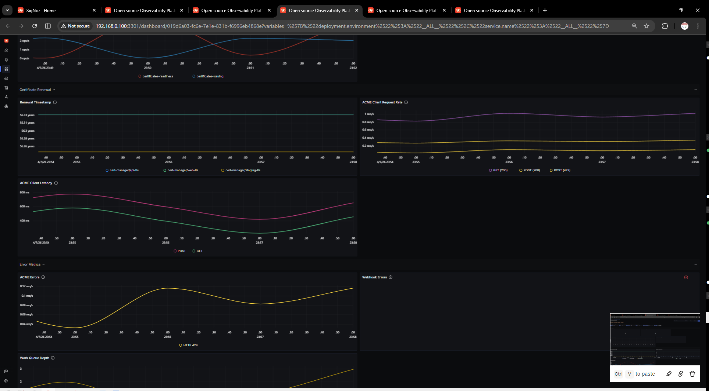

# Cert-Manager Dashboard

## Metrics Ingestion

### Cert-Manager Metrics

Cert-Manager exposes Prometheus metrics on port `9402` at the `/metrics` endpoint. These metrics provide insights into certificate lifecycle, controller operations, ACME client requests, and process health.

Key metric categories:
- **Certificate metrics**: `certmanager_certificate_ready_status`, `certmanager_certificate_expiration_timestamp_seconds`
- **Controller metrics**: `certmanager_controller_sync_call_count`, `certmanager_controller_sync_error_count`
- **ACME metrics**: `certmanager_http_acme_client_request_count`, `certmanager_http_acme_client_request_duration_seconds`
- **Process metrics**: `process_cpu_seconds_total`, `process_resident_memory_bytes`, `process_start_time_seconds`
- **Workqueue metrics**: `workqueue_adds_total`, `workqueue_depth`

### Configure OpenTelemetry Collector

1. Add a Prometheus receiver to the `receivers:` section of your OpenTelemetry Collector config:

```yaml
  prometheus:
    config:
      global:
        scrape_interval: 60s
      scrape_configs:
        - job_name: cert-manager
          metrics_path: /metrics
          scheme: http
          static_configs:
            - targets:
              - cert-manager.cert-manager.svc.cluster.local:9402
```

> **Note:** Adjust the target address based on your cert-manager deployment. The default Kubernetes service address is `cert-manager.cert-manager.svc.cluster.local:9402`. For local development, use `localhost:9402`.

2. Complete Configuration Example

Below is a complete `otel-config.yaml` example:

```yaml
receivers:
  otlp:
    protocols:
      grpc:
        endpoint: 0.0.0.0:4317
      http:
        endpoint: 0.0.0.0:4318
  hostmetrics:
    collection_interval: 60s
    scrapers:
      cpu: {}
      disk: {}
      load: {}
      filesystem: {}
      memory: {}
      network: {}
      paging: {}
      process:
        mute_process_name_error: true
        mute_process_exe_error: true
        mute_process_io_error: true
      processes: {}
  prometheus:
    config:
      global:
        scrape_interval: 60s
      scrape_configs:
        - job_name: otel-collector-binary
          static_configs:
            - targets:
              - localhost:8888
        - job_name: cert-manager
          metrics_path: /metrics
          scheme: http
          static_configs:
            - targets:
              - cert-manager.cert-manager.svc.cluster.local:9402

processors:
  batch:
    send_batch_size: 1000
    timeout: 10s
  resourcedetection:
    detectors: [env, system]
    timeout: 2s
    system:
      hostname_sources: [os]
  resource/env:
    attributes:
    - key: deployment.environment
      value: production
      action: upsert

extensions:
  health_check: {}
  zpages: {}

exporters:
  otlp:
    endpoint: "ingest.{region}.signoz.cloud:443"
    tls:
      insecure: false
    headers:
      "signoz-access-token": "your-ingestion-key"
  logging:
    verbosity: normal

service:
  telemetry:
    metrics:
      address: 0.0.0.0:8888
  extensions: [health_check, zpages]
  pipelines:
    metrics:
      receivers: [otlp]
      processors: [resource/env, batch]
      exporters: [otlp]
    metrics/internal:
      receivers: [prometheus, hostmetrics]
      processors: [resource/env, resourcedetection, batch]
      exporters: [otlp]
    traces:
      receivers: [otlp]
      processors: [resource/env, batch]
      exporters: [otlp]
    logs:
      receivers: [otlp]
      processors: [resource/env, batch]
      exporters: [otlp]
```

## Variables

- `{{namespace}}`: Kubernetes namespace where cert-manager is deployed
- `{{issuer}}`: Certificate issuer name (e.g., letsencrypt-prod, vault)
- `{{certificate_name}}`: Specific certificate name to filter metrics
- `{{cluster}}`: Kubernetes cluster name for multi-cluster setups
- `{{deployment_environment}}`: Deployment environment (e.g., production, staging)

## Sections

- General Overview
  - Total Certificates -
  `certmanager_certificate_ready_status`
  - Active Certificates -
  `certmanager_certificate_ready_status`
  - Certificate Requests -
  `certmanager_controller_sync_call_count`
  - Uptime -
  `process_start_time_seconds`
  
- Certificate Issuance
  - Certificates Issued per Issuer -
  `certmanager_certificate_ready_status`
  - Issuance Rate -
  `certmanager_controller_sync_call_count`
  - Issuance Success Rate -
  `certmanager_controller_sync_call_count`, `certmanager_controller_sync_error_count`
  
- Certificate Renewal
  - Certificates Pending Renewal -
  `certmanager_certificate_ready_status`
  - Renewal Success Rate -
  `certmanager_controller_sync_call_count`, `certmanager_controller_sync_error_count`
  - Renewal Duration -
  `certmanager_http_acme_client_request_duration_seconds`
  
- Error Metrics
  - Certificate Issuance Errors -
  `certmanager_controller_sync_error_count`
  - Renewal Errors -
  `certmanager_controller_sync_error_count`
  - API Server Errors -
  `certmanager_http_acme_client_request_count`
  
- Resource Usage
  - CPU Usage -
  `process_cpu_seconds_total`
  - Memory Usage -
  `process_resident_memory_bytes`
  - Workqueue Depth -
  `workqueue_depth`
  
- API and Event Metrics
  - API Request Rate -
  `certmanager_http_acme_client_request_count`
  - Event Processing Rate -
  `workqueue_adds_total`
  - Failed API Requests -
  `certmanager_http_acme_client_request_count`
  
