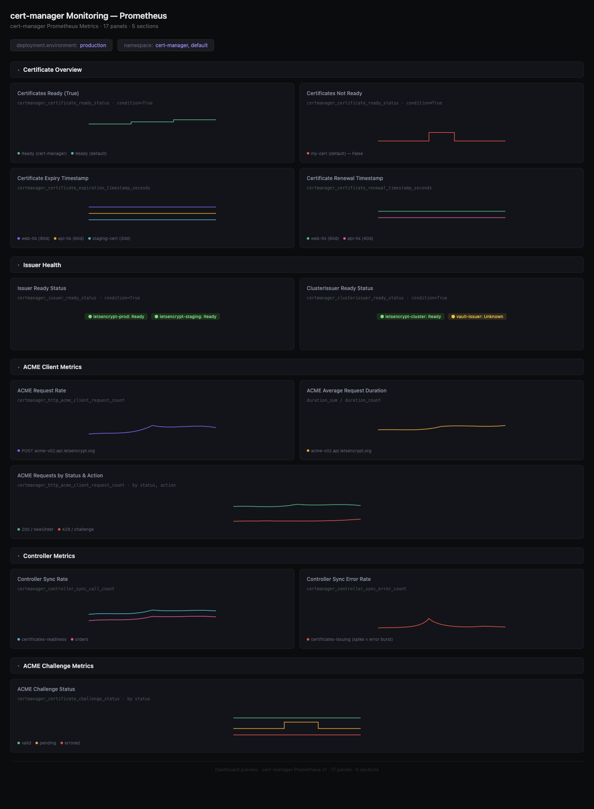

# cert-manager Monitoring Dashboard - Prometheus

## Dashboard Preview



## Metrics Ingestion

This dashboard uses Prometheus metrics exposed by [cert-manager](https://cert-manager.io/docs/devops-tips/prometheus-metrics/) on port `9402` at the `/metrics` endpoint.

Configure your OpenTelemetry Collector to scrape cert-manager metrics:

```yaml
receivers:
  prometheus:
    config:
      scrape_configs:
        - job_name: cert-manager
          scrape_interval: 30s
          kubernetes_sd_configs:
            - role: pod
          relabel_configs:
            - source_labels: [__meta_kubernetes_pod_label_app_kubernetes_io_name]
              regex: cert-manager
              action: keep
            - source_labels: [__meta_kubernetes_pod_annotation_prometheus_io_port]
              regex: "9402"
              action: keep
            - source_labels: [__meta_kubernetes_pod_ip]
              target_label: __address__
              replacement: $1:9402

processors:
  resource/env:
    attributes:
    - key: deployment.environment
      value: production
      action: upsert

exporters:
  otlp:
    endpoint: "<signoz-otel-collector-endpoint>:4317"
    tls:
      insecure: true

service:
  pipelines:
    metrics:
      receivers: [prometheus]
      processors: [resource/env]
      exporters: [otlp]
```

## Variables

- `{{deployment.environment}}`: Deployment environment
- `{{namespace}}`: Kubernetes namespace (multi-select)

## Dashboard Panels

### Section: Certificate Overview
- **Certificates Ready (True)** - Count of certificates with Ready=True condition per namespace (`certmanager_certificate_ready_status`)
- **Certificates Not Ready** - Certificates with condition False or Unknown (`certmanager_certificate_ready_status`)
- **Certificate Expiry Timestamp** - When each certificate expires (`certmanager_certificate_expiration_timestamp_seconds`)
- **Certificate Renewal Timestamp** - When each certificate should be renewed (`certmanager_certificate_renewal_timestamp_seconds`)

### Section: Issuer Health
- **Issuer Ready Status** - Ready status of namespaced Issuers (`certmanager_issuer_ready_status`)
- **ClusterIssuer Ready Status** - Ready status of ClusterIssuers (`certmanager_clusterissuer_ready_status`)

### Section: ACME Client Metrics
- **ACME Request Rate** - Rate of outbound ACME HTTP requests (`certmanager_http_acme_client_request_count`)
- **ACME Average Request Duration** - Average latency of ACME requests using sum/count formula (`certmanager_http_acme_client_request_duration_seconds`)
- **ACME Requests by Status & Action** - Requests grouped by HTTP status code and ACME action (`certmanager_http_acme_client_request_count`)

### Section: Controller Metrics
- **Controller Sync Rate** - Rate of sync() calls per controller (`certmanager_controller_sync_call_count`)
- **Controller Sync Error Rate** - Rate of sync errors per controller (`certmanager_controller_sync_error_count`)

### Section: ACME Challenge Metrics
- **ACME Challenge Status** - Status distribution of certificate challenges (`certmanager_certificate_challenge_status`)
