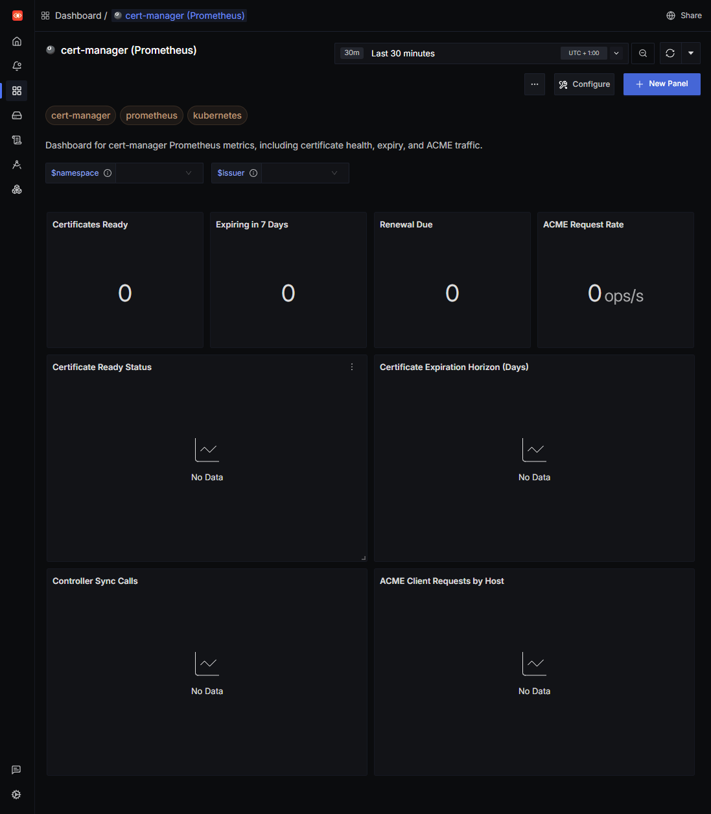

# cert-manager Dashboard - Prometheus

## Screenshot



## Data Ingestion

This dashboard expects cert-manager Prometheus metrics to be scraped into SigNoz.

cert-manager exposes Prometheus metrics on port 9402. Make sure the metrics endpoint is enabled and reachable from the OpenTelemetry Collector.

### OpenTelemetry Collector Prometheus receiver

```yaml
receivers:
  prometheus:
    config:
      scrape_configs:
        - job_name: cert-manager
          honor_timestamps: true
          scrape_interval: 30s
          metrics_path: /metrics
          kubernetes_sd_configs:
            - role: endpoints
          relabel_configs:
            - source_labels: [__meta_kubernetes_namespace]
              action: keep
              regex: cert-manager
            - source_labels: [__meta_kubernetes_service_name]
              action: keep
              regex: cert-manager
            - source_labels: [__meta_kubernetes_endpoint_port_number]
              action: keep
              regex: '9402'

processors:
  batch: {}

exporters:
  otlp:
    endpoint: ${SIGNOZ_OTLP_ENDPOINT}
    tls:
      insecure: true

service:
  pipelines:
    metrics:
      receivers: [prometheus]
      processors: [batch]
      exporters: [otlp]
```

### Optional Helm values

If you deploy cert-manager with Helm, make sure metrics are enabled and exposed on port 9402.

```yaml
prometheus:
  enabled: true
servicemonitor:
  enabled: true
```

## Variables

- namespace: Certificate namespace filter.
- issuer_name: Cascading issuer filter scoped by namespace.
- controller: cert-manager controller filter.

## Dashboard Sections

- Certificate Overview
- Certificate Lifecycle
- ACME Client
- Controller Performance
- Resource Usage
