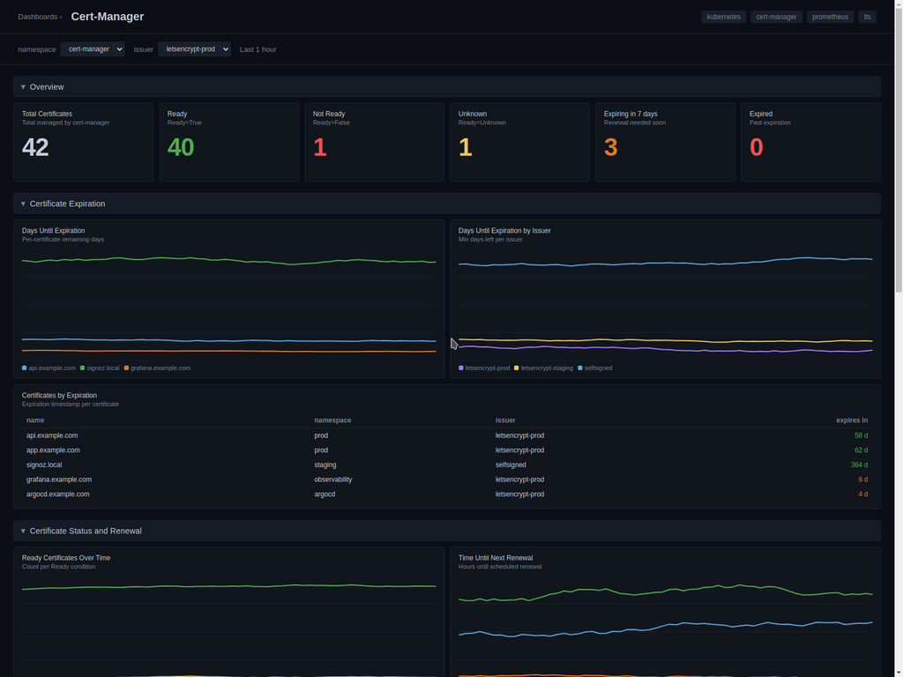

# Cert-Manager Dashboard - Prometheus

Tracks certificate lifecycle, renewal behaviour and controller health for [cert-manager](https://cert-manager.io/) running on Kubernetes.

## Metrics Ingestion

cert-manager exposes Prometheus metrics on port `9402` of the `cert-manager`, `cainjector` and `webhook` pods at the `/metrics` path. Scrape them with the OpenTelemetry Collector's `prometheus` receiver and forward to SigNoz.

### OpenTelemetry Collector configuration

```yaml
receivers:
  prometheus:
    config:
      global:
        scrape_interval: 60s
      scrape_configs:
        - job_name: cert-manager
          metrics_path: /metrics
          kubernetes_sd_configs:
            - role: pod
          relabel_configs:
            - source_labels: [__meta_kubernetes_pod_label_app_kubernetes_io_instance]
              regex: cert-manager
              action: keep
            - source_labels: [__meta_kubernetes_pod_container_port_number]
              regex: "9402"
              action: keep
            - source_labels: [__meta_kubernetes_namespace]
              target_label: namespace
            - source_labels: [__meta_kubernetes_pod_name]
              target_label: pod

processors:
  batch:
    send_batch_size: 1000
    timeout: 10s

exporters:
  otlp:
    endpoint: "ingest.{region}.signoz.cloud:443"
    tls:
      insecure: false
    headers:
      "signoz-access-token": "<your-ingestion-key>"

service:
  pipelines:
    metrics/cert-manager:
      receivers: [prometheus]
      processors: [batch]
      exporters: [otlp]
```

If cert-manager is installed via its Helm chart, enable the Prometheus scrape endpoint with:

```yaml
prometheus:
  enabled: true
  servicemonitor:
    enabled: false
```

## Variables

- `{{namespace}}`: Kubernetes namespace where cert-manager is deployed.
- `{{issuer}}`: Issuer name (`ClusterIssuer` or `Issuer`) to filter by.

## Sections

### Overview
- Total Certificates — `certmanager_certificate_ready_status`
- Ready / Not Ready / Unknown — `certmanager_certificate_ready_status`
- Expiring in 7 days / Expired — `certmanager_certificate_expiration_timestamp_seconds`

### Certificate Expiration
- Days Until Expiration — `certmanager_certificate_expiration_timestamp_seconds`
- Days Until Expiration by Issuer — `certmanager_certificate_expiration_timestamp_seconds`
- Certificates by Expiration — `certmanager_certificate_expiration_timestamp_seconds`

### Certificate Status and Renewal
- Ready Certificates Over Time — `certmanager_certificate_ready_status`
- Time Until Next Renewal — `certmanager_certificate_renewal_timestamp_seconds`
- Renewal Success Rate — `certmanager_http_acme_client_request_count`

### Controller
- Controller Sync Rate — `certmanager_controller_sync_call_count`
- ACME Client Request Rate by Status — `certmanager_http_acme_client_request_count`
- ACME Client Request Latency — `certmanager_http_acme_client_request_duration_seconds_bucket`
- Controller CPU / Memory — `container_cpu_usage_seconds_total`, `container_memory_working_set_bytes`
- Controller Pod Restarts — `kube_pod_container_status_restarts_total`

## Screenshots


