# Cline Dashboard

## Details

This dashboard gives a clear view into Cline usage and cost across a team. It covers token spend by model, prompt-cache effectiveness, request latency and time to first token, tool mix and failures, and provider API errors. Built from OpenTelemetry events and metrics under `service.name` `cline`, which require `CLINE_BUNDLE_OVERRIDE=legacy`.

To start sending Cline telemetry to SigNoz, follow the [Cline observability guide](https://signoz.io/docs/cline-observability/).

## Dashboard panels

### Sections

### Input Tokens

Total prompt tokens summed from `task.tokens` events. Read this next to Cache Read Tokens rather than alone: Cline resends the system prompt and workspace context on every turn, so most of this number is context rather than anything the developer typed.

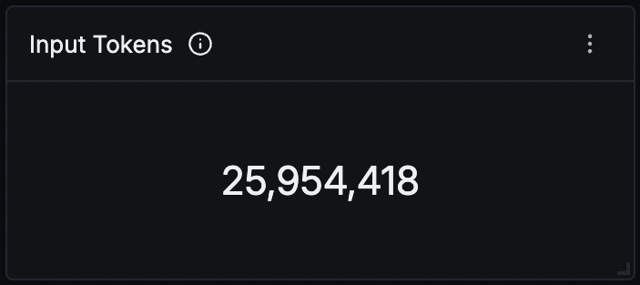

### Output Tokens

Tokens the model generated. Expect this one to two orders of magnitude below input. A ratio anywhere near parity usually means very short sessions rather than an efficiency win.

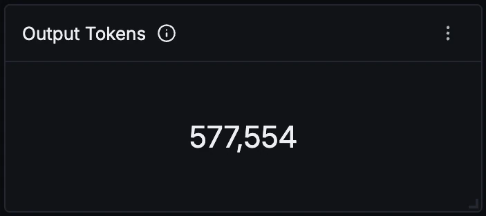

### Cache Read Tokens

Tokens served from the provider prompt cache. These are reported separately from `tokensIn` and are not included in it, so do not add the two together. A figure close to input tokens is the healthy shape and means the cache is absorbing the repeated context.

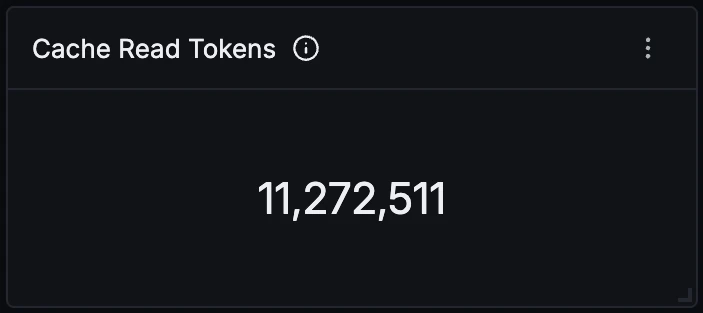

### Total Cost (USD)

Sum of `totalCost`. Cline computes this client side from its own per-model price table rather than reading it back from the provider, so it reads 0 on Cline's bundled free provider and only becomes meaningful once a directly priced model is configured.

### Tasks Started

One count per `task.created` event, so this counts tasks rather than prompts or tool calls. Divide Input Tokens by this to get the average context size a task carries.

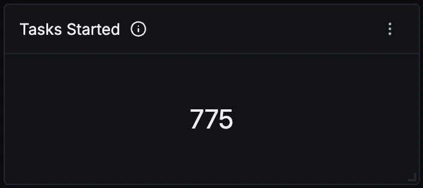

### Tool Calls

Every `task.tool_used` event, successful or not. Tool calls running several times higher than Tasks Started is the normal shape for an agent; a ratio close to 1 suggests the agent is answering from context instead of acting on the workspace.

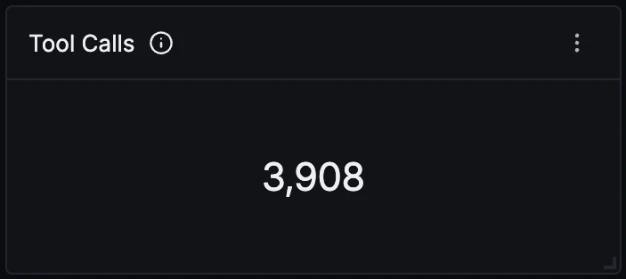

### Conversation Turns

Model round trips across all tasks. Compare against Tasks Started to see how many turns an average task takes to finish.

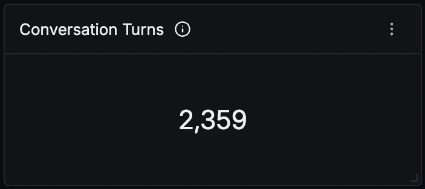

### Provider API Errors

Count of `task.provider_api_error`, coloured red at one or more. This covers failures reaching the model, so auth, rate limits, context overflow and upstream 5xx all land here rather than in the tool failure counts.

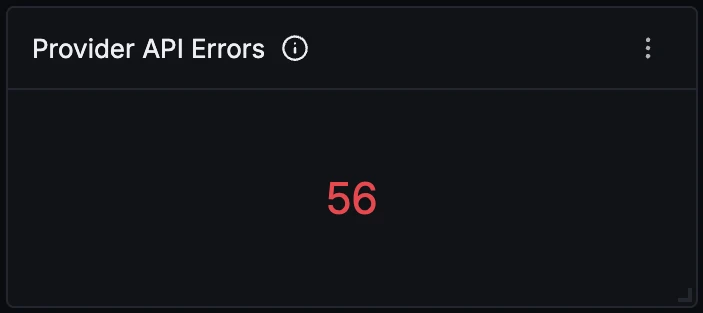

### Token Usage Over Time

Input against output per interval. The gap between the two lines is the point of the panel: output stays almost flat on the axis while input swings with workload, because context resend dominates spend. Sharp input spikes with no matching output rise usually mean larger workspaces rather than more work done.

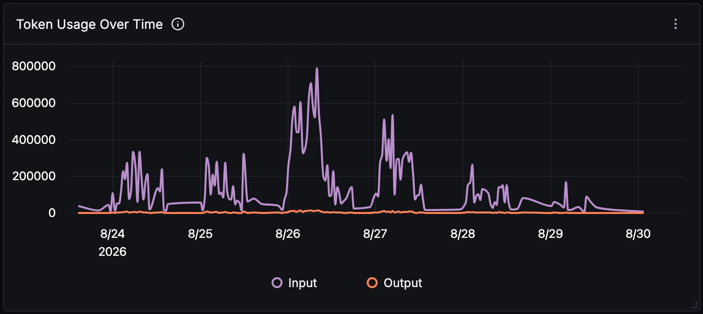

### Input Tokens by Model

The same volume split per model, driven by the `Model` variable at the top of the dashboard. This is the panel that shows which model is quietly consuming the budget, which is often not the one with the most requests.

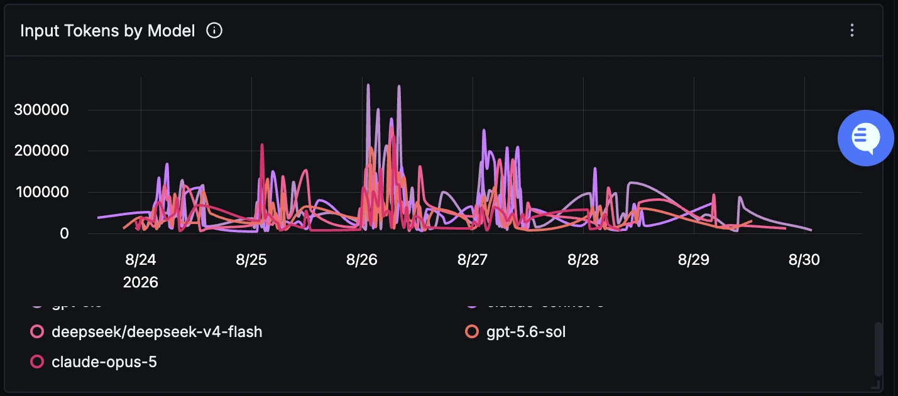

### Cost Over Time by Model

Spend per interval per model. Worth reading against the previous panel, since the ranking usually differs: a low-volume premium model can outspend a high-volume cheap one, and only this panel makes that visible.

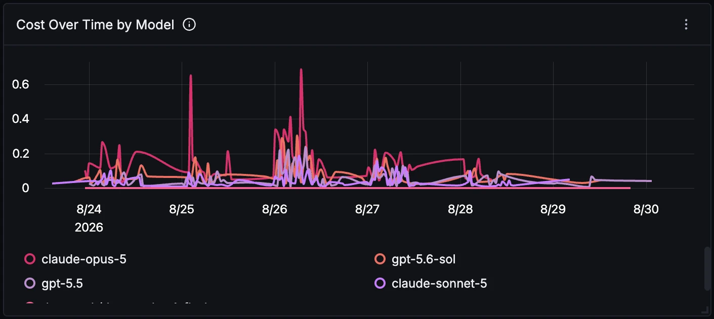

### Cache Read vs Write Tokens

Prompt-cache effectiveness over time. High read with low write is the shape you want. Sustained write volume with little read means the cache is being populated and then missed, which is usually context changing between turns faster than the cache can pay for itself.

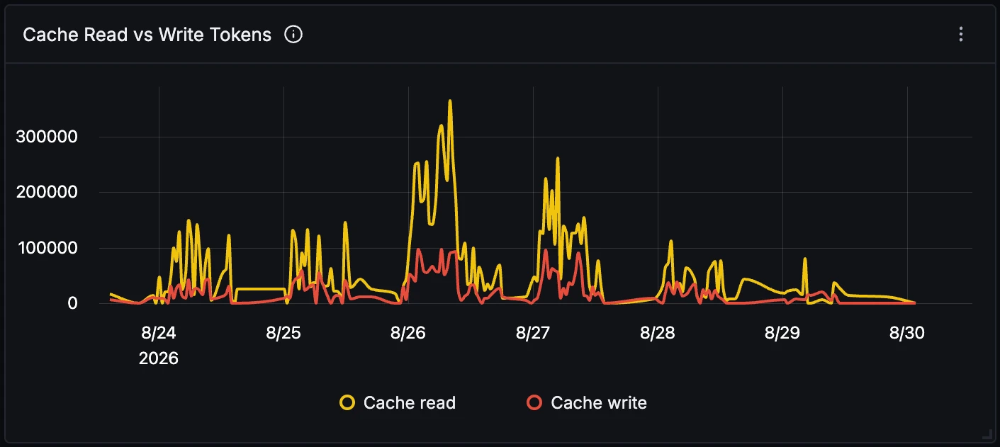

### API Duration (p50 / p95 / p99)

Full model request duration from the `cline.api.duration.seconds` histogram. Note the wide gap between p50 and the tails: p50 sits low and steady while p99 pins near the top of the range, which is characteristic of agent traffic where a few long generations dominate. This panel reads metrics, so unlike the token panels it needs sustained traffic before percentiles are meaningful.

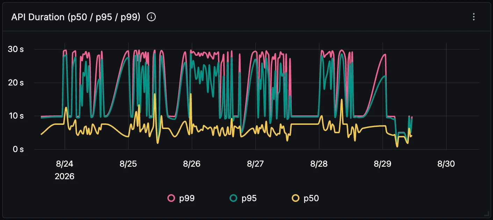

### Time To First Token (p95)

How long before the model starts streaming, split per model. This is the number a developer actually feels, and it is available only as a metric, never in the events. Reasoning-heavy models sit visibly higher here even when their total duration is comparable.

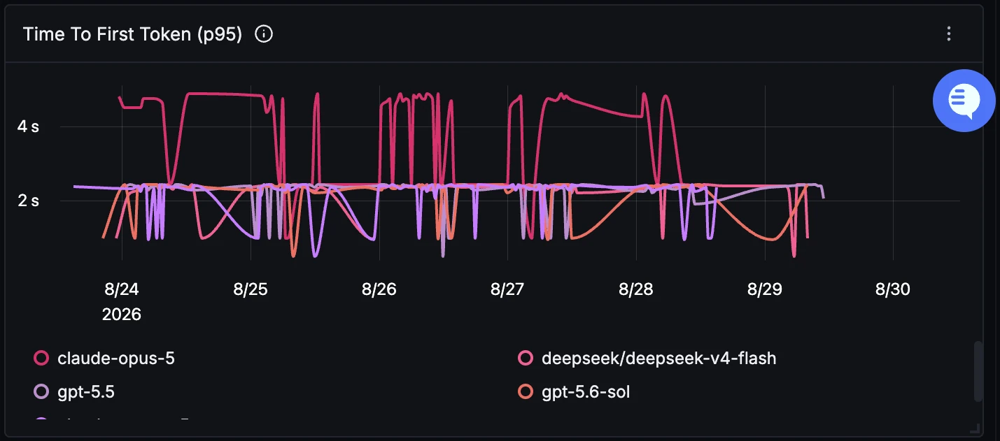

### Event Mix

Share of each Cline event type. The event name arrives as the log body rather than as an attribute, which is why this groups on `body`. `task.tool_used` leading, followed by `task.conversation_turn` and `task.tokens`, is the normal shape. `task.created` and `task.initialization` should track each other closely, and a gap between them points at tasks failing during startup.

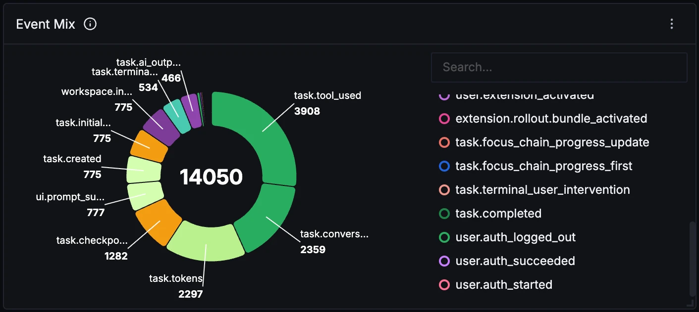

### Tool Usage

Calls broken down by tool, success and auto-approval. The auto-approval split is the useful one: the same tool appearing twice, once approved automatically and once not, shows how much the agent is being gated by a human. Note that these events carry the model under `modelId`, not `model`, so a filter written for the token panels will not match here.

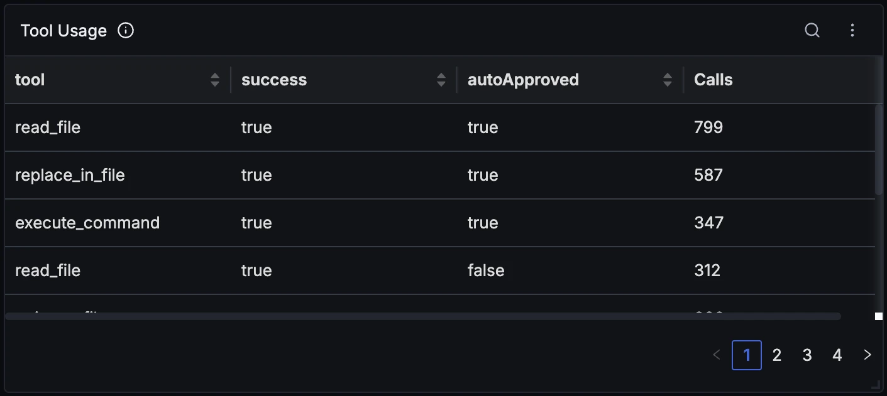

### Recent Provider API Errors

The most recent failed model requests with error type, message, failure phase and task `ulid`. `failurePhase` separates requests rejected before the call from those that died mid-stream, which is the fastest way to tell a quota problem from a network one. Use the `ulid` to pull every other event from the same task.

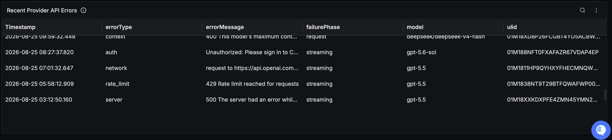
