# Cursor IDE Dashboard

## Details

This dashboard offers a clear view into Cursor IDE agent usage and performance. It highlights token spend by model, turn volume, turn and tool latency, tool mix, and tool failures. Built from OpenTelemetry hook traces under `service.name` `ide-agent`. Cursor IDE only: the CLI does not emit the events these panels need.

To start sending Cursor telemetry to SigNoz, follow the [Cursor observability guide](https://signoz.io/docs/cursor-observability/).

## Dashboard panels

### Sections

### Input Tokens

Total input tokens across every agent turn in the window. This is filtered to the `afterAgentResponse` event deliberately: Cursor reports the same token counts a second time on `Stop`, so an unfiltered sum doubles. Input is what drives spend here, not output.

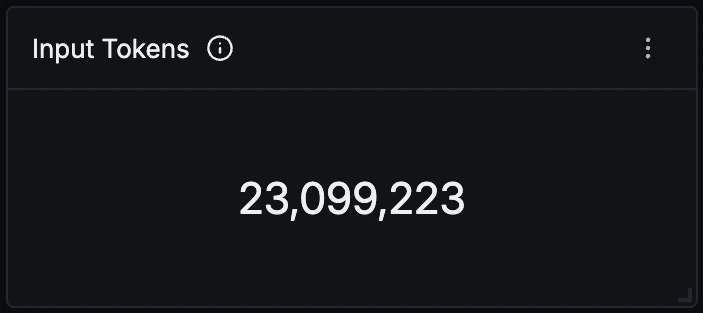

### Output Tokens

Total tokens the model generated. Expect this to sit one to two orders of magnitude below input, because Cursor resends the system prompt and workspace context on every turn. A ratio closer to parity usually means very short sessions rather than an efficiency win.

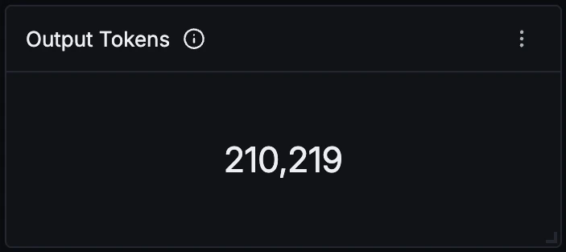

### Agent Turns

One count per `gen_ai.client.generation` span, so this counts prompts answered rather than sessions or tool calls. Read it next to Input Tokens to get the average context size per turn.

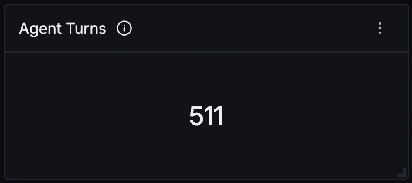

### Tool Failure Rate

Failed tool calls over all completed tool calls, counted from `PostToolUseFailure`. Counting span error status instead would roughly double the figure, because a single failure marks the `PreToolUse`, `PostToolUse` and failure spans alike. Turns red above 10 percent.

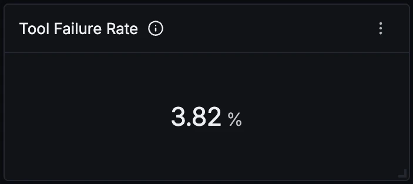

### Input Tokens Over Time

Charted apart from output because input is large enough that a shared axis flattens output to nothing. Sustained growth here without a matching rise in Agent Turns points at context bloat rather than more work getting done.

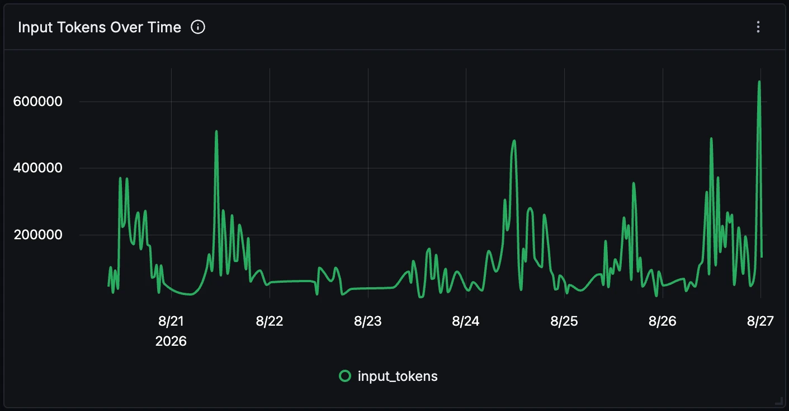

### Output Tokens Over Time

Output tokens per interval. Spikes correspond to long generated answers or large refactors, and this is the part of a turn that drives Turn Duration, since generation time scales with output rather than input.

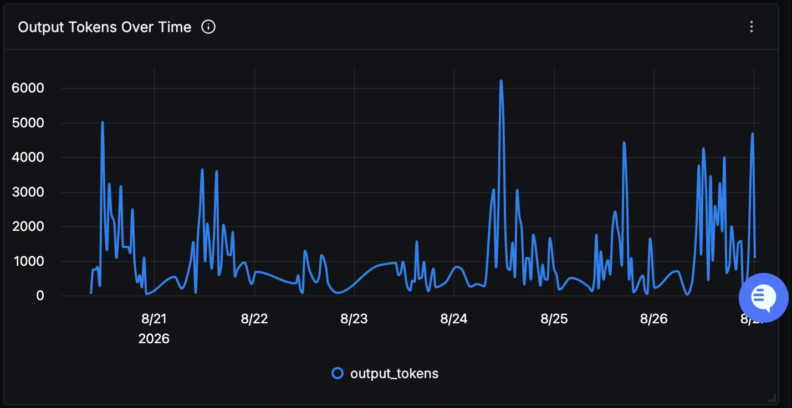

### Tokens by Model

Turns and token split per model. Cursor switches models within a single session, so this has to group at span level; grouping per session or per user would attribute all of a session's spend to whichever model happened to answer first.

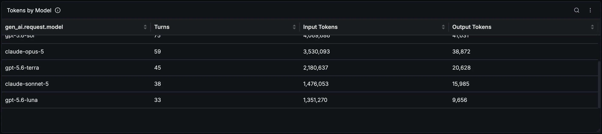

### Turn Duration

p50, p95 and p99 of the `gen_ai.client.generation` span, the only span that measures a complete turn. The `Stop` span is always 1 ms and is a marker rather than a measurement, so it is not used here. A widening p99 against a flat p50 usually means a few very long agent loops.

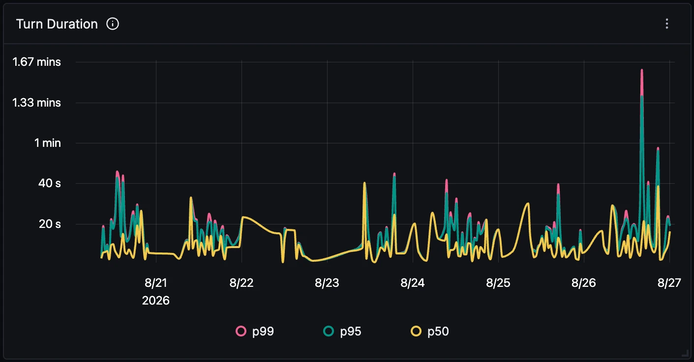

### Tool Latency p95 by Tool

p95 of `PostToolUse` spans per tool. Shell sitting well above the rest is the normal shape, since it waits on real commands, while Read and Glob hug the floor. Watch for a search tool climbing over time, which usually means the repository grew rather than the tool regressing.

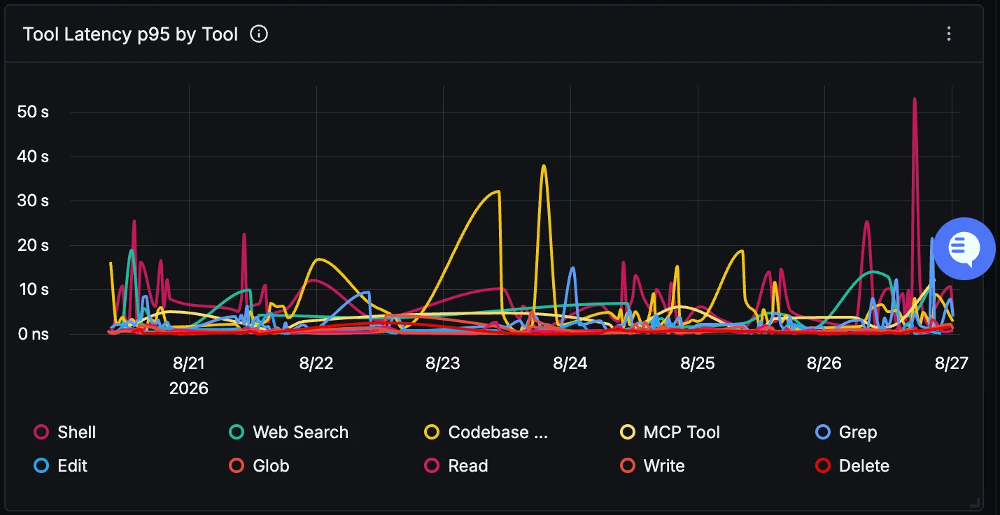

### Tool Call Distribution

Share of completed calls per tool. Search and read tools dominating is the normal shape for a coding agent. A high share of Write or Edit relative to Read is worth a look, since it suggests the agent is editing on less context than it should have gathered.

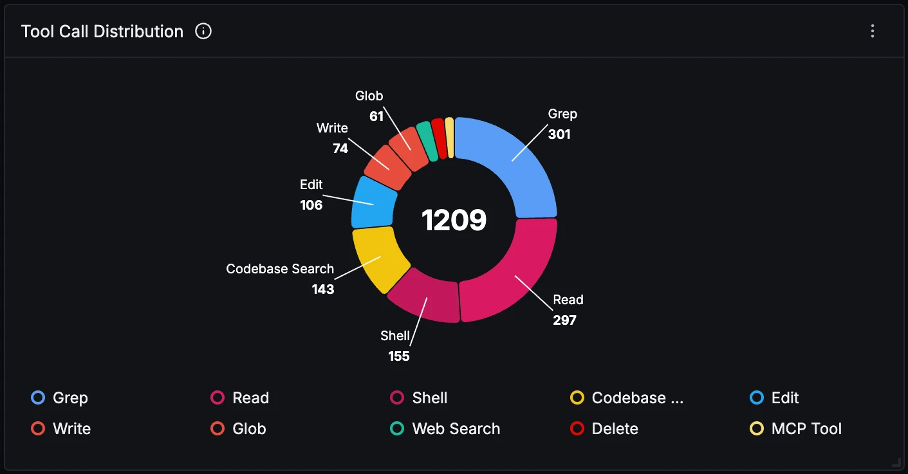

### Tool Calls Over Time

Completed calls per interval, split by tool. Most useful for spotting a window where one tool suddenly dominates, which is more often a retry loop than genuine work.

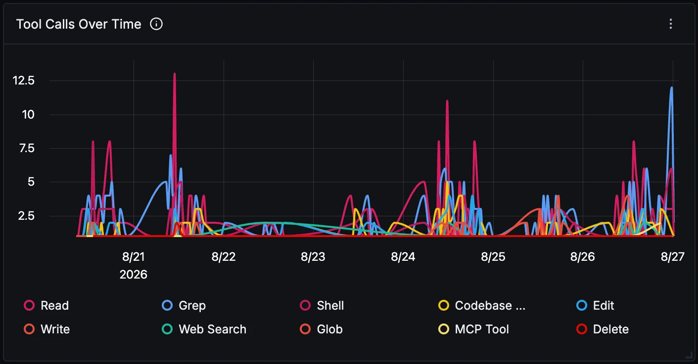

### Tool Performance

Call volume with average and p95 latency per tool. The gap between the two columns is the interesting part: a tool with a low average and a high p95 is occasionally blocking the agent for a long time, and that tail is invisible in the average alone.

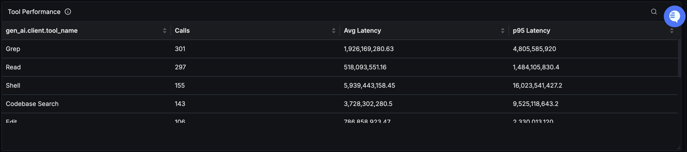

### Tool Failures Over Time

`PostToolUseFailure` events by tool. Expect a mostly empty chart with isolated spikes. A sustained line for one tool is usually a broken path or a command that no longer exists, rather than transient errors worth retrying.

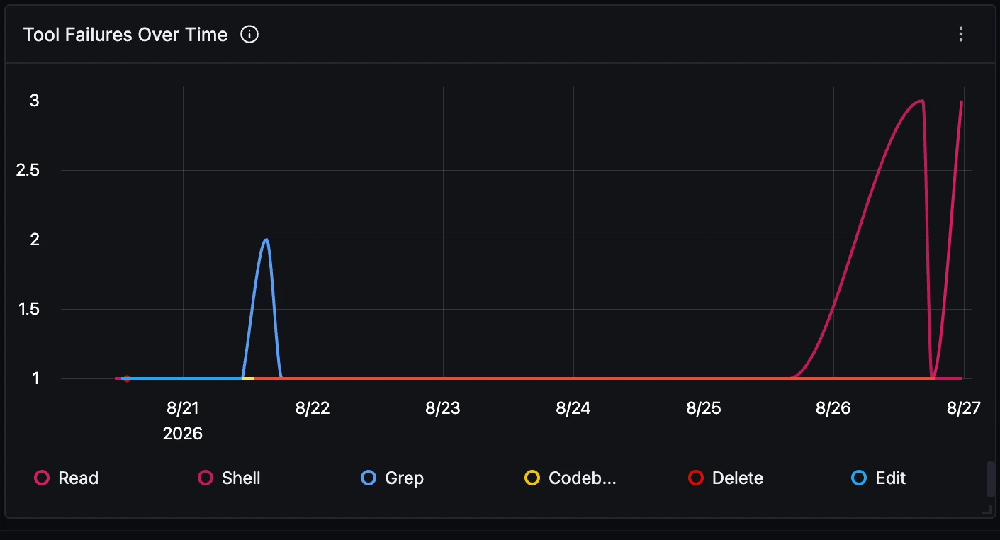

### Recent Tool Failures

The individual failed calls behind the rate, newest first, with tool, model, duration and repository. Rows can show `N/A` under repository: the hook resolves repository context once per session and does not always succeed, so those rows are missing attribution rather than running outside a repository.

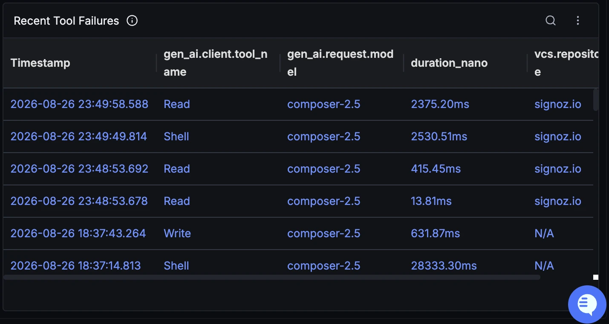
