# DeepSeek Harness Dashboard

## Details

This dashboard offers a clear view into DeepSeek Harness (`dsh`) usage and performance. It highlights key metrics such as token spend and cache efficiency, turn and session volume, model latency and time to first token, native and MCP tool activity, and error breakdown.

To start sending DeepSeek Harness telemetry to SigNoz, follow the [DeepSeek Harness observability guide](https://signoz.io/docs/deepseek-harness-observability/).

## Dashboard panels

### Sections

### Agent Turns

Every prompt-and-response cycle the harness completed. Subagent turns are included here, because a spawned subagent opens its own root span rather than nesting under its parent; the Activity panel breaks them out separately.

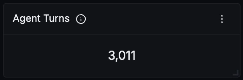

### Sessions

Distinct sessions. Read this next to Agent Turns to tell a lot of quick one-shot invocations apart from a few long working sessions. A subagent runs under its own session id and is tied back to its parent by `dsh.session.parent_id`.

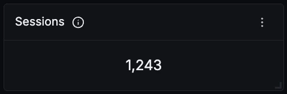

### Model Calls

One count per model call. Divided by Agent Turns, this tells you how many round trips the agent needs to finish a piece of work.

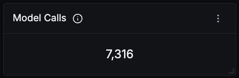

### Tool Calls

Every tool the agent executed, native and MCP together, which is a good proxy for how much real work is being delegated to it rather than just discussed.

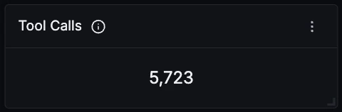

### Total Tokens

Total token spend across every model call. Scoped to `LLM` spans on purpose: the `invoke_agent` span repeats the sum of its own model calls, so an unscoped sum double counts exactly 2x.

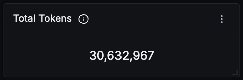

### Cache Hit Rate

Share of input tokens served from cache. On a long session this climbs quickly, since each turn replays the conversation so far. Read from `AGENT` spans, because `LLM` spans omit the cache attribute rather than setting it to zero on a miss, which would drop the cold calls out of the average and read high.

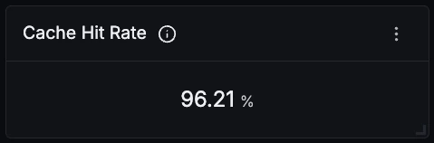

### Token Usage Over Time

Input, cached, and output tokens over time. Output stays low and flat on almost any real agent workload: most model calls are short decisions about which tool to run next, and only the final answer of a turn is long.

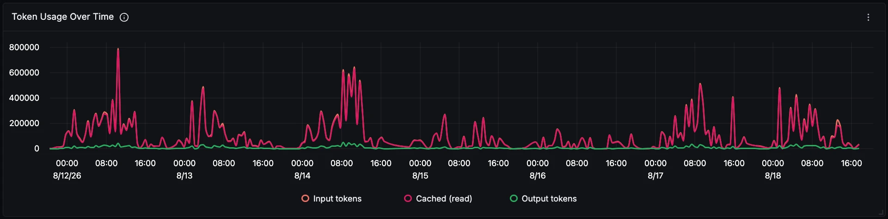

### Turn Outcomes

How turns actually finished, from `dsh.turn.end_reason`. A healthy setup is almost entirely `completed`; a rising `error` share points at the model provider rather than at tooling, since tool failures do not end a turn.

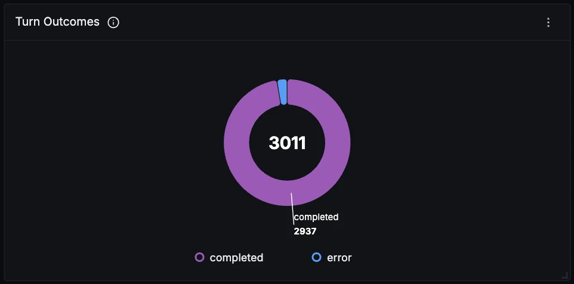

### Activity Over Time

Turns, model calls, tool calls, and subagent turns on one axis. The subagent line is worth watching on its own, because those turns are also counted in the turn total and can quietly inflate it.

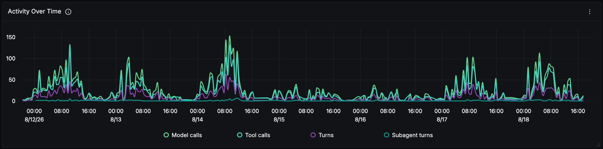

### Model Finish Reasons

Why each model call stopped. `tool_calls` dominating over `stop` is the normal shape for an agent: most calls end by reaching for a tool, and only the last call of a turn ends with a finished answer. Scoped to `LLM` spans, since on `AGENT` spans the same attribute holds the turn outcome instead.

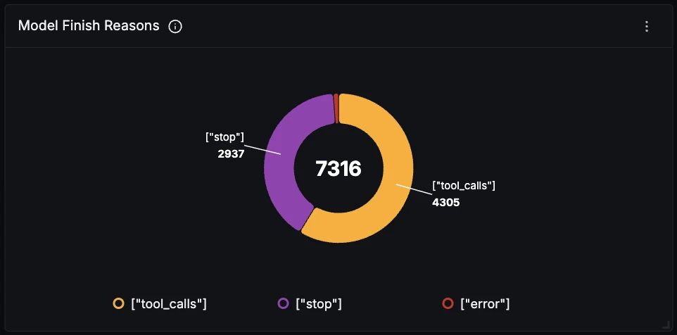

### Model Call Latency

p95 and p99 duration of model calls. This tracks output length more than anything else, so a rising p99 usually means longer answers rather than a slower provider. Check it against Time to First Token to tell the two apart.

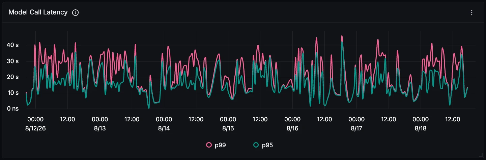

### Time to First Token

How long the model takes to start responding. Unlike total latency this is independent of answer length, so it is the honest measure of provider responsiveness and the one developers actually feel.

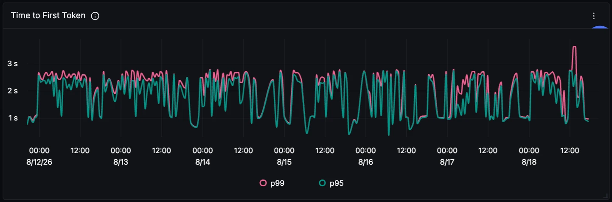

### Token Distribution by Model

Token spend per model. Useful for tracking migration between model versions and for spotting which model is actually carrying the workload, which is rarely the one you assume.

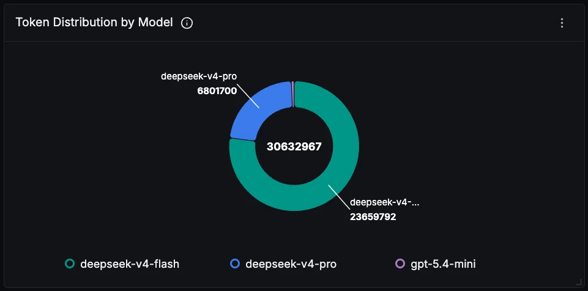

### Tool Call Distribution

Which tools the agent reaches for. Tools named `mcp__<server>__<tool>` come from an MCP server, and the name is the only thing that identifies them: no attribute distinguishes an MCP tool from a native one.

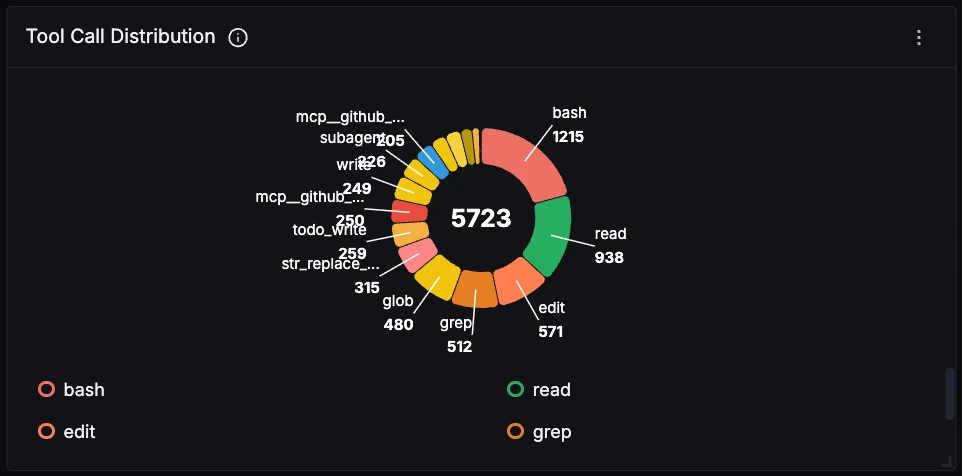

### Errors Over Time

Failed turns, model call errors, and reported tool errors together. Read the tool line with care: it only counts tools that report failure explicitly, so a shell command exiting non-zero still records a successful span and never appears here.

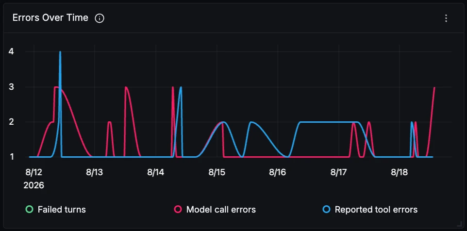

### Session Details

Token spend and model call count per session, sorted so the expensive ones surface first. Subagent sessions appear as their own rows, identifiable by a bare UUID where a top-level session id carries a `session-` prefix.

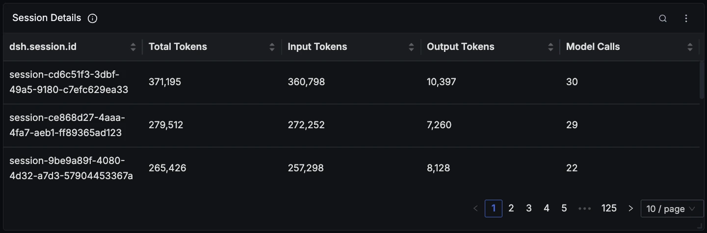

### Tool Performance

Call count and latency per tool. Slow tools are worth attention even when they never fail, since every second here is a second the model sits idle mid-turn and the developer sits watching.

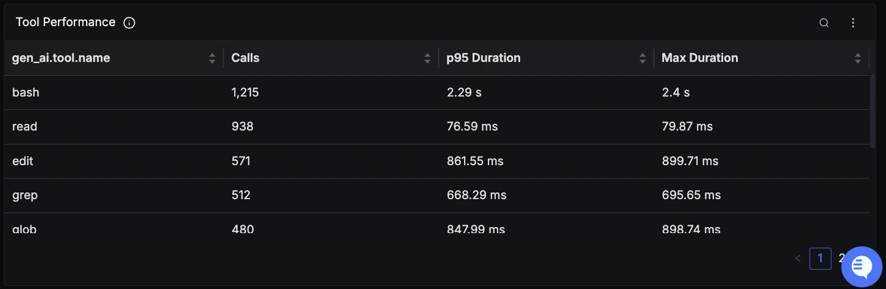
