# DSPy Dashboard

## Details

This dashboard monitors DSPy programs instrumented with `openinference-instrumentation-dspy`: module/chain/tool activity, LLM call volume and latency, per-model usage, and errors. It is built on DSPy-native OpenTelemetry span attributes (`openinference.span.kind`, `llm.model_name`), so every panel keys off the span kinds DSPy emits (CHAIN / LLM / TOOL). Use the `service_name` picker to filter to one or more DSPy services.

## Dashboard panels

### Sections

#### DSPy operations

Total instrumented DSPy spans (any span carrying `openinference.span.kind`) over the selected time range. A quick pulse on how much DSPy work is being driven.

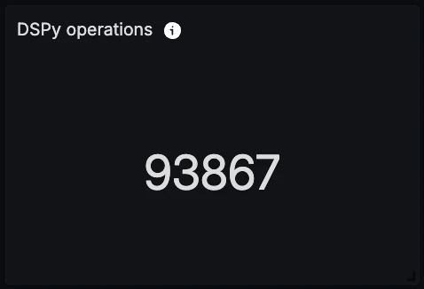

#### LLM calls

Count of `LM.__call__` spans, i.e. the actual model requests DSPy makes. Shows raw model-invocation volume.

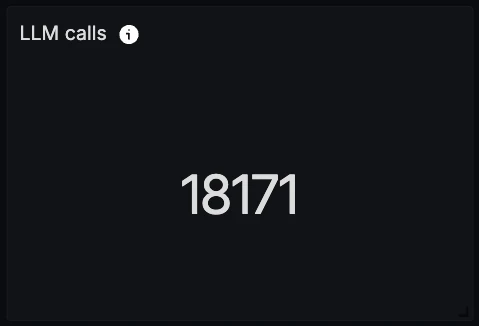

#### Tool calls

Count of TOOL spans (ReAct tool invocations). Shows how much tool activity the programs are driving.

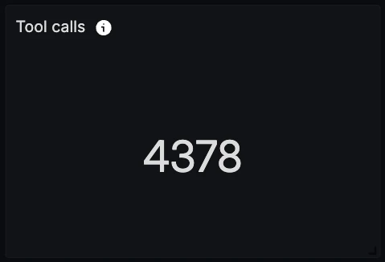

#### Error rate

The fraction of the selected DSPy services' spans that have an error status. An at-a-glance health signal.

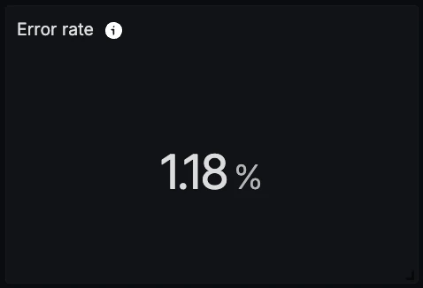

#### Avg LLM calls / program run

LLM spans divided by `dspy.program.run` root spans: the model-call fan-out per program run. Useful for spotting changes in how many model calls each run makes.

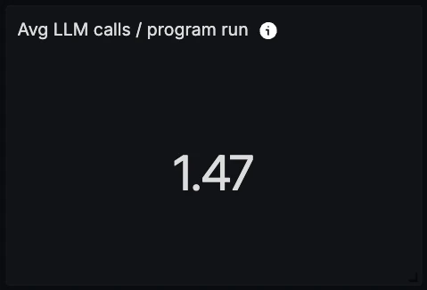

#### LLM latency (p95)

95th-percentile duration of `LM.__call__` spans. Surfaces the tail latency that shapes worst-case experience.

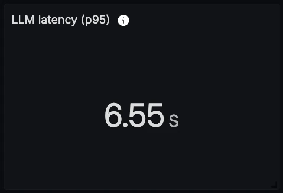

#### DSPy operations by span kind (over time)

CHAIN / LLM / TOOL activity over time. Reveals traffic patterns and which span kinds dominate.

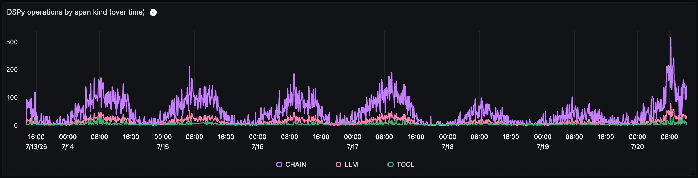

#### Span kind distribution

A pie chart showing each span kind's share of CHAIN / LLM / TOOL spans. Complements the trend graph with a clear share-of-activity view.

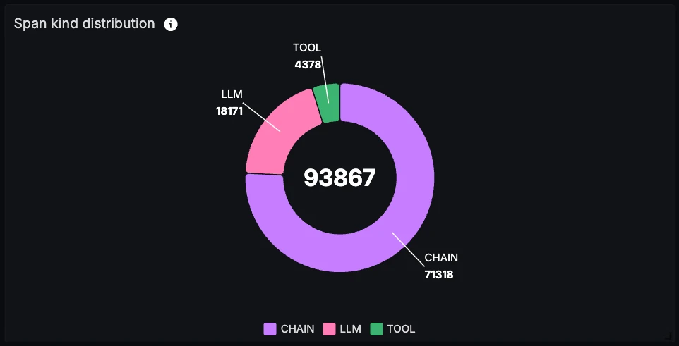

#### LLM calls by model (over time)

`LM.__call__` volume over time, grouped by `llm.model_name`. Shows which models drive the traffic and how it trends.

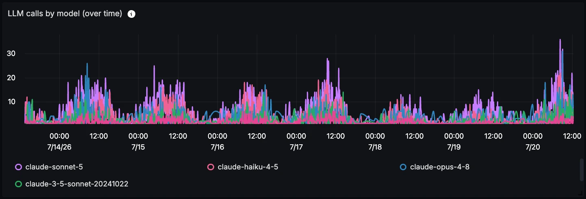

#### LLM latency percentiles (over time)

p50 / p90 / p99 of `LM.__call__` duration. Surfaces both typical performance and tail latency over time.

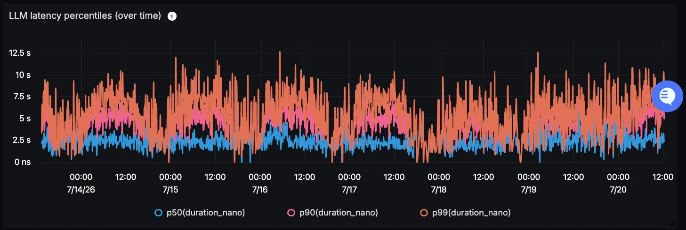

#### DSPy module breakdown

A table of CHAIN spans grouped by module/operation name, with call count and average latency. Gives a side-by-side comparison across the modules in a program.

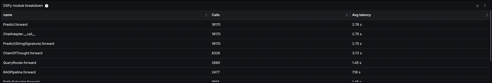

#### Model usage

A table of LLM spans grouped by model and provider. Shows how model usage is distributed across providers.

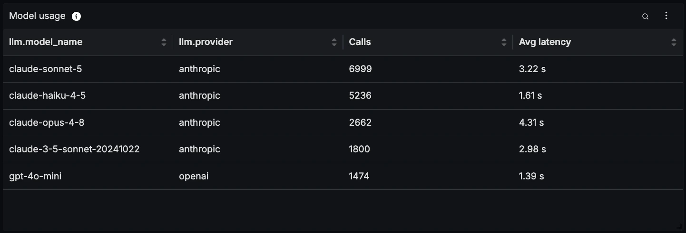

#### Tool usage

A table of TOOL spans grouped by tool name, with call count and average latency. Identifies which tools are used most and which are slowest.

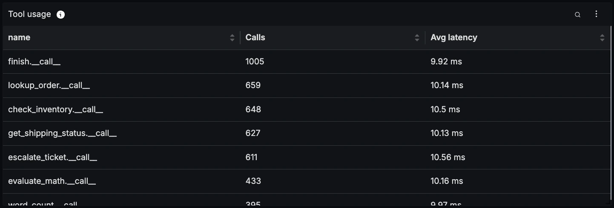

#### Recent DSPy operations

A list of the latest instrumented DSPy spans, ordered by timestamp descending. Useful for drilling into individual operations when investigating a latency spike.

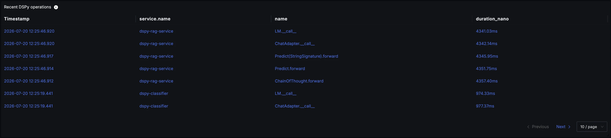

#### Errors

A list of recent errored spans across the selected DSPy services. Useful for jumping straight to failures when the error rate climbs.

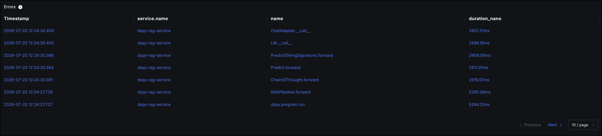
