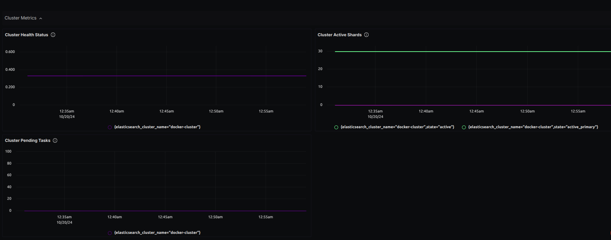

# Elasticsearch Monitoring Dashboard - OTLP

## Data Ingestion

### With OTLP Elasticsearch Receiver

- Update `otel-config.yaml` with the following:

Add elasticsearch receiver to the `receivers:` section:

```yaml
receivers:
  elasticsearch:
    nodes: ["_local"]
    indices: [".geoip_databases"]
    endpoint: http://localhost:9200
    username: <your-local-username>
    password: <your-local-password>
    collection_interval: 10s
```

Add elasticsearch receiver to the `pipelines:` section:

```yaml
service:
  pipelines:
    metrics:
      receivers: [elasticsearch]
```

Below is sample `otel-config.yaml` file with an elasticsearch instance:

```yaml
receivers:
  otlp:
    protocols:
      grpc:
        endpoint: 0.0.0.0:4317
      http:
        endpoint: 0.0.0.0:4318
  elasticsearch:
    nodes: ["_local"]
    indices: [".geoip_databases"]
    endpoint: http://localhost:9200
    username: local-username
    password: local-password
    collection_interval: 10s
processors:
  resource/env:
    attributes:
    - key: deployment.environment
      value: staging
      action: upsert
  batch:
    send_batch_size: 1000
    timeout: 10s
exporters:
  otlp:
    endpoint: "ingest.{region}.signoz.cloud:443" # replace {region} with your region if you are using signoz cloud, otherwise use localhost:4317 or wherever your collector is running
    tls:
      insecure: false
    headers:
      "signoz-access-token": "{signoz-token}" # Obtain from https://{your-signoz-url}/settings/ingestion-settings (signoz-token is only required for signoz cloud)
  logging:
    verbosity: detailed
service:
  telemetry:
    metrics:
      address: localhost:8888
  pipelines:
    metrics:
      receivers: [otlp, elasticsearch]
      processors: [resource/env, batch]
      exporters: [otlp]
```

## Dashboard panels

## Variables

- `{{deployment_environment}}`: Deployment environment
- `{{elasticsearch_node_name}}`: Elasticsearch node name
- `{{elasticsearch_cluster_name}}`: Elasticsearch cluster name

### Sections

- Node Metrics
  - Node Disk Free - `elasticsearch_node_fs_disk_free`
  - Node Disk Available - `elasticsearch_node_fs_disk_available`
  - Node CPU Usage - `elasticsearch_os_cpu_usage`
  - Node JVM Memory Usage - `jvm_memory_used`
  - Node Heap Memory Usage - `jvm_memory_heap_used`
  - Screenshot of Node Metrics Section - 
- Cluster Health Metrics
  - Cluster Health Status - `elasticsearch_cluster_health`
  - Cluster Active Shards - `elasticsearch_cluster_shards`
  - Cluster Pending Tasks - `elasticsearch_cluster_pending_tasks`
  - Screenshot of Cluster Health Metrics Section - 
- Index Metrics
  - Index Document Count - `elasticsearch_index_documents`
- Cache Metrics
  - Cache Evictions - `elasticsearch_node_cache_evictions`