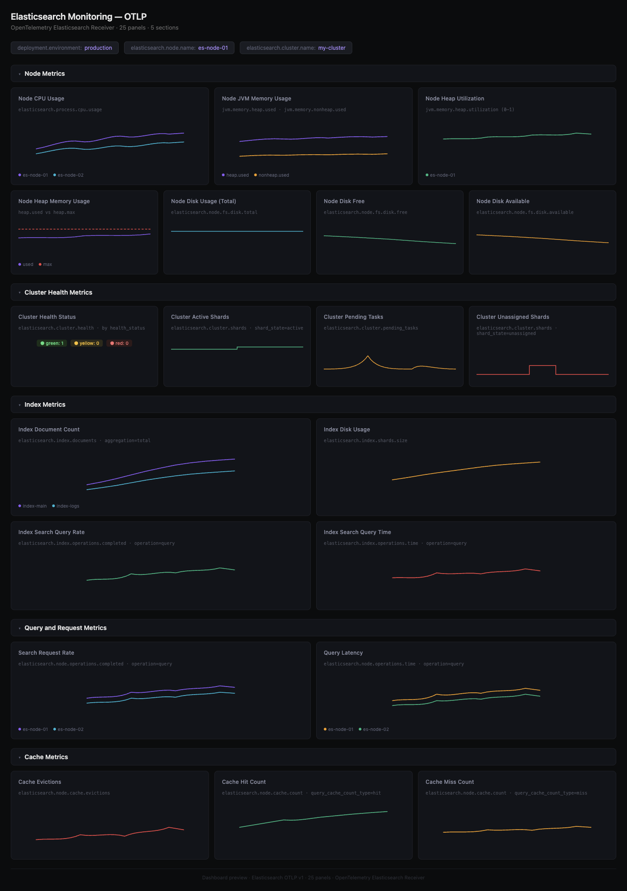

# Elasticsearch Dashboard - OTLP

## Dashboard Preview



## Metrics Ingestion

This dashboard uses metrics from the [OpenTelemetry Elasticsearch receiver](https://github.com/open-telemetry/opentelemetry-collector-contrib/tree/main/receiver/elasticsearchreceiver).

Add the Elasticsearch receiver to your `otel-config.yaml`:

```yaml
receivers:
  elasticsearch:
    endpoint: http://localhost:9200
    collection_interval: 30s

processors:
  resource/env:
    attributes:
    - key: deployment.environment
      value: staging
      action: upsert

exporters:
  otlp:
    endpoint: "<signoz-otel-collector-endpoint>:4317"
    tls:
      insecure: true

service:
  pipelines:
    metrics:
      receivers: [elasticsearch]
      processors: [resource/env]
      exporters: [otlp]
```

## Variables

- `{{deployment.environment}}`: Deployment environment
- `{{elasticsearch.node.name}}`: Elasticsearch node name
- `{{elasticsearch.cluster.name}}`: Elasticsearch cluster name

## Dashboard Panels

### Section: Node Metrics
- **Node CPU Usage** - CPU usage percentage of each Elasticsearch node (`elasticsearch.process.cpu.usage`)
- **Node JVM Memory Usage** - JVM heap and non-heap memory usage per node (`jvm.memory.heap.used`, `jvm.memory.nonheap.used`)
- **Node Heap Memory Usage** - Heap memory used vs max per node (`jvm.memory.heap.used`, `jvm.memory.heap.max`)
- **Node Heap Utilization** - Fraction of heap memory in use (`jvm.memory.heap.utilization`)
- **Node Disk Usage (Total)** - Total disk space across file stores (`elasticsearch.node.fs.disk.total`)
- **Node Disk Free** - Free (unallocated) disk space (`elasticsearch.node.fs.disk.free`)
- **Node Disk Available** - Disk space available to the JVM (`elasticsearch.node.fs.disk.available`)

### Section: Cluster Health Metrics
- **Cluster Health Status** - Overall cluster health by health_status (green/yellow/red) (`elasticsearch.cluster.health`)
- **Cluster Active Shards** - Number of active shards (`elasticsearch.cluster.shards` filtered by shard_state=active)
- **Cluster Pending Tasks** - Pending cluster-level changes (`elasticsearch.cluster.pending_tasks`)
- **Cluster Unassigned Shards** - Unassigned shards (`elasticsearch.cluster.shards` filtered by shard_state=unassigned)

### Section: Index Metrics
- **Index Document Count** - Total documents across indices (`elasticsearch.index.documents`)
- **Index Disk Usage** - Size of shards per index (`elasticsearch.index.shards.size`)
- **Index Search Query Rate** - Rate of search query operations (`elasticsearch.index.operations.completed` filtered by operation=query)
- **Index Search Query Time** - Time spent on search queries (`elasticsearch.index.operations.time` filtered by operation=query)

### Section: Query and Request Metrics
- **Search Request Rate** - Rate of query operations per node (`elasticsearch.node.operations.completed` filtered by operation=query)
- **Query Latency** - Time spent on query operations per node (`elasticsearch.node.operations.time` filtered by operation=query)

### Section: Cache Metrics
- **Cache Evictions** - Rate of cache evictions per node (`elasticsearch.node.cache.evictions`)
- **Cache Hit Count** - Query cache hits per node (`elasticsearch.node.cache.count` filtered by query_cache_count_type=hit)
- **Cache Miss Count** - Query cache misses per node (`elasticsearch.node.cache.count` filtered by query_cache_count_type=miss)
