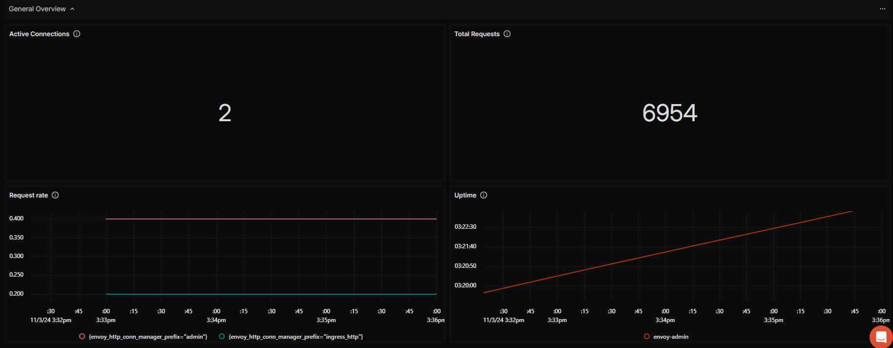
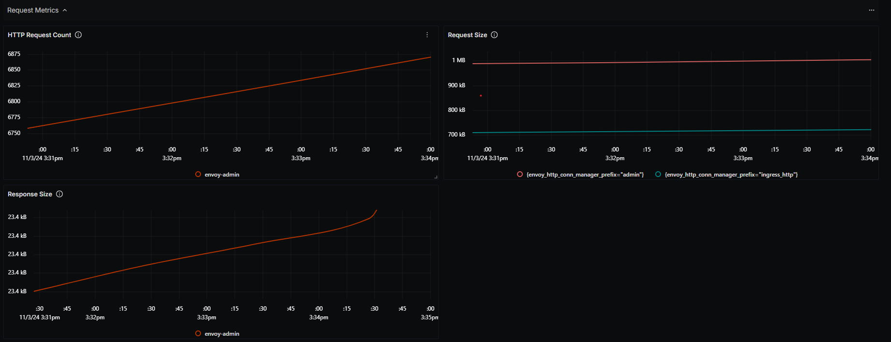
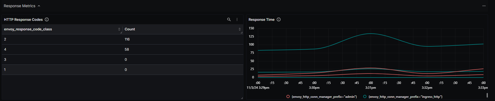
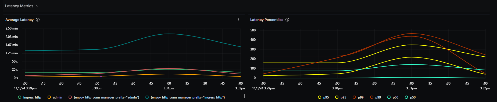
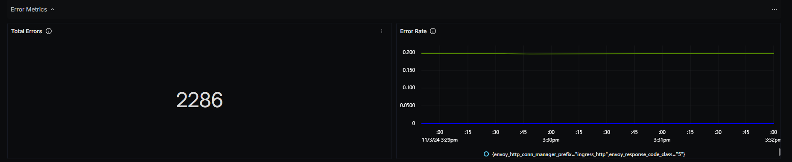
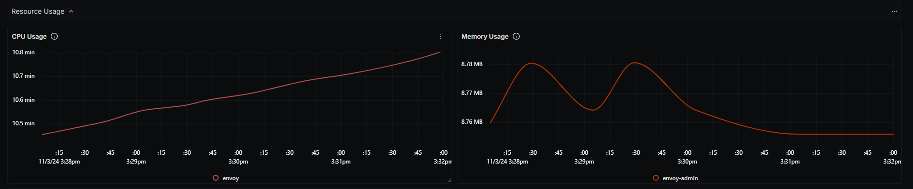
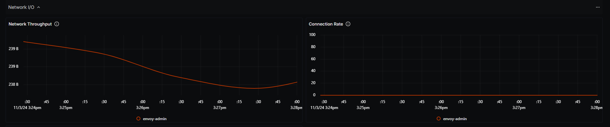
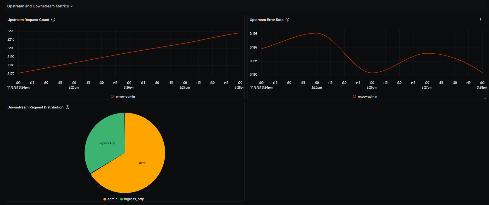

# Envoy-Monitoring Dashboard - Prometheus

## Metrics Ingestion

### Prerequisites

> **Note:**
> A running Kubernetes Cluster is required (local or cloud). On local, you can
> install it on Minikube or any other cluster manager tool.

1. Install Envoy using helm 

```bash
    helm repo add slamdev https://slamdev.github.io/helm-charts
    helm repo update
    helm install envoy slamdev/envoy --version 0.0.16

```

2. Start your local Kubernetes node.

```bash
    minikube start
```

### Install Custom OpenTelemetry Collector For SigNoz

To ingest metrics for the **Envoy Dashboard - Prometheus**, create a `otel-config.yaml` configuration file and follow the steps below:

1. **Set up Prometheus Receiver:**
   - Define a `prometheus` receiver to collect metrics.
   - Specify `scrape_configs` to target envoy services in Kubernetes.

   ```yaml
   receivers:
     prometheus:
       config:
         scrape_configs:
           - job_name: 'envoy-admin'
             scrape_interval: 5s
             metrics_path: /stats/prometheus
             static_configs:
               - targets: ['envoy-admin.default.svc.cluster.local:80']
           - job_name: 'envoy'
             scrape_interval: 5s
             static_configs:
               - targets: ['envoy.default.svc.cluster.local:80']
   ```


2. **Configure Processors:**
   - Use `batch` to group metrics and `filter` to specify included metric names.

   ```yaml
   processors:
     batch:
       timeout: 10s
       send_batch_size: 1000
     filter:
       metrics:
         include:
           match_type: regexp
           metric_names:
             - "envoy_.*"
   ```

3. **Set Up OTLP Exporter with Access Token:**
   - Define the `otlp` exporter with the endpoint `ingest.in.signoz.cloud:443`.
   - Store the access token in a Kubernetes secret named `signoz-token`.
   - Load the secret into the environment using `extraEnvs`, which allows the collector to access the `SIGNOZ_ACCESS_TOKEN` during deployment.

   ```yaml
   exporters:
     otlp:
       endpoint: "ingest.{region}.signoz.cloud:443"
       headers:
         "signoz-access-token": "${SIGNOZ_ACCESS_TOKEN}"
       tls:
         insecure: false
   ```

   ```yaml
   extraEnvs:
     - name: SIGNOZ_ACCESS_TOKEN
       valueFrom:
         secretKeyRef:
           name: signoz-token
           key: access-token
   ```

5. **Define the Metrics Pipeline:**
   - Link `prometheus` as the receiver, `filter` and `batch` as processors, and `otlp` as the exporter.

   ```yaml
   service:
     pipelines:
       metrics:
         receivers: [prometheus]
         processors: [filter, batch]
         exporters: [otlp]
   ```

> [!Note]
> - **Local Deployment:** The setup has been deployed locally using a single-cluster configuration.
> - **Multi-Cluster Support:** You can extend this setup to support a multi-cluster environment if needed.

### Full Configuration

Below is the complete configuration file (`otel-config.yaml`):

```yaml
apiVersion: v1
kind: ConfigMap
metadata:
  name: otelcontribcol
  labels:
    app: otelcontribcol
data:
  config.yaml: |
    receivers:
      prometheus:
        config:
          scrape_configs:
            - job_name: 'envoy-admin'
              scrape_interval: 5s
              metrics_path: /stats/prometheus
              static_configs:
                - targets: ['envoy-admin.default.svc.cluster.local:80']
              metric_relabel_configs:
                - source_labels: [__name__]
                  target_label: service
                  replacement: 'envoy-admin'
            - job_name: 'envoy'
              scrape_interval: 5s
              static_configs:
                - targets: ['envoy.default.svc.cluster.local:80']
              metric_relabel_configs:
                - source_labels: [__name__]
                  target_label: service
                  replacement: 'envoy'

  processors:
    batch:
      timeout: 10s
      send_batch_size: 1000
    filter:
      metrics:
        include:
          match_type: regexp
          metric_names:
            - "envoy_.*"

  exporters:
    otlp:
      endpoint: "ingest.in.signoz.cloud:443"
      headers:
        "signoz-access-token": "${SIGNOZ_ACCESS_TOKEN}"
      tls:
        insecure: false

  service:
    telemetry:
      logs:
        level: "debug"
    pipelines:
      metrics:
        receivers: [prometheus]
        processors: [filter, batch]
        exporters: [otlp]

resources:
  requests:
    memory: "512Mi"
    cpu: "250m"
  limits:
    memory: "1Gi"
    cpu: "500m"

extraEnvs:
  - name: SIGNOZ_ACCESS_TOKEN
    valueFrom:
      secretKeyRef:
        name: signoz-token
        key: access-token
```

This setup securely collects and exports metrics with the access token loaded via `extraEnvs`.

## Variables

- `{{namespace}}`: Filters metrics based on the Kubernetes namespace where envoy is deployed.
- `{{service_name}}`: Select specific services within the envoy to filter metrics.  
- `{{cluster}}`: For multi-cluster setups, filters metrics based on the Kubernetes cluster.
- `{{deployment_environment}}`: Specifies the deployment environment (e.g., `staging`, `production`).

## Sections

### General Overview

This section provides a high-level overview of Envoy's health and performance metrics, allowing for a quick assessment of the system's current state.

- Active Connections - `sum(envoy_http_downstream_cx_active)`
- Total Requests - `sum(envoy_http_downstream_rq_total)`
- Request Rate - `sum(rate(envoy_http_downstream_rq_total[5m])) by (envoy_http_conn_manager_prefix)`
- Uptime - `envoy_server_uptime`



### Request Metrics

This section focuses on metrics related to the handling of requests by Envoy, providing insights into traffic volume and request processing.

- HTTP Request Count - `sum(envoy_http_downstream_rq_total)`
- Request Size - `sum(envoy_http_downstream_cx_rx_bytes_total ) by (envoy_http_conn_manager_prefix)` 
- Response Size - `sum(envoy_http_downstream_cx_tx_bytes_total) / sum(envoy_http_downstream_rq_total)`



### Response Metrics
This section provides detailed metrics on the responses generated by Envoy, including status codes and response times.

- HTTP Response Codes - `envoy_http_downstream_rq_xx` 
- Response Time - `envoy_http_downstream_rq_time_sum`
- Response Time Histogram - `histogram_quantile(0.95, sum(rate(envoy_http_request_duration_seconds_bucket[5m])) by (le))` 



### Latency Metrics

This section monitors the latency of requests processed by Envoy, helping to ensure optimal performance and user experience.

- Average Latency - `envoy_http_downstream_rq_time_sum / envoy_http_downstream_rq_time_count`
- Latency Percentiles - `envoy_http_downstream_rq_time_bucket`



### Error Metrics

This section monitors errors and failures within Envoy operations, aiding in the troubleshooting and resolution of issues.

 - Total Errors - `sum(envoy_http_downstream_rq_xx{envoy_response_code_class   = "4"}) + sum(envoy_http_downstream_rq_xx{envoy_response_code_class   = "5"})`
 - Error Rate - `sum(rate(envoy_http_downstream_rq_xx{envoy_response_code_class=~"4|5"}[5m])) by (envoy_response_code_class, envoy_http_conn_manager_prefix)`

 

### Resource Usage

This section provides insights into the resource consumption of Envoy, helping ensure it operates efficiently within the infrastructure.

- CPU Usage - `process_cpu_seconds_total` (Filter: `process = envoy`)
- Memory Usage - `envoy_server_memory_allocated`



### Network I/O

This section provides insights into the network performance of Envoy, monitoring data throughput and connection metrics.

- Network Throughput - `sum(rate(envoy_cluster_upstream_cx_tx_bytes_total[5m]) + rate(envoy_cluster_upstream_cx_rx_bytes_total[5m]))`
- Connection Rate - `rate(envoy_cluster_upstream_cx_total[5m])`
- Rejected Connections - `sum(envoy_cluster_upstream_cx_connect_fail) + sum(envoy_cluster_upstream_cx_connect_timeout)`



### Upstream and Downstream Metrics

This section tracks metrics related to upstream and downstream services, providing visibility into service interactions and dependencies.

- Upstream Request Count - `envoy_cluster_upstream_rq_total{service_name = "$service_name"}`
- Upstream Error Rate - `rate(envoy_cluster_upstream_rq_xx{envoy_response_code_class="4"}[1m])`
- Downstream Request Distribution - `envoy_http_downstream_rq_total`

