# Eve Dashboard

## Details

This dashboard offers a clear view into agents built on eve, Vercel's agent framework. It highlights turns, conversations, and model calls, token usage per model and per agent, latency percentiles for calls and turns, tool, subagent, and provider-tool activity, turn outcomes, and errors by type.

To start sending eve telemetry to SigNoz, follow the [Eve observability guide](https://signoz.io/docs/eve-observability/).

## Dashboard panels

### Sections

### Turns

Agent turns, counted from `invoke_agent` spans. eve starts a new trace for every turn, and a subagent's turn is its own trace linked to the caller, so subagent turns count here too.

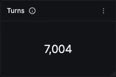

### Conversations

Distinct sessions, from `gen_ai.conversation.id`. A subagent shares its caller's session, and `/new` in the dev TUI keeps the same id, so a long session with several topics still counts once.

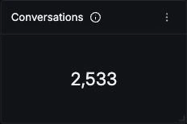

### LLM Calls

Model calls across every agent, from `chat` spans. Read it against Turns: close to two calls per turn is normal for a tool-using agent (one call that requests tools, one that answers).

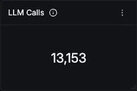

### Input Tokens

Prompt tokens, summed over `chat` spans only. eve reports the same usage on `chat`, `agent.step`, and `invoke_agent`, so a query that sums every span triples the figure. Cache reads are included in this number.

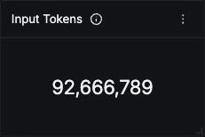

### Output Tokens

Completion tokens, summed over `chat` spans only, for the same reason as Input Tokens.

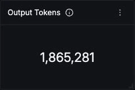

### Turn Failure Rate

Share of turns where `agent.turn.outcome` is `failed`. This reads the outcome attribute rather than span status, because a cancelled turn marks its children as errors and a failed tool call leaves the turn clean.

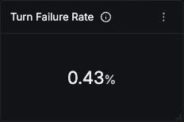

### Token Usage Over Time

Input, output, and cache-read tokens over time. Input dominates because every step resends the conversation and tool results. Cache reads are a subset of input and cover most of it on long sessions, so a widening gap between the two lines is a caching regression worth checking.

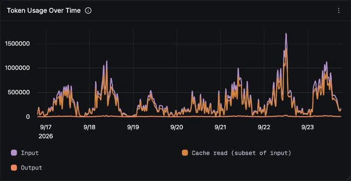

### LLM Calls by Model

Call volume per `gen_ai.response.model`, which carries the dated snapshot the provider served. A silent model upgrade shows up as a new series here.

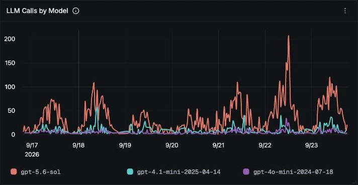

### Tokens by Model

Calls, input, output, and cache-read tokens per served model and `gen_ai.provider.name`. The provider reads `openai.responses` for eve's `openai()` helper and `gateway` for AI Gateway model strings, which is how to spot traffic that moved to the Gateway.

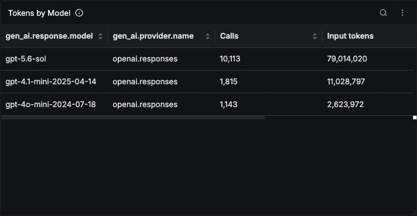

### Tokens by Agent

Turns and tokens per agent, read from `invoke_agent` spans. Subagents appear as their own rows because their usage is reported on their own turn and is not rolled into the caller, so add a subagent's row to its caller's to get the full cost of a request.

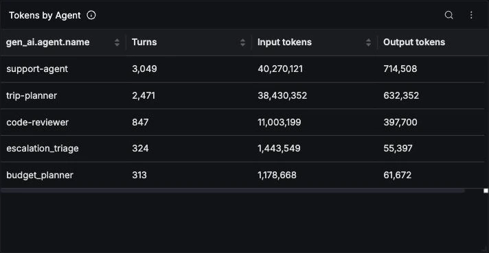

### LLM Call Latency

p50, p95, and p99 of `chat` span duration. A p99 that spikes while p50 stays flat usually means rate-limit retries on a few calls rather than a slower model.

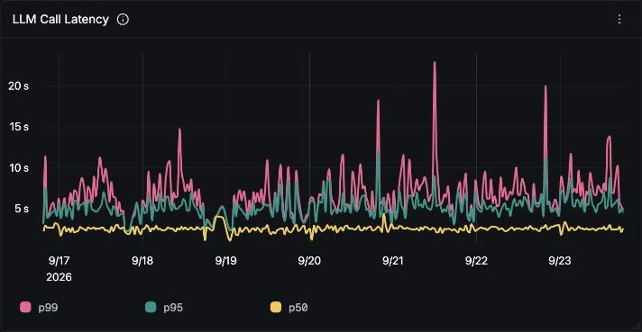

### Turn Latency (p95)

p95 end-to-end turn duration per agent, including every model step, tool call, and subagent dispatch. Compare each agent to its own baseline: agents with slow tools or subagents sit well above chat-only ones.

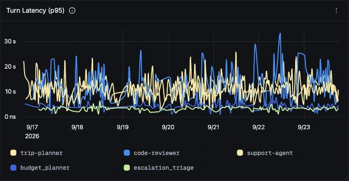

### Model Steps per Turn

Average `agent.step` spans per turn. Each tool round trip adds a step, so a line drifting upward means agents need more tool calls to answer.

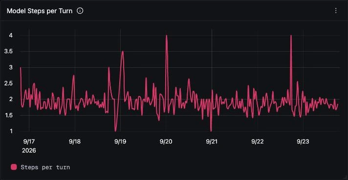

### Finish Reasons

Why each model call ended. A near-even split between `tool-calls` and `stop` is the normal shape for tool-using agents. A growing `length` slice means responses are being cut off at the token limit.

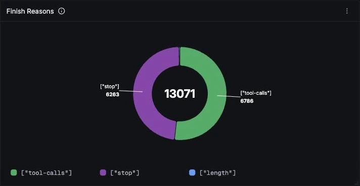

### Agents

Turns, failed turns, cancelled turns, and average latency per agent, all from `agent.turn.outcome`. Cancelled turns come from a user pressing Escape, so a high count points at slow answers rather than broken code.

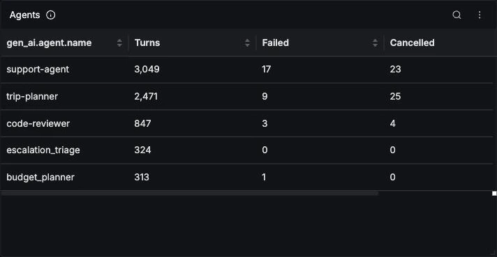

### Tools

Calls, failures, and average latency per authored tool, from `execute_tool` spans. A tool failure does not fail the turn, because the model sees the error and recovers, so this table is where a flaky backend shows up.

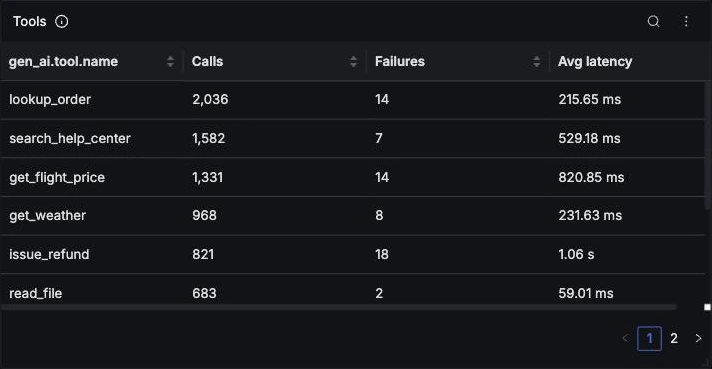

### Tool Calls Over Time

Authored tool invocations per tool. A sustained climb on one tool without a matching rise in Turns is the usual early sign of an agent looping on a tool instead of answering.

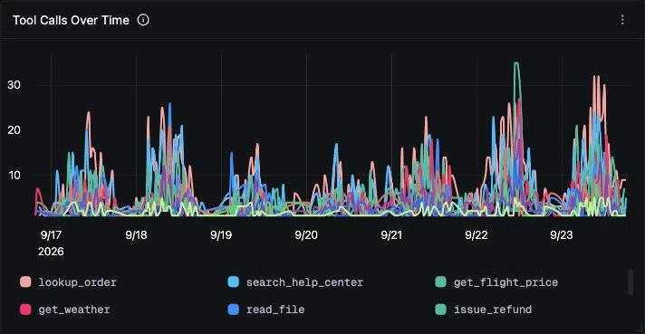

### Actions by Kind

Every action the model took, from `agent.action` spans, split by `agent.action.kind` into tool calls and subagent calls. Provider-executed tools such as OpenAI `web_search` have no `execute_tool` span, so this is the only panel that counts them. Sort or page the table to reach the subagent rows.

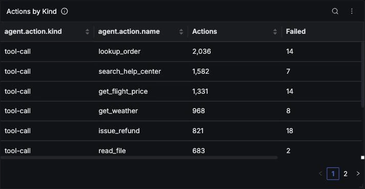

### Turn Outcomes

Turns over time by outcome: completed, failed, and cancelled. Failures and cancellations should stay a thin band under completed. Model failures that exhaust their retries are what fail a turn, so a rising failed band usually traces back to rate limits or provider errors in LLM Error Rate.

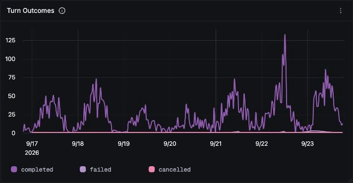

### Errors by Type

Errored agent spans by `error.type` and operation. A model failure appears as `AI_RetryError` on both `chat` and `agent.step`, and a failed tool as `Error` on `execute_tool` plus `ACTION_RESULT_FAILED` on its `agent.action`, so read the chart per operation rather than summing it.

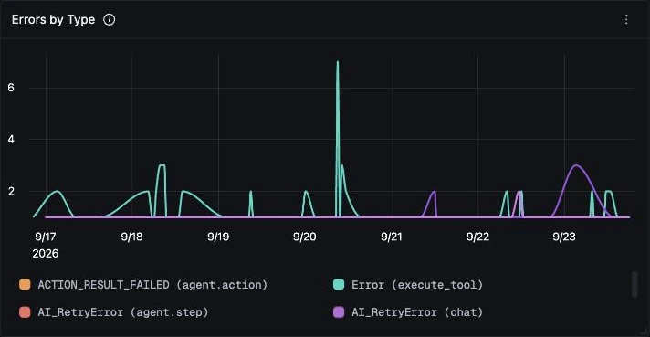

### Tool Error Rate

Share of authored tool executions that threw. The agent usually recovers and still answers, which is why this rate needs its own panel.

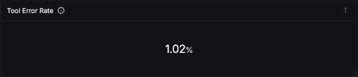

### LLM Error Rate

Share of model calls that failed after retries. Cancellations are excluded: eve marks a cancelled call as `TurnCancelledError`, which would otherwise inflate this rate every time a user presses Escape.

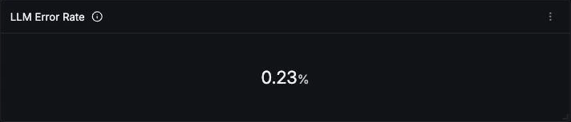

### Recent Errors

The latest errored agent spans with their error class, message, and service. A failed tool shows as an `execute_tool` row followed by its `agent.action` at the same timestamp, and a model failure as a `chat` row followed by its `agent.step`.

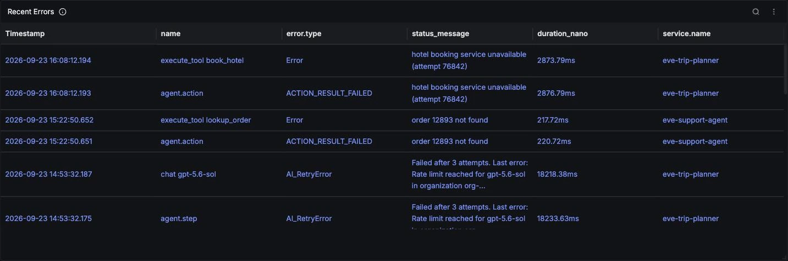
