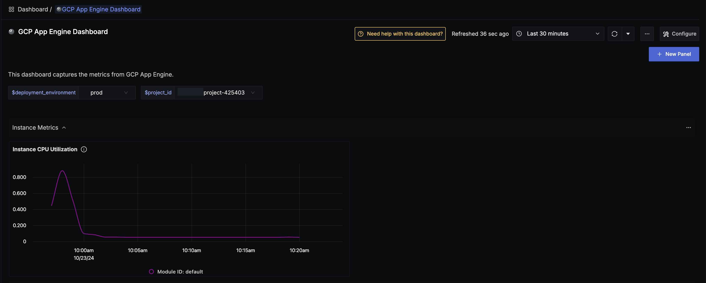
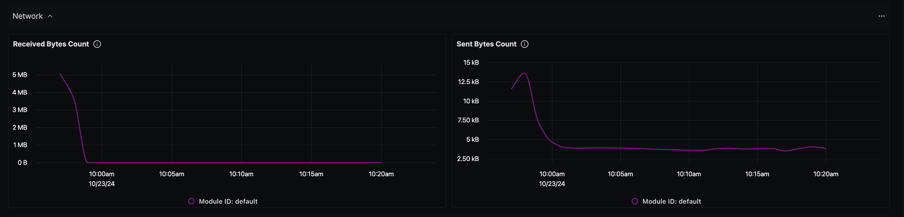
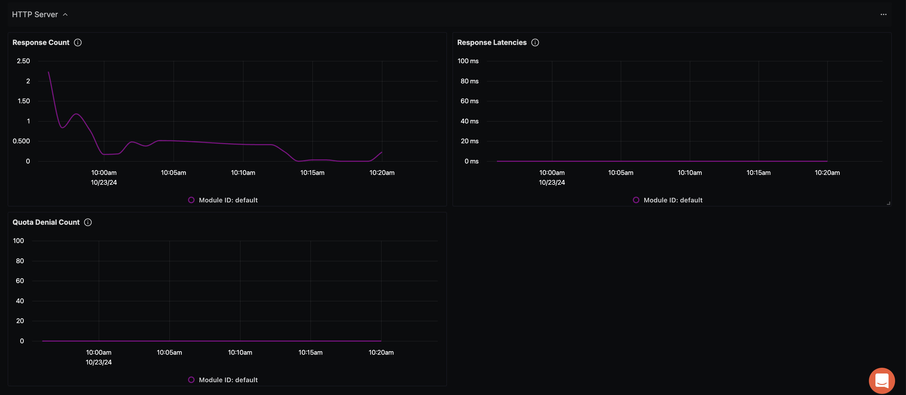

# GCP App Engine Dashboard - OTLP

## Data Ingestion

### Integrate GCP App Engine with OpenTelemetry Collector and SigNoz

Follow the instructions [here](https://signoz.io/docs/gcp-monitoring/app-engine/metrics/) about integrating OpenTelemetry with GCP App Engine.

## Dashboard panels

## Variables

- `{{deployment_environment}}`: The deployment.environment for the service.
- `{{project_id}}`: GCP Project ID

### Sections

- Instance Metrics
  - Instance CPU Utilization - `appengine_googleapis_com_flex_instance_cpu_utilization`
  - Screenshot of Instance Metrics Section - 
- Network Section
  - Received Bytes Count - `appengine_googleapis_com_flex_instance_network_received_bytes_count`
  - Sent Bytes Count - `appengine_googleapis_com_flex_instance_network_sent_bytes_count`
  - Screenshot of Network Section - 
- HTTP Server Section
  - Response Count - `appengine_googleapis_com_http_server_response_count`
  - Response Latencies - `appengine_googleapis_com_http_server_response_latencies`
  - Quota Denial Count - `appengine_googleapis_com_http_server_quota_denial_count`
  - Screenshot of HTTP Server Section - 
