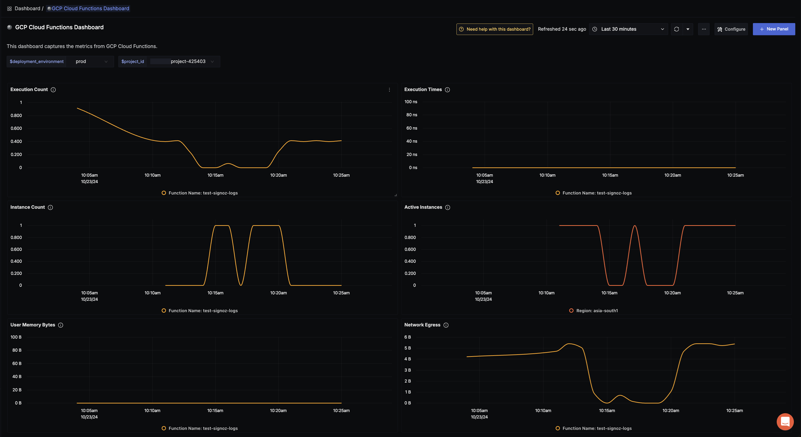

# GCP Cloud Functions Dashboard - OTLP

## Data Ingestion

### Integrate GCP Cloud Functions with OpenTelemetry Collector and SigNoz

Follow the instructions [here](https://signoz.io/docs/gcp-monitoring/gcp-fns/fns-metrics/) about integrating OpenTelemetry with GCP Cloud Functions.

## Dashboard panels

## Variables

- `{{deployment_environment}}`: The deployment.environment for the service.
- `{{project_id}}`: GCP Project ID

### Sections

- Execution Count - `cloudfunctions_googleapis_com_function_execution_count`
- Execution Times - `cloudfunctions_googleapis_com_function_execution_times`
- Instance Count - `cloudfunctions_googleapis_com_function_instance_count`
- Active Instances - `cloudfunctions_googleapis_com_function_active_instances`
- User Memory Bytes - `cloudfunctions_googleapis_com_function_user_memory_bytes`
- Network Egress - `cloudfunctions_googleapis_com_function_network_egress`
- Screenshot of GCP Cloud Functions Dashboard - 
