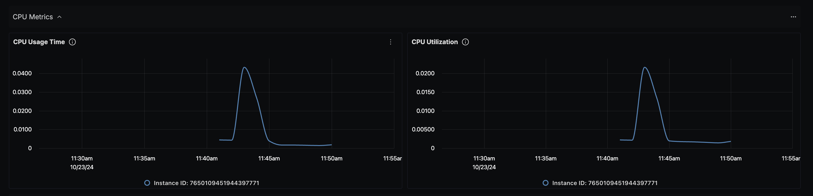
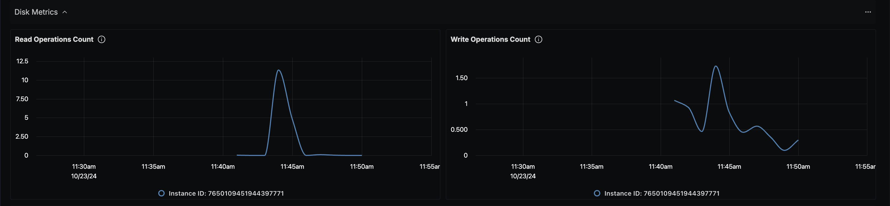
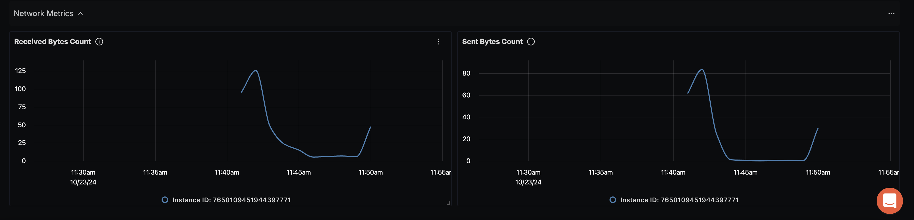

# GCP Compute Engine Dashboard - OTLP

## Data Ingestion

### Integrate GCP Compute Engine with OpenTelemetry Collector and SigNoz

Follow the instructions [here](https://signoz.io/docs/gcp-monitoring/compute-engine/metrics/) about integrating OpenTelemetry with GCP Compute Engine.

## Dashboard panels

## Variables

- `{{deployment_environment}}`: The deployment.environment for the service.
- `{{project_id}}`: GCP Project ID

### Sections

- CPU Metrics Section
  - CPU Usage Time - `compute_googleapis_com_instance_cpu_usage_time`
  - CPU Utilization - `compute_googleapis_com_instance_cpu_utilization`
  - Screenshot of CPU Metrics Section - 
- Disk Metrics Section
  - Read Operations Count - `compute_googleapis_com_instance_disk_read_ops_count`
  - Write Operations Count - `compute_googleapis_com_instance_disk_write_ops_count`
  - Screenshot of Disk Metrics Section - 
- Network Metrics Section
  - Received Bytes Count - `compute_googleapis_com_instance_network_received_bytes_count`
  - Sent Bytes Count - `compute_googleapis_com_instance_network_sent_bytes_count`
  - Screenshot of Network Metrics Section - 

