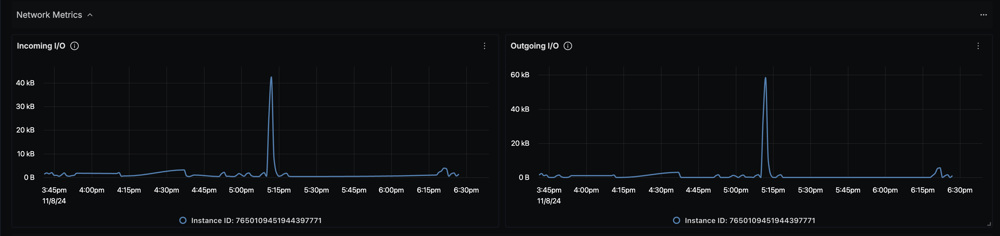

# GCP Compute Engine Dashboard - OTLP

## Data Ingestion

### Integrate GCP Compute Engine with OpenTelemetry Collector

Follow the instructions on the SigNoz's GCP Compute Engine Metrics [page](https://signoz.io/docs/gcp-monitoring/compute-engine/metrics/) about integrating OpenTelemetry with GCP Compute Engine to fetch metrics.

## Dashboard panels

## Variables

- `{{deployment.environment}}`: The deployment environment for the service.
- `{{project_id}}`: GCP Project ID.

### Sections

- Instances
  - Total Active GCE Instances - `compute_googleapis_com_instance_uptime_total`
  - GCE Instances Running by Zone - `compute_googleapis_com_instance_uptime_total`
  - Instance Uptime - `compute_googleapis_com_instance_uptime_total`
  - Screenshot of Instances Metrics Section - 
- CPU Metrics
  - CPU Usage Time - `compute_googleapis_com_instance_cpu_usage_time`
  - CPU Utilization - `compute_googleapis_com_instance_cpu_utilization`
  - Screenshot of CPU Metrics Section - 
- Memory Metrics
  - Memory Used - `compute_googleapis_com_instance_memory_balloon_ram_used` and `compute_googleapis_com_instance_memory_balloon_ram_size`
  - Free Memory - `compute_googleapis_com_instance_memory_balloon_ram_used` and `compute_googleapis_com_instance_memory_balloon_ram_size`
  - Screeenshot of Memory Metrics Section - 
- Disk Metrics
  - Read I/O - `compute_googleapis_com_instance_disk_read_ops_count`
  - Write I/O - `compute_googleapis_com_instance_disk_write_ops_count`
  - Screenshot of Disk Metrics Section - 
- Network Metrics
  - Incoming I/O - `compute_googleapis_com_instance_network_received_bytes_count`
  - Outgoing I/O - `compute_googleapis_com_instance_network_sent_bytes_count`
  - Screenshot of Network Metrics Section - 
- Firewall Metrics
  - Dropped Bytes - `compute_googleapis_com_firewall_dropped_bytes_count`
  - Dropped Packets - `compute_googleapis_com_firewall_dropped_packets_count`
  - Screenshot of Firewall Metrics Section - 
