# GitHub Copilot Dashboard

## Details

This comprehensive dashboard provides deep visibility into GitHub Copilot Chat usage patterns and performance metrics. It tracks token consumption and prompt cache efficiency, per-model call volume and latency, tool and MCP activity, and errors, giving teams the data they need to optimize their AI-assisted development workflows.

Everything here is built from the OpenTelemetry traces the Copilot Chat extension exports natively, so there is no instrumentation library to install and no collector to run. Panels key off the GenAI semantic-convention attributes Copilot emits, including `gen_ai.operation.name` (`invoke_agent`, `chat`, `execute_tool`, `embeddings`), `gen_ai.response.model`, `gen_ai.usage.*`, `gen_ai.tool.name`, `gen_ai.agent.name`, and `gen_ai.conversation.id`. Use the `Service` variable at the top to scope the dashboard to one or more Copilot rollouts.

Token panels are deliberately scoped to `gen_ai.operation.name = 'chat'`. The `invoke_agent` span carries a roll-up of its children's token counts, so summing across every span would roughly double count. Copilot also emits no `gen_ai.usage.total_tokens`, which is why totals are computed as input plus output.

To start sending GitHub Copilot telemetry to SigNoz, follow the [GitHub Copilot monitoring guide](https://signoz.io/docs/github-copilot-monitoring/).

## Dashboard panels

### Sections

#### Total Tokens

Tokens are the currency of AI coding assistants. This panel adds input and output tokens across every Copilot model call, so you can see at a glance how much work Copilot is doing and whether usage is ramping up, holding steady, or tailing off.

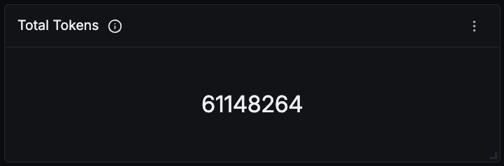

#### Model Calls

How many chat completions developers asked Copilot for. Read this alongside Conversations to tell long multi-turn sessions apart from a lot of quick one-off questions.

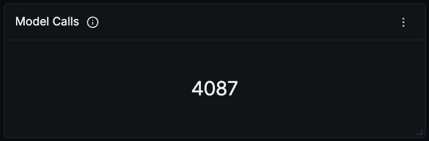

#### Tool Calls

Copilot's agent does more than talk. This counts every tool it executed, from reading a file to running a terminal command to calling an MCP server, which is a good proxy for how much real work is being delegated to it.

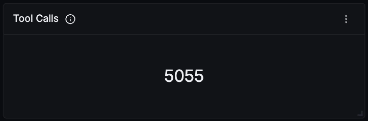

#### Conversations

How many distinct chat conversations developers started, counted on `gen_ai.conversation.id`. Conversations show how often people turn to Copilot, while model calls capture the depth of each interaction.

#### Prompt Cache Hit Rate

The share of input tokens served from the prompt cache instead of being reprocessed. Cached input is billed at a steep discount, so this is the single biggest lever you have on Copilot spend. A falling rate usually means conversations are being restarted rather than continued.

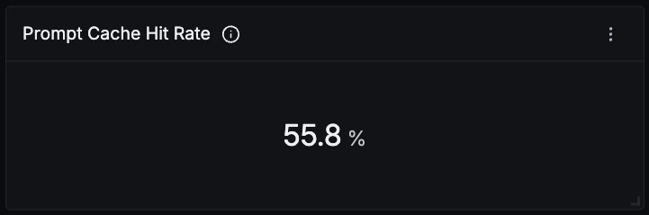

#### Cached Input Tokens

The absolute number of input tokens read from cache. Worth reading next to the hit rate, because a healthy percentage on a small volume means something very different from the same percentage across millions of tokens.

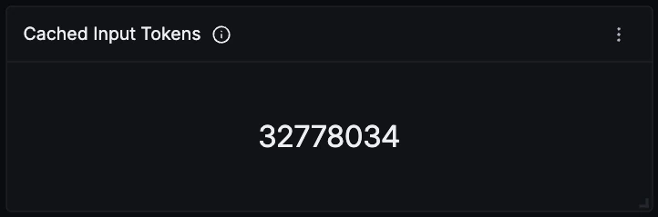

#### Reasoning Tokens

Output tokens that reasoning-capable models spend thinking before they answer. You are billed for these as output tokens and never see them in the chat, which makes them easy to miss when a bill comes in higher than expected.

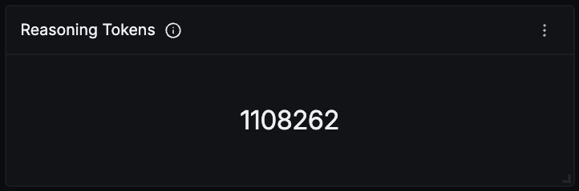

#### Avg Input Tokens per Call

The average prompt size per model call. Rising values mean the agent is carrying more context into every turn, which pushes up cost and time to first token together.

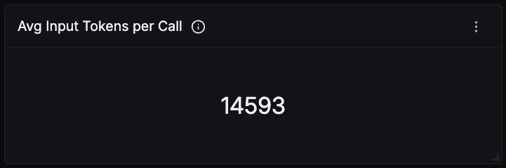

#### Token Usage Over Time

Instead of a single snapshot, this time series breaks input, output, cached input, and reasoning tokens out over time. It is the fastest way to spot a sprint spike, a steady adoption curve, or a sudden jump in reasoning spend. Cached input is a subset of input, not an extra charge on top of it.

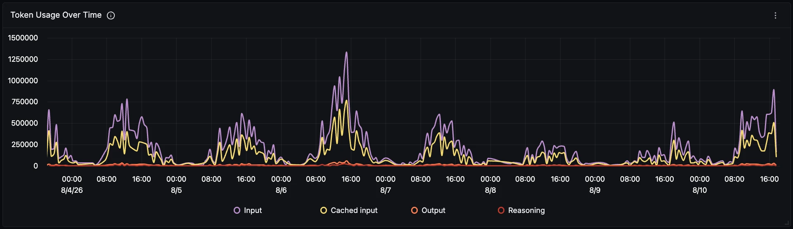

#### Tokens by Model

Which model is actually consuming the token budget. Copilot routes different tasks to different models, so this rarely matches the call-count split, and an expensive model with relatively few calls can still dominate your cost.

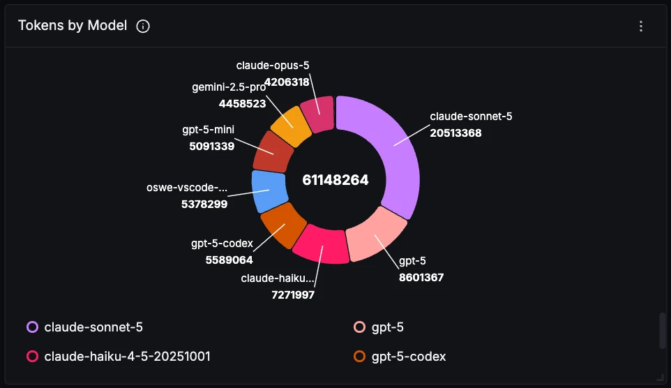

#### Model Calls Over Time

Chat completions per model over time. This is where you notice Copilot quietly routing you to a different model, or a newer model gaining traction across the team.

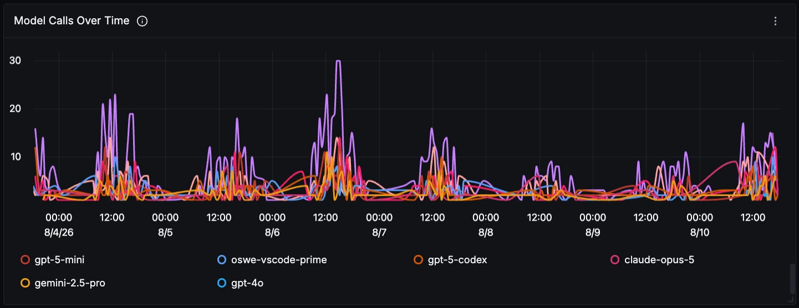

#### Finish Reasons

How model responses ended. A growing share of `["length"]` means answers are being cut off by the token limit, while `["tool_calls"]` means the model handed control back to the agent to go run something. The attribute is the plural `gen_ai.response.finish_reasons` and its values are JSON array strings, which is why they read that way in the legend.

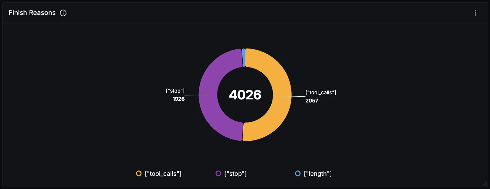

#### Model Call Latency

How long model calls actually take, from p50 through p99. The gap between p50 and p99 tells you whether Copilot is consistently quick or occasionally painful.

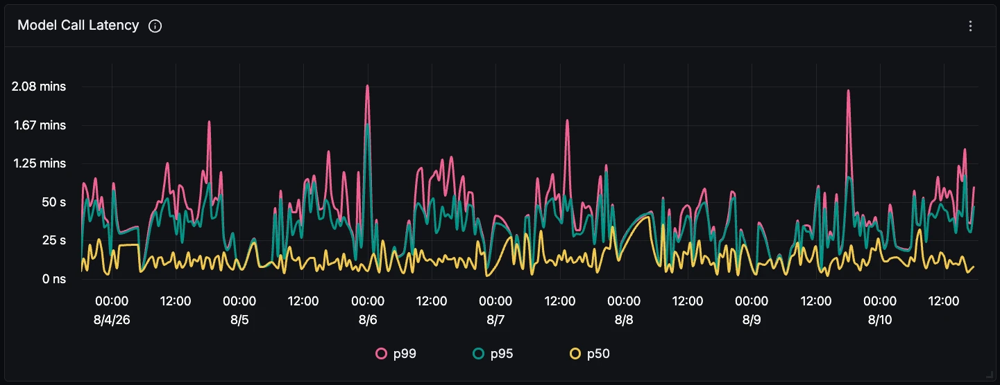

#### Time to First Chunk

Seconds until the first streamed token appears. This is what developers actually perceive as Copilot being slow, independent of how long the full response takes to finish.

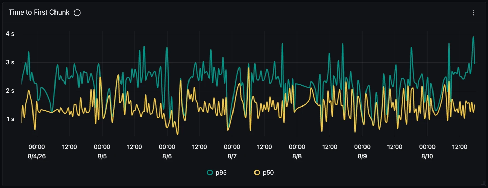

#### Tool Calls by Name

Which tools the agent reaches for most. This shines a light on the kinds of coding tasks your team trusts Copilot with, whether that is reading code, editing it, searching the workspace, or running tests.

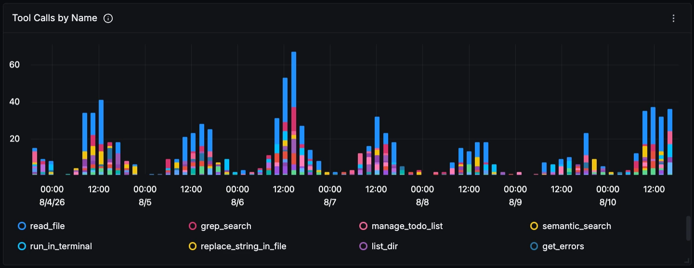

#### MCP vs Built-in Tools

The split between MCP server tools, whose names are prefixed with `mcp_`, and Copilot's built-in tools. If you have wired up MCP servers, this shows whether they are earning their place in the tool list or being ignored.

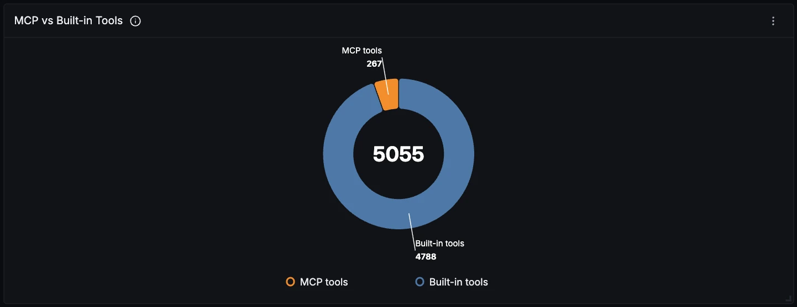

#### Tool Latency (p95)

The slowest tools by 95th percentile execution time. Long-running terminal commands and remote MCP calls dominate here, and because the agent waits on them, they stall the entire turn.

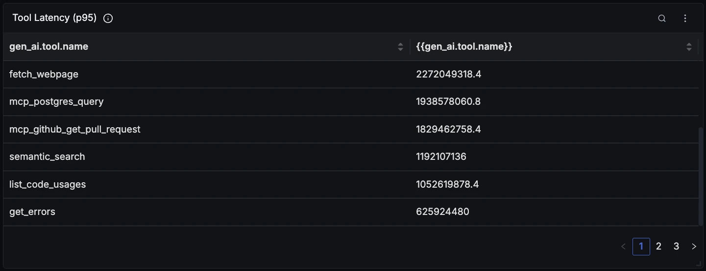

#### Activity by Operation

A breakdown of Copilot spans across chat, execute_tool, invoke_agent, and embeddings. It gives you a feel for the shape of the workload, in particular how tool-heavy your agent turns really are.

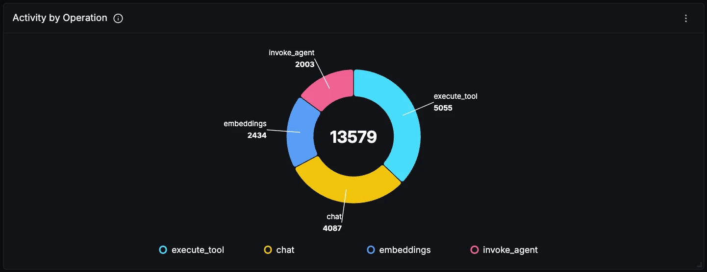

#### Activity by Agent

Which internal Copilot agents are running. Background agents such as title generation and `summarizeVirtualTools` spend real tokens without any visible chat turn, and this is where that otherwise invisible usage shows up.

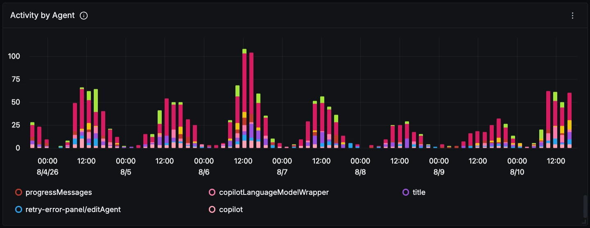

#### Errors Over Time

Copilot spans that ended with an error status. In practice most of these are tools that failed rather than the model itself, so a spike here usually points at the workspace or an MCP server rather than at Copilot.

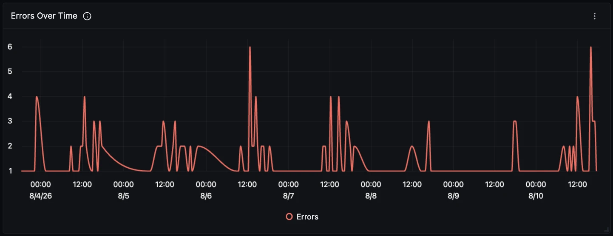

#### Recent Errors

The individual failing spans with their status messages. Click through to the full trace to see the conversation turn that produced the failure.

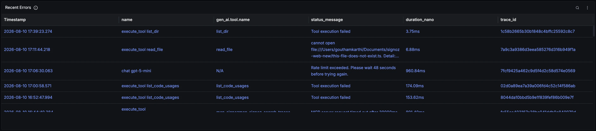
