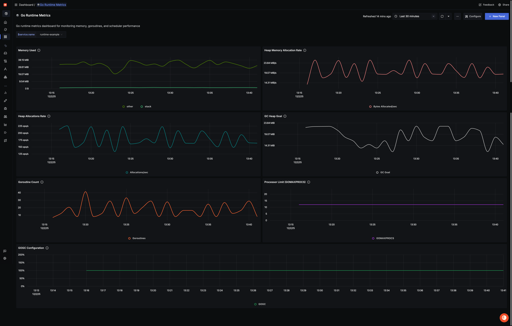

# Go Runtime Metrics

This dashboard expects the application to be instrumented with the [runtime](https://pkg.go.dev/go.opentelemetry.io/contrib/instrumentation/runtime) package to export Go runtime metrics.

The runtime package automatically exports the following Go runtime metrics:

### Memory Metrics
- `go.memory.used` - Memory used by the Go runtime
- `go.memory.allocated` - Memory allocated to the heap by the application
- `go.memory.allocations` - Count of allocations to the heap by the application
- `go.memory.gc.goal` - Heap size target for the end of the GC cycle

### Concurrency Metrics
- `go.goroutine.count` - Count of live goroutines
- `go.processor.limit` - The number of OS threads that can execute user-level Go code simultaneously

### Configuration Metrics
- `go.config.gogc` - Heap size target percentage configured by the user (default: 100)

For more details, refer to the [OpenTelemetry Go Runtime Metrics Documentation](https://opentelemetry.io/docs/specs/semconv/runtime/go-metrics/).
