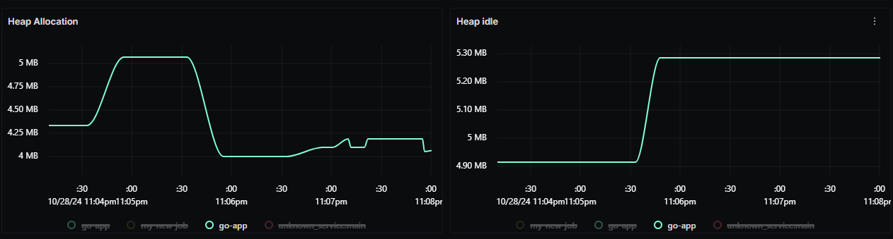
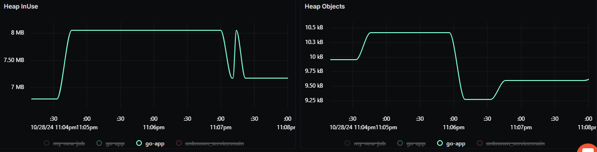
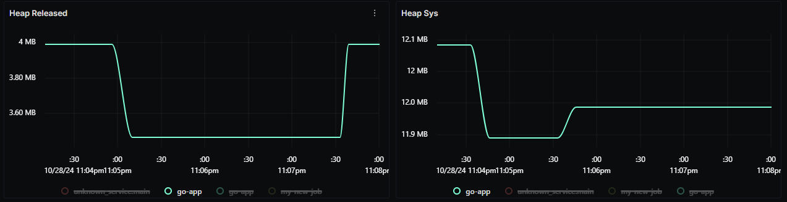
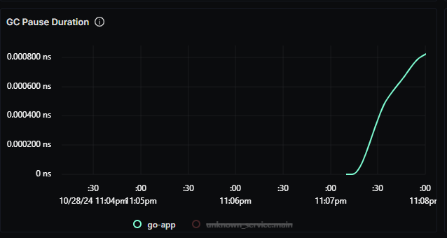
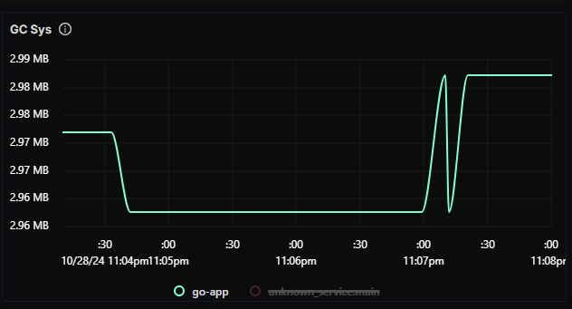
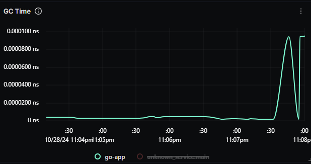
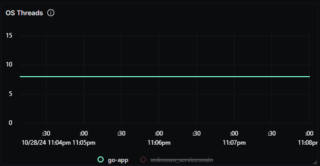
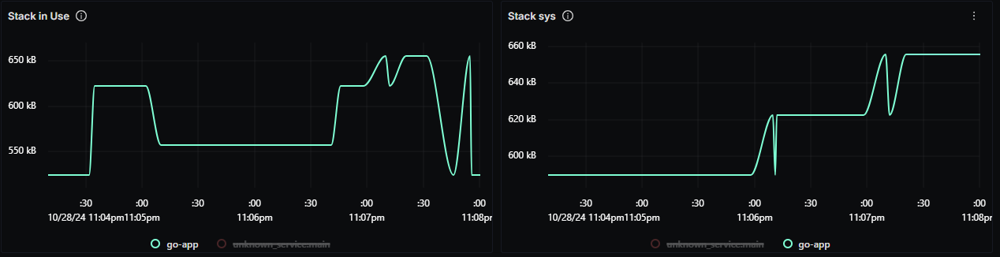

# Go Runtime Metrics Dashboard - OTLP

## Data Ingestion

### With OTLP Go Runtime Metrics

- Update `otel-config.yaml` with the following:

Add prometheus receiver to the `receivers:` section:

```yaml
receivers:
  prometheus:
    config:
      scrape_configs:
        - job_name: go-app
          scrape_interval: 10s
          static_configs:
            - targets: ["localhost:8080"]
```

Add prometheus receiver to the `pipelines:` section:

```yaml
service:
  pipelines:
    metrics:
      receivers: [prometheus]
```

Below is sample `otel-config.yaml` file with two mysql instances:

```yaml
receivers:
  otlp:
    protocols:
      grpc:
        endpoint: 0.0.0.0:4317
      http:
        endpoint: 0.0.0.0:4318
  prometheus:
    config:
      scrape_configs:
        - job_name: "go-app-1"
          scrape_interval: 10s
          static_configs:
            - targets: ["localhost:8080"]
        - job_name: "go-app-2"
          scrape_interval: 10s
          static_configs:
            - targets: ["localhost:8081"]
processors:
  batch:
    send_batch_size: 1000
    timeout: 10s
  resourcedetection:
    detectors: [env, system]
    timeout: 2s
    system:
      hostname_sources: [os]
  resource/env:
    attributes:
      - key: deployment.environment
        value: staging
        action: upsert
exporters:
  otlp:
    endpoint: 'ingest.in.signoz.cloud:443'
    tls:
      insecure: false
    headers:
      'signoz-access-token': '{signoz-token}'
  logging:
    verbosity: normal
service:
  telemetry:
    metrics:
      address: 0.0.0.0:8888
  extensions: [health_check, zpages]
  pipelines:
    metrics:
      receivers: [prometheus]
      processors: [batch]
      exporters: [otlp]
```

## Dashboard panels

## Variables

- `{{env}}`: Deployment environment
- `{{service_name}}`: Service name

### Sections

- Memory Metrics
  - Heap Allocation - `go_memstats_heap_alloc_bytes`
  - Heap Idle - `go_memstats_heap_idle_bytes`
  - Row Locks - `go_memstats_heap_inuse_bytes`
  - Row Operations - `go_memstats_heap_objects`
  - SQL Locks - `go_memstats_heap_released_bytes`
  - Count by Handlers - `go_memstats_heap_sys_bytes`
  - GC Pause Duration - `rate(go_gc_duration_seconds_sum[1m])`
  - GC Count - `go_gc_cycles_total`
  - GC Forced - `go_gc_forced_total`
  - Screenshots of Memory Metrics Section -    
- Go Routines
  - Active Goroutines - `go_goroutines`
  - Total Goroutines Created - `go_threads_created_total`
- GC (Garbage Collection)
  - CPU Fraction - `go_gc_cpu_fraction`
  - GC Sys - `go_memstats_gc_sys_bytes`
  - Screenshot of Go Routines Section - 
- CPU Metrics
  - Goroutine Execution Time - `go_runtime_cpu_time_nanoseconds_total`
  - GC Time - `rate(go_gc_duration_seconds_sum[5m])`
  - System Time - `go_runtime_sys_nanoseconds_total`
  - Screenshot of CPU Metrics Section - 
- Thread Metrics
  - OS Threads - `go_threads`
  - Screenshot of Thread Metrics Section - 
- Stack Metrics
  - Stack In Use - `go_memstats_stack_inuse_bytes`
  - Stack Sys - `go_memstats_stack_sys_bytes`
  - Screenshot of Stack Metrics Section - 
- Mutex Metrics
  - Mutex Wait Time - `rate(go_mutex_wait_seconds_total[5m])`
  - Mutex Lock Count - `go_mutex_lock_total`