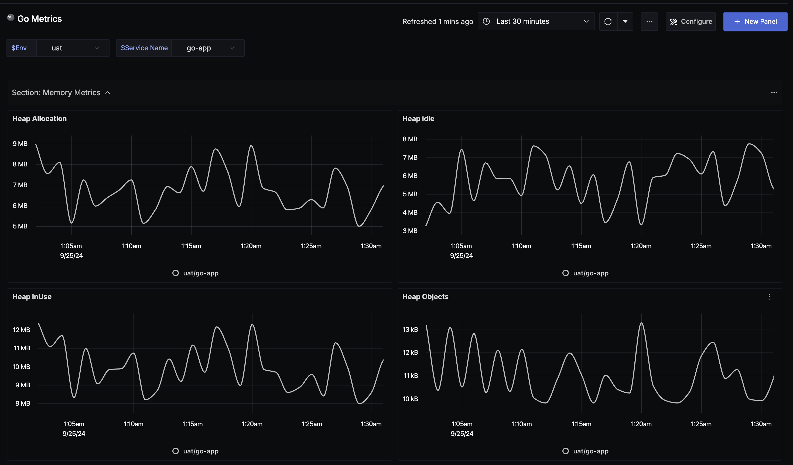
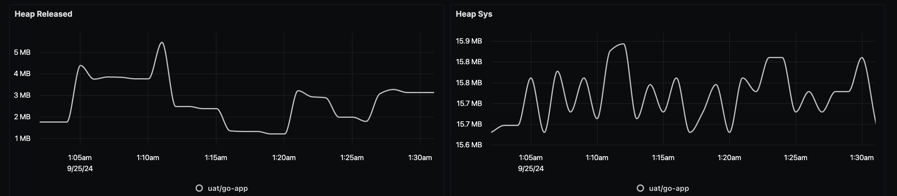

# Go Metrics Dashboard - Prometheus

## Metrics Ingestion
For metrics ingestion, you may refer to a minimal setup for exporting go gin server with prometheus enabled. https://github.com/Rishabh3321/otel-prom-go-example 

### With Prometheus Receiver

- Update `otel-config.yaml` for adding a prometheus reciever:

Add prometeus receiver to the `receivers:` section:

```yaml
receivers:
  otlp:
    protocols:
      grpc:
      http:

  # Data sources: metrics
  prometheus:
    config:
      scrape_configs:
        - job_name: "otel-collector"
          scrape_interval: 30s
          static_configs:
            - targets: ["otel-collector:8889"]
        - job_name: "my-new-job"
          scrape_interval: 30s
          static_configs:
          - targets: ["host.docker.internal:8080"]
            labels:
              service_name: go-app
              env: uat         
processors:
  batch:
    send_batch_size: 1000
    timeout: 10s
```

All paramaters can be tweaked, like I had to do with `targets`. `host.docker.internal` translates to localhost, you may want to scrape another servers.
 
Linking Offical Docs too - [link](https://signoz.io/docs/userguide/send-metrics/#enable-a-prometheus-receiver)


## Dashboard panels

## Variables

- `{{env}}`: Deployment environment
- `{{service_name}}`: Service Name Identifier

### Sections

**Section: Memory Metrics**
- Panel: Heap Allocation - Displays the current number of bytes allocated on the heap.
- Panel: Heap Idle - Shows memory allocated by the OS but not actively used by the Go runtime.
- Panel: Heap In Use - Shows the memory currently in use for heap objects.
- Panel: Heap Objects - Displays the number of allocated heap objects.
- Panel: Heap Released - Memory released back to the OS.
- Panel: Heap Sys - Total bytes obtained from the system for the heap.
- Screenshots-  
