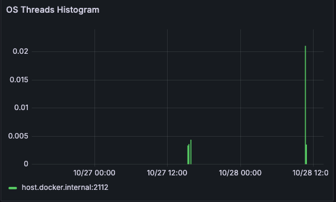

# Golang Runtime Metrics Dashboard - Prometheus


### OS Threads Histogram Panel
1. Tracks the number of goroutines currently in use by the application.
2. Tracks CGO calls, which indicate OS-level threads involvement if CGO is used.

The code snippet below calculates the `go_goroutines_count` and `go_cgo_calls_count`



```
package main

import (
    "log"
    "net/http"
    "runtime"
    "time"

    "github.com/prometheus/client_golang/prometheus"
    "github.com/prometheus/client_golang/prometheus/promhttp"
)

var (
    // Gauge for OS-level goroutines count
    goRoutineCount = prometheus.NewGauge(prometheus.GaugeOpts{
        Name: "go_goroutines_count",
        Help: "Number of goroutines currently managed by the Go runtime.",
    })

    // Counter for CGO calls (proxy for OS thread use when working with CGO)
    cgoCallCount = prometheus.NewCounterFunc(
        prometheus.CounterOpts{
            Name: "go_cgo_calls_count",
            Help: "Number of CGO calls made by the Go runtime.",
        },
        func() float64 {
            return float64(runtime.NumCgoCall())
        },
    )
)

func initMetrics() {
    // Register the goroutine count gauge
    prometheus.MustRegister(goRoutineCount)
    prometheus.MustRegister(cgoCallCount)
}

func main() {
    initMetrics()

    // Goroutine to periodically update goroutine count
    go func() {
        for {
            goRoutineCount.Set(float64(runtime.NumGoroutine()))
            time.Sleep(5 * time.Second)
        }
    }()

    // Expose metrics on port 2112
    http.Handle("/metrics", promhttp.Handler())
    log.Println("Starting server on :2112")
    if err := http.ListenAndServe(":2112", nil); err != nil {
        log.Fatalf("Failed to start server: %v", err)
    }
}

```

### Sections

- os-threads-histogram