# Grok Build Dashboard

## Details

This comprehensive dashboard provides deep visibility into Grok Build usage patterns and performance metrics. It tracks everything from token consumption and model mix to tool effectiveness, error categories, and startup latency, giving teams the data they need to optimize their AI-assisted development workflows.

Grok Build exports metrics natively, so no instrumentation library is required. Enable it with `GROK_EXTERNAL_OTEL=1` plus an OTLP exporter, and use `http/protobuf` as the protocol.

## Dashboard panels

### Sections

### Total Tokens

Tokens are the currency of AI coding assistants. This panel adds every token type together, giving you a complete picture of how much work Grok is doing and whether usage is ramping up, holding steady, or tailing off.

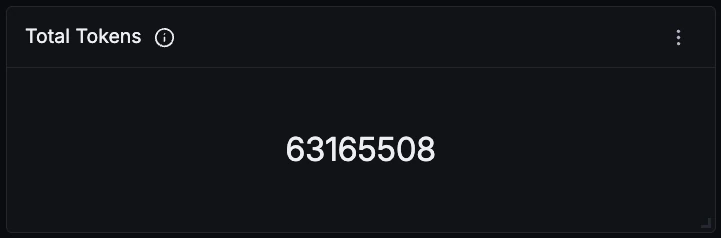

### Sessions

How many times Grok Build was started. Sessions show how often developers are turning to the agent, revealing adoption and engagement patterns across the team.

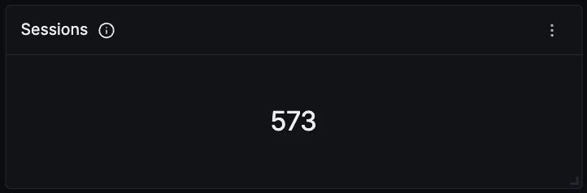

### Turns

Every prompt-and-response cycle the agent completed. Read this alongside Sessions to tell a lot of quick one-off invocations apart from a few long working sessions.

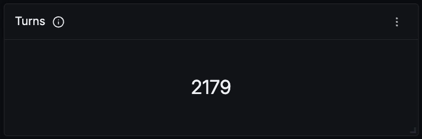

### Errors

Total errors across every category. The panel turns amber as soon as one is recorded, since a healthy setup should sit at zero.

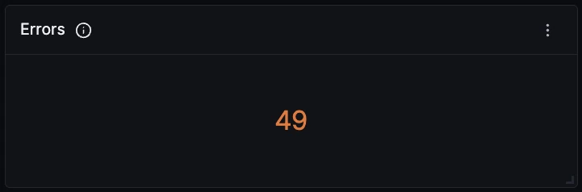

### Token Usage Over Time

Token consumption split by type over time. Grok reports four types: input, output, cache reads, and reasoning. Reasoning tokens are broken out separately rather than folded into output, so you can see how much of your spend goes on thinking the user never sees.

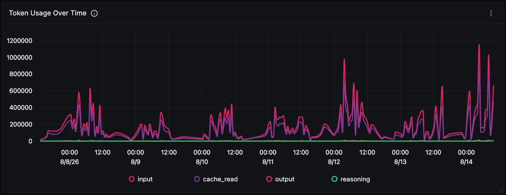

### Tokens by Type

The same four types as a share of the total. Input tokens dominate on almost any real workload, and a high cache read share means prompt caching is working. A falling share usually means sessions are being restarted rather than continued.

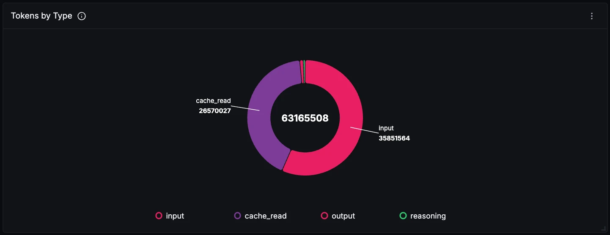

### Tokens by Model

Token spend per model. Useful for tracking migration between model versions and for spotting which model is actually carrying the workload, which is rarely the one you assume.

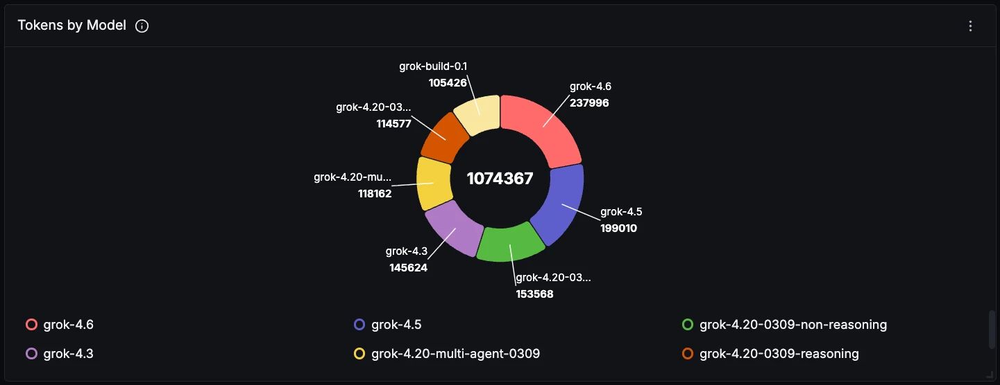

### Tool Calls by Tool

Grok's agent does more than talk. This counts every tool it executed, from reading a file to running a terminal command to spawning a subagent, which is a good proxy for how much real work is being delegated to it.

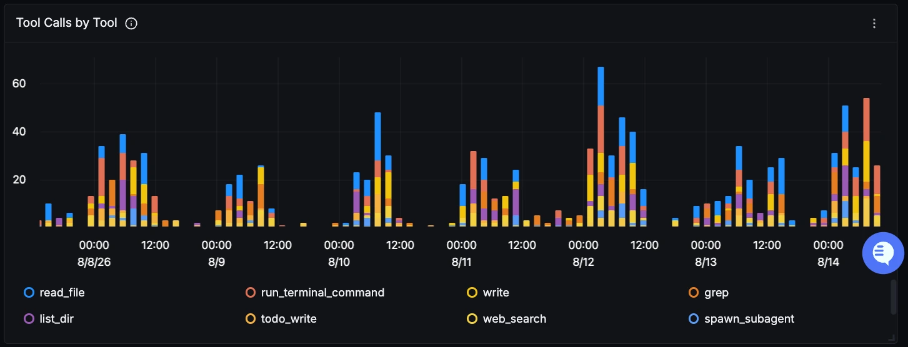

### Tool Outcomes

Success against error across all tool calls. Tool failures are usually environmental rather than model problems: a missing file, a command that exits non-zero, a denied permission.

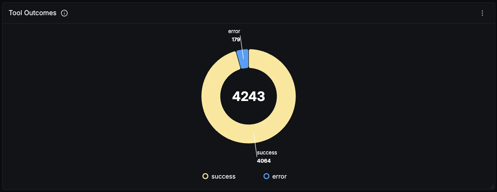

### Turns Over Time by Outcome

Turn volume split by completed, cancelled, and error. Cancellations are worth watching on their own, since they usually mean a developer stopped the agent mid-answer rather than anything failing.

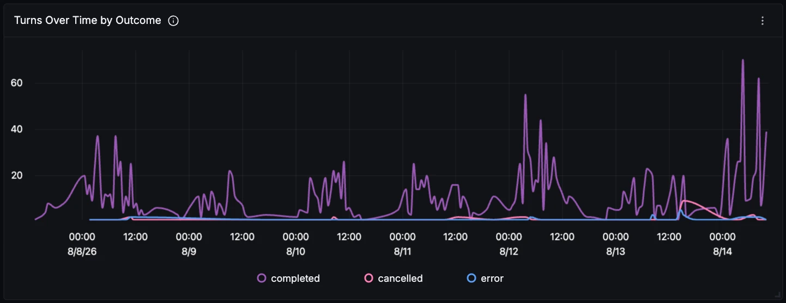

### Errors by Category

Errors over time, grouped by category. Note that rate limit covers both the per-minute request ceiling and full quota exhaustion, so check the status code on the api_error event to tell them apart.

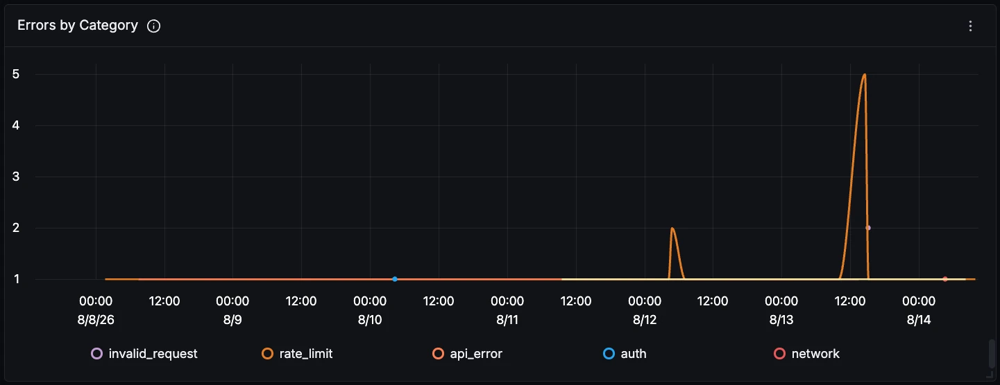

### Startup Duration p95

How long Grok takes from process start to a usable session. This includes a deliberate wait while the CLI fetches fleet policy, which is bounded and never exceeds 30 seconds.

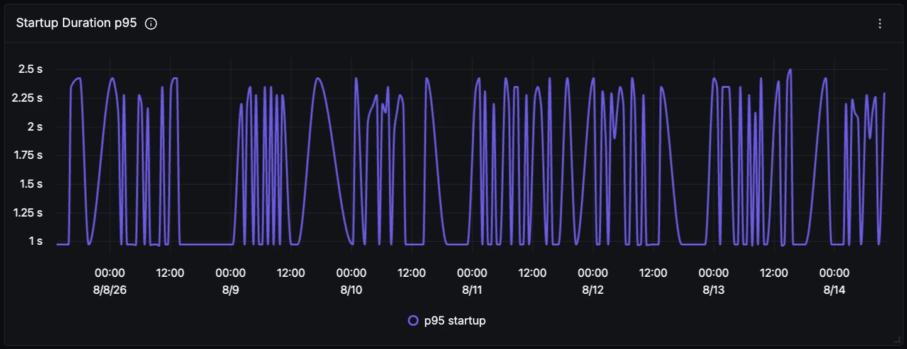

### Startup Phase Duration p95

The same startup cost broken down by step, which is what you need to make it faster. Filter on a successful outcome before comparing percentiles, since truncated samples from timeouts will skew the result.

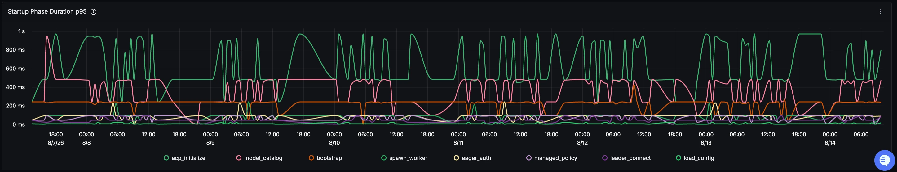
