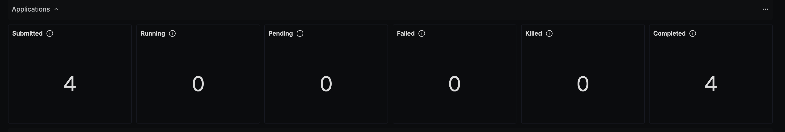
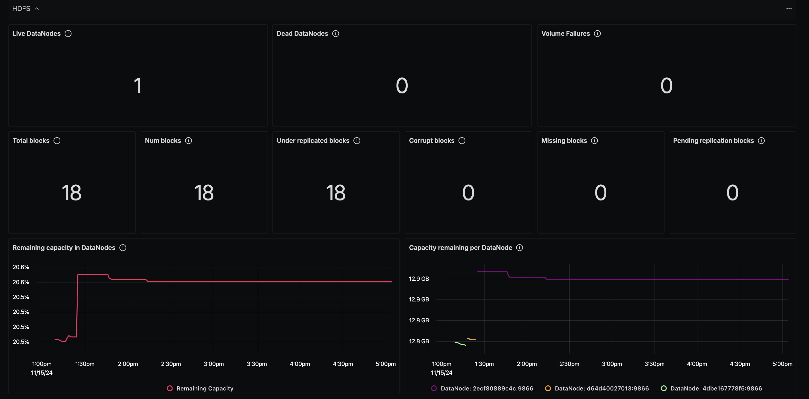
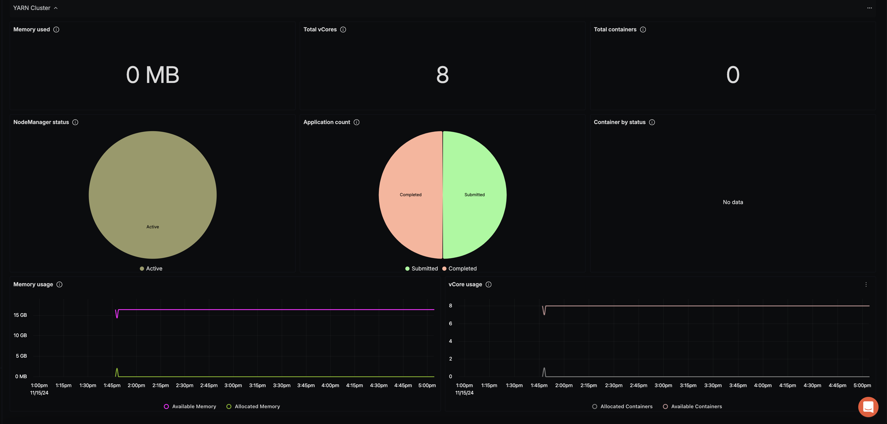

# Hadoop Dashboard - OTLP

> [!Note]
> **Dashboard Migration Status**: Due to the migration of metric names and attributes, the dashboards may not work properly and are currently being updated:
> We are actively working on updating these dashboards to be compatible with the new metric structure.


## Data Ingestion

### Integrate Hadoop with OpenTelemetry Collector

You can collect the metrics from Hadoop using prometheus or JMX receiver in OpenTelemetry.

## OTel Config

Here is the config file used for gathering Hadoop metrics for SigNoz. Note that this config file uses JMX receiver by default.

```
receivers:
  #Using JMX
  jmx:
    jar_path: /Users/shrutimantri/Downloads/opentelemetry-jmx-metrics-1.32.0-alpha.jar
    endpoint: localhost:9999
    target_system: hadoop,jvm
    collection_interval: 60s
    resource_attributes:
      hadoop.endpoint: localhost:9870

  #Using prometheus
  #prometheus:
  #  config:
  #    scrape_configs:
  #      - job_name: 'otel-collector-hadoop'
  #        scrape_interval: 15s
  #        static_configs:
  #          - targets: ['localhost:6688']
processors:
  resource/env:
    attributes:
    - key: deployment.environment
      value: prod
      action: upsert
  batch: {}
exporters:
  otlp:
    endpoint: "ingest.{region}.signoz.cloud:443"
    tls:
      insecure: false
    headers:
      "signoz-access-token": "<SIGNOZ_INGESTION_KEY>"
service:
  pipelines:
    metrics:
      receivers: [jmx]
      processors: [resource/env,batch]
      exporters: [otlp]
```

## Dashboard panels

### Variables

- `{{deployment_environment}}`: The deployment environment for the service.
- `{{cluster}}`: Hadoop cluster.

### Sections

- Application Metrics
  - Submitted application count - `hadoop_yarn_resourcemanager_application_count` (status = Submitted)
  - Running application count - `hadoop_yarn_resourcemanager_application_count` (status = Running)
  - Pending application count - `hadoop_yarn_resourcemanager_application_count` (status = Pending)
  - Failed application count - `hadoop_yarn_resourcemanager_application_count` (status = Failed)
  - Killed application count - `hadoop_yarn_resourcemanager_application_count` (status = Killed)
  - Completed application count - `hadoop_yarn_resourcemanager_application_count` (status = Completed)
  - Screenshot of Application Metrics Section - 
- HDFS Metrics
  - Live DataNodes - `hadoop_hdfs_namenode_fsname_system_state_num_live_data_nodes` (state = Live)
  - Dead DataNodes - `hadoop_hdfs_namenode_fsname_system_state_num_live_data_nodes` (state = Dead)
  - Volume Failures - `hadoop_hdfs_namenode_fsname_system_state_volume_failures_total`
  - Total blocks - `hadoop_hdfs_namenode_nninfo_total_blocks`
  - Num blocks - `hadoop_hdfs_namenode_nninfo_live_nodes_num_blocks`
  - Under replicated blocks - `hadoop_hdfs_namenode_fsname_system_under_replicated_blocks`
  - Corrupt blocks - `hadoop_hdfs_namenode_fsname_system_corrupt_blocks`
  - Missing blocks - `hadoop_hdfs_namenode_fsname_system_missing_blocks`
  - Pending replication blocks - `hadoop_hdfs_namenode_fsname_system_pending_replication_blocks`
  - Remaining capacity in DataNodes - `hadoop_hdfs_namenode_fsname_system_capacity_bytes` (mode = Remianing)
  - Capacity remaining per DataNode - `hadoop_hdfs_namenode_nninfo_live_nodes_remaining`
  - Screenshot of HDFS Metrics Section - 
- YARN Metrics
  - Memory used - `hadoop_yarn_resourcemanager_node_memory_used_mb`
  - Total vCores - `hadoop_yarn_resourcemanager_vcore_count`
  - Total containers - `hadoop_yarn_resourcemanager_node_containers_total`
  - NodeManager status - `hadoop_yarn_resourcemanager_nodemanager_total`
  - Application count - `hadoop_yarn_resourcemanager_application_count`
  - Container by status - `hadoop_yarn_resourcemanager_container_count`
  - Memory usage - `hadoop_yarn_resourcemanager_memory_in_mb`
  - vCore usage - `hadoop_yarn_resourcemanager_vcore_count`
  - Screeenshot of YARN Metrics Section - 
