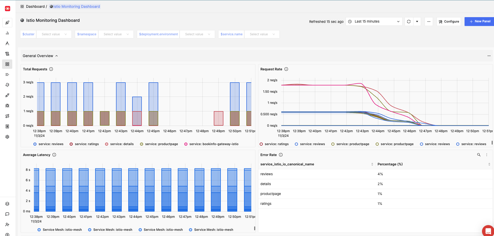
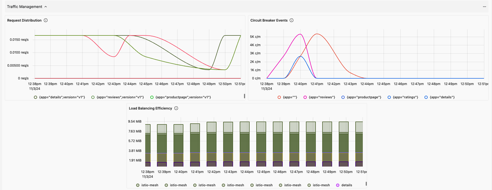
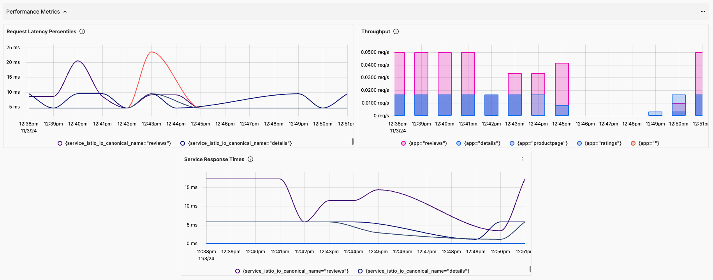
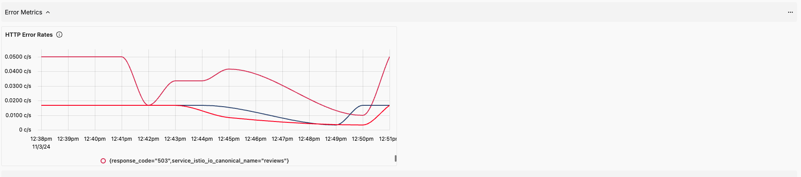
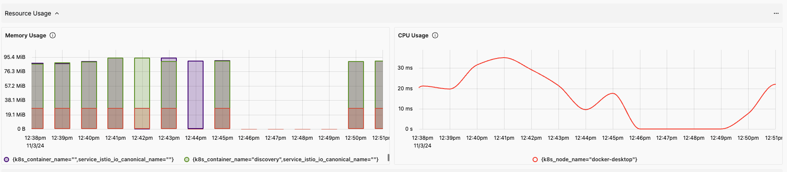
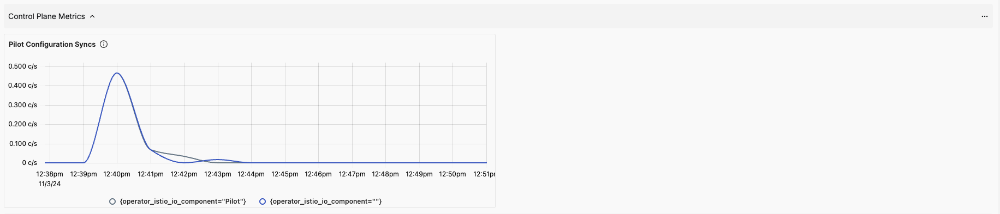
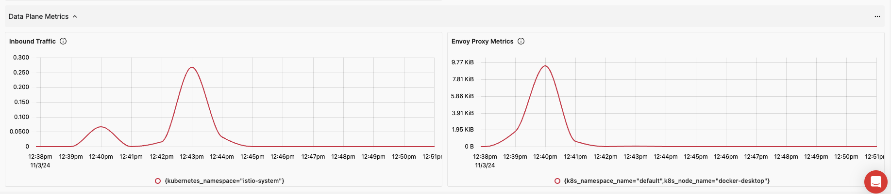

# Istio Monitoring Dashboard

## Metrics Ingestion

> [!NOTE]
> Make sure the Kubernetes Cluster installed (local or cloud). </br>
> Install [Istio](https://istio.io/latest/docs/setup/getting-started/) in your local machine.

### Install OpenTelemetry Collector for `SigNoz`

This is sample configuration `otel-config.yaml` export metrics

```yaml
mode: deployment
config:
  receivers:
    prometheus:
      config:
        scrape_configs:
          - job_name: 'istio-mesh'
            kubernetes_sd_configs:
              - role: pod
            relabel_configs:
              # Only scrape pods with prometheus.io annotations enabled by Istio
              - source_labels: [__meta_kubernetes_pod_annotation_prometheus_io_scrape]
                action: keep
                regex: true
              - source_labels: [__meta_kubernetes_pod_annotation_prometheus_io_path]
                action: replace
                target_label: __metrics_path__
                regex: (.+)
              - source_labels: [__address__, __meta_kubernetes_pod_annotation_prometheus_io_port]
                action: replace
                target_label: __address__
                regex: (.+):(?:\d+);(\d+)
                replacement: $1:$2
              # Map additional labels to make metrics more meaningful
              - action: labelmap
                regex: __meta_kubernetes_pod_label_(.+)
              - source_labels: [__meta_kubernetes_namespace]
                action: replace
                target_label: kubernetes_namespace
              - source_labels: [__meta_kubernetes_pod_name]
                action: replace
                target_label: kubernetes_pod_name

          - job_name: 'istiod'
            kubernetes_sd_configs:
              - role: endpoints
                namespaces:
                  names:
                    - istio-system
            relabel_configs:
              - source_labels: [__meta_kubernetes_service_name, __meta_kubernetes_endpoint_port_name]
                action: keep
                regex: istiod;http-monitoring
              # Add labels to identify namespace and pod
              - source_labels: [__meta_kubernetes_namespace]
                action: replace
                target_label: kubernetes_namespace
              - source_labels: [__meta_kubernetes_pod_name]
                action: replace
                target_label: kubernetes_pod_name

  processors:
    resource/env:
      attributes:
      - key: deployment.environment
        value: Staging
        action: upsert
      - key: cluster
        value: docker-desktop
        action: upsert

  exporters:
    otlp:
      endpoint: "https://ingest.{region-code}.signoz.cloud:443" # replace {region} with your region if you are using signoz cloud, otherwise use localhost:4317 or wherever your collector is running
      headers:
        signoz-access-token: "<signoz-token>" # Obtain from https://{your-signoz-url}/settings/ingestion-settings (signoz-token is only required for signoz cloud)

  service:
    pipelines:
      metrics:
        receivers: [prometheus]
        processors: [resource/env]
        exporters: [otlp]
image:
  repository: "otel/opentelemetry-collector-contrib"
```

* Receivers: 
    * Defines the **prometheus receiver**, which scrapes metrics from Istio pods and services.
    * `istio-mesh` job: Scrapes all pods with the prometheus.io/scrape: true annotation, automatically enabled by Istio. This will collect all the metrics from the entire Mesh
    * `istiod` job: Targets the Istio control plane in the istio-system namespace.
* Processors: Adds an environment label to all metrics
* Exporters: Metrics are forwarded to **SigNoz** at the specified endpoint with your access token.

### In order to deploy the OpenTelemetry Collector with this configuration, we need to:

Create a observability namespace for OpenTelemetry Collector:
```bash
kubectl create namespace istio-observability
```
Give the [permission](https://opentelemetry.io/docs/kubernetes/collector/components/) to collect metrics.

`otel-collector-serviceaccount.yaml`
```yaml
apiVersion: v1
kind: ServiceAccount
metadata:
  name: otel-collector
  namespace: istio-observability
```

`otel-collector-clusterrole.yaml`

```yaml
apiVersion: rbac.authorization.k8s.io/v1
kind: ClusterRole
metadata:
  name: otel-collector
rules:
- apiGroups: [""]
  resources:
  - nodes
  - nodes/proxy
  - services
  - endpoints
  - pods
  verbs: ["get", "list", "watch"]
- apiGroups: [""]
  resources:
  - configmaps
  verbs: ["get"]
- nonResourceURLs: ["/metrics"]
  verbs: ["get"]
```

`otel-collector-clusterrolebinding.yaml`

```yaml
apiVersion: rbac.authorization.k8s.io/v1
kind: ClusterRoleBinding
metadata:
  name: otel-collector
roleRef:
  apiGroup: rbac.authorization.k8s.io
  kind: ClusterRole
  name: otel-collector
subjects:
- kind: ServiceAccount
  name: opentelemetry-collector
  namespace: istio-observability
```

```bash
helm repo add open-telemetry https://open-telemetry.github.io/opentelemetry-helm-charts

helm install --namespace istio-observability opentelemetry-collector open-telemetry/opentelemetry-collector -f otel-config.yaml
```

## Dashboard Panels

### Variables
* `namespace` – Filter metrics based on the Kubernetes namespace where Istio is deployed.
* `service.name` – Select specific services within the mesh to filter metrics.
* `deployment.environment` – Environment of application (configured at Otel agent level).
* `cluster` -  For multi-cluster setups, filter metrics based on the Kubernetes cluster.

### Sections

- **General Overview**: This section provides a high-level overview of the Istio service mesh's health and performance metrics, enabling quick assessment of the overall system state.

    - `Total Requests` - Displays the total number of requests processed by the service mesh - `istio_requests_total`

    - `Request Rate` - Shows the rate of incoming and outgoing requests per second. - `rate(istio_requests_total[15m])`

    - `Average Latency` - Illustrates the average latency of requests within the mesh. - `istio_request_duration_milliseconds_sum / istio_request_duration_milliseconds_count`

    - `Error Rate` - Displays the percentage of failed requests compared to total requests. - `istio_requests_total (response_code > 400)`



- **Traffic Management**: This section focuses on traffic management metrics, providing insights into how traffic is routed, load-balanced, and managed across services.

    - `Request Distribution` - Shows the distribution of requests across different services and versions. - `istio_requests_total`

    - `Load Balancing Efficiency` - Displays metrics on load balancing effectiveness, such as request distribution fairness. - `envoy_cluster_upstream_cx_rx_bytes_total and envoy_cluster_upstream_cx_tx_bytes_total`

    - `Circuit Breaker Events` - Monitors the number of circuit breaker events triggered, indicating potential service issues. - `envoy_cluster_upstream_cx_tx_bytes_total`



- **Performance Metrics**: This section provides detailed performance metrics to monitor the responsiveness and efficiency of services managed by Istio.

    - `Request Latency Percentiles` - Displays latency percentiles (p90) for requests, highlighting performance bottlenecks. - `istio_request_duration_milliseconds_bucket`

    - `Throughput` - Shows the number of requests processed per unit of time, indicating service capacity. - `istio_requests_total`

    - `Service Response Times` - Illustrates the response times of individual services within the mesh. - `istio_response_bytes_sum`



- **Error Metrics**: This section monitors errors and failures within the Istio service mesh, aiding in the troubleshooting and resolution of issues.

    - `HTTP Error Rates` - Displays the rate of HTTP errors (e.g., 4xx, 5xx) across services. - `istio_requests_total(response_code > 400)`



- **Resource Usage**: This section provides insights into the resource consumption of Istio components, ensuring efficient operation within the Kubernetes cluster.

    - `CPU Usage` - Displays CPU usage for Istio control plane and data plane components. - `process_cpu_seconds_total`

    - `Memory Usage` - Shows memory consumption of Istio components, helping identify potential memory leaks or inefficiencies. - `process_resident_memory_bytes`



- **Control Plane Metrics**: This section tracks metrics specific to the Istio control plane, ensuring the configuration and management layers are functioning correctly.

    - `Pilot Configuration Syncs` - Displays the number of configuration synchronizations performed by Pilot. - `pilot_xds_pushes`



- **Data Plane Metrics**: This section tracks metrics specific to the Istio control plane, ensuring the configuration and management layers are functioning correctly.

    - `Envoy Proxy Metrics` - Displays key metrics from Envoy proxies, such as active connections and request rates. - `envoy_http_downstream_rq_total`

    - `Inbound Traffic` - Shows the volume of inbound traffic handled by data plane proxies. - `envoy_cluster_upstream_cx_rx_bytes_total`



## More Information:
- https://istio.io/latest/docs/setup/getting-started/
- https://istio.io/latest/docs/ops/integrations/prometheus/#option-1-quick-start
- https://istio.io/latest/docs/reference/config/metrics/
- https://istio.io/latest/docs/concepts/observability/
- https://grafana.com/docs/grafana-cloud/monitor-infrastructure/integrations/integration-reference/integration-istio/
- https://istio.io/latest/docs/tasks/observability/distributed-tracing/opentelemetry/
- https://prometheus.io/docs/prometheus/latest/configuration/configuration/
- https://opentelemetry.io/docs/kubernetes/collector/components/
- https://www.datadoghq.com/blog/istio-metrics/