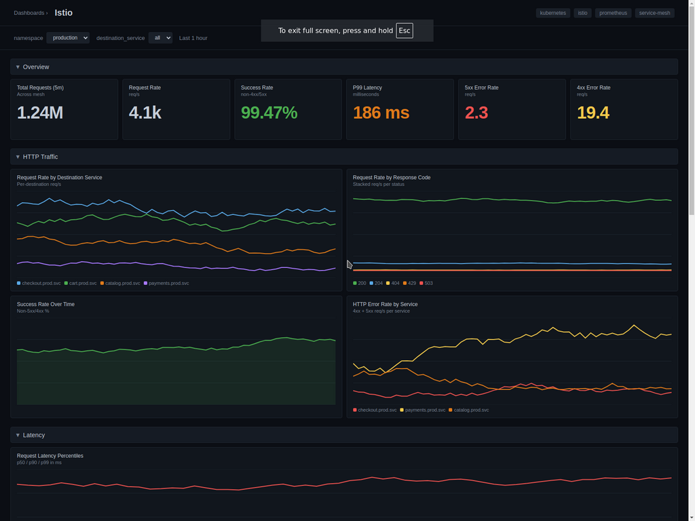

# Istio Dashboard - Prometheus

Tracks request volume, success rate, latency and control plane health for an [Istio](https://istio.io/) service mesh.

## Metrics Ingestion

Istio ships sidecars and the istiod control plane with Prometheus endpoints enabled by default. Sidecars expose metrics on `15020/stats/prometheus` and istiod on `15014/metrics`. Scrape them with the OpenTelemetry Collector's `prometheus` receiver and forward to SigNoz.

### OpenTelemetry Collector configuration

```yaml
receivers:
  prometheus:
    config:
      global:
        scrape_interval: 30s
      scrape_configs:
        - job_name: istio-proxy
          metrics_path: /stats/prometheus
          kubernetes_sd_configs:
            - role: pod
          relabel_configs:
            - source_labels: [__meta_kubernetes_pod_container_name]
              regex: istio-proxy
              action: keep
            - source_labels: [__meta_kubernetes_pod_annotation_prometheus_io_scrape]
              regex: "true"
              action: keep
            - source_labels: [__address__, __meta_kubernetes_pod_annotation_prometheus_io_port]
              regex: ([^:]+)(?::\d+)?;(\d+)
              replacement: $1:$2
              target_label: __address__
            - source_labels: [__meta_kubernetes_namespace]
              target_label: namespace
            - source_labels: [__meta_kubernetes_pod_name]
              target_label: pod

        - job_name: istiod
          metrics_path: /metrics
          kubernetes_sd_configs:
            - role: endpoints
              namespaces:
                names: [istio-system]
          relabel_configs:
            - source_labels: [__meta_kubernetes_service_name]
              regex: istiod
              action: keep

processors:
  batch:
    send_batch_size: 1000
    timeout: 10s

exporters:
  otlp:
    endpoint: "ingest.{region}.signoz.cloud:443"
    tls:
      insecure: false
    headers:
      "signoz-access-token": "<your-ingestion-key>"

service:
  pipelines:
    metrics/istio:
      receivers: [prometheus]
      processors: [batch]
      exporters: [otlp]
```

## Variables

- `{{namespace}}`: Destination workload namespace (filters every panel except the control plane section).
- `{{destination_service}}`: Destination service FQDN to drill into a specific workload.

## Sections

### Overview
- Total Requests / Request Rate — `istio_requests_total`
- Success Rate — `istio_requests_total` with `response_code!~"5..|4.."`
- P99 Latency — `istio_request_duration_milliseconds_bucket`
- 4xx / 5xx Error Rate — `istio_requests_total`

### HTTP Traffic
- Request Rate by Destination Service — `istio_requests_total`
- Request Rate by Response Code — `istio_requests_total`
- Success Rate Over Time — `istio_requests_total`
- HTTP Error Rate by Service — `istio_requests_total`

### Latency
- Request Latency Percentiles (p50, p90, p99) — `istio_request_duration_milliseconds_bucket`
- P99 Latency by Destination Service — `istio_request_duration_milliseconds_bucket`
- P99 Latency by Source Workload — `istio_request_duration_milliseconds_bucket`

### TCP Traffic
- TCP Bytes Sent / Received Rate — `istio_tcp_sent_bytes_total`, `istio_tcp_received_bytes_total`
- TCP Connections Opened / Closed — `istio_tcp_connections_opened_total`, `istio_tcp_connections_closed_total`

### Control Plane
- xDS Push Rate by Type — `pilot_xds_pushes`
- Proxy Convergence Time (p99) — `pilot_proxy_convergence_time_bucket`
- istiod CPU / Memory — `container_cpu_usage_seconds_total`, `container_memory_working_set_bytes`

## Screenshots


