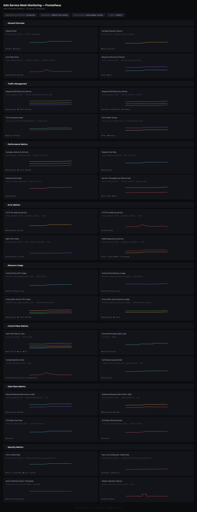

# Istio Service Mesh Monitoring Dashboard - Prometheus

## Dashboard Preview



## Metrics Ingestion

This dashboard uses Prometheus metrics exposed by [Istio](https://istio.io/latest/docs/reference/config/metrics/) sidecars (Envoy proxies) and the istiod control plane.

Configure your OpenTelemetry Collector to scrape Istio metrics:

```yaml
receivers:
  prometheus:
    config:
      scrape_configs:
        # Scrape Istio sidecar (Envoy) metrics
        - job_name: envoy-stats
          scrape_interval: 15s
          metrics_path: /stats/prometheus
          kubernetes_sd_configs:
            - role: pod
          relabel_configs:
            - source_labels: [__meta_kubernetes_pod_container_port_number]
              regex: "15090"
              action: keep
            - source_labels: [__meta_kubernetes_pod_ip]
              target_label: __address__
              replacement: $1:15090

        # Scrape istiod control plane metrics
        - job_name: istiod
          scrape_interval: 15s
          kubernetes_sd_configs:
            - role: pod
              namespaces:
                names: [istio-system]
          relabel_configs:
            - source_labels: [__meta_kubernetes_pod_label_app]
              regex: istiod
              action: keep
            - source_labels: [__meta_kubernetes_pod_ip]
              target_label: __address__
              replacement: $1:15014

        # Scrape kubelet/cAdvisor for resource metrics
        - job_name: kubelet
          scrape_interval: 15s
          scheme: https
          tls_config:
            insecure_skip_verify: true
          bearer_token_file: /var/run/secrets/kubernetes.io/serviceaccount/token
          kubernetes_sd_configs:
            - role: node
          relabel_configs:
            - target_label: __address__
              replacement: kubernetes.default.svc:443
            - source_labels: [__meta_kubernetes_node_name]
              target_label: __metrics_path__
              replacement: /api/v1/nodes/$1/proxy/metrics/cadvisor

processors:
  resource/env:
    attributes:
    - key: deployment.environment
      value: production
      action: upsert

exporters:
  otlp:
    endpoint: "<signoz-otel-collector-endpoint>:4317"
    tls:
      insecure: true

service:
  pipelines:
    metrics:
      receivers: [prometheus]
      processors: [resource/env]
      exporters: [otlp]
```

## Variables

- `{{deployment.environment}}`: Deployment environment
- `{{namespace}}`: Kubernetes namespace (multi-select, maps to `destination_workload_namespace`)
- `{{service.name}}`: Destination service name (multi-select)
- `{{cluster}}`: Cluster name for multi-cluster setups

## Dashboard Panels

### Section: General Overview
- **Request Rate** - Total incoming request rate across the mesh (`istio_requests_total`)
- **Average Request Latency** - Average latency using formula duration_sum/duration_count (`istio_request_duration_milliseconds`)
- **Error Rate (5xx)** - Rate of server errors by service (`istio_requests_total`)
- **Request Volume by Protocol** - Requests broken down by HTTP/gRPC/TCP (`istio_requests_total`)

### Section: Traffic Management
- **Request Distribution by Service** - How traffic is spread across services (`istio_requests_total`)
- **Request Distribution by Version** - Traffic split by service version for canary analysis (`istio_requests_total`)
- **TCP Connection Rate** - Rate of TCP connections opened and closed (`istio_tcp_connections_opened_total`, `istio_tcp_connections_closed_total`)
- **TCP Traffic Volume** - TCP bytes sent and received across the mesh (`istio_tcp_sent_bytes_total`, `istio_tcp_received_bytes_total`)

### Section: Performance Metrics
- **Average Latency by Service** - Per-service latency using formula duration_sum/duration_count (`istio_request_duration_milliseconds`)
- **Request Size Rate** - Rate of incoming request body sizes (`istio_request_bytes_sum`)
- **Response Size Rate** - Rate of outgoing response body sizes (`istio_response_bytes_sum`)
- **Service Throughput by Status Code** - Requests per service broken down by HTTP status (`istio_requests_total`)

### Section: Error Metrics
- **HTTP 4xx Rate by Service** - Client error rate per service (`istio_requests_total`)
- **HTTP 5xx Rate by Service** - Server error rate per service (`istio_requests_total`)
- **gRPC Error Rate** - Non-OK gRPC status codes by service (`istio_requests_total`)
- **Failed Requests by Service** - Combined 4xx+5xx errors by service and code (`istio_requests_total`)

### Section: Resource Usage
- **Control Plane CPU Usage** - CPU consumption of istiod pods (`container_cpu_usage_seconds_total`)
- **Control Plane Memory Usage** - Memory consumption of istiod pods (`container_memory_working_set_bytes`)
- **Proxy CPU Usage** - CPU consumption of istio-proxy sidecars (`container_cpu_usage_seconds_total`)
- **Proxy Memory Usage** - Memory consumption of istio-proxy sidecars (`container_memory_working_set_bytes`)

### Section: Control Plane Metrics
- **xDS Push Rate by Type** - Rate of CDS/EDS/LDS/RDS config pushes (`pilot_xds_pushes`)
- **Connected Proxies** - Number of Envoy proxies connected to istiod (`pilot_xds`)
- **Config Rejections Rate** - Rate of proxy config rejections (`pilot_total_xds_rejects`)
- **Certificate Issuance Rate** - Rate of certificate issuance by Citadel CA (`citadel_server_success_cert_issuance_count`)

### Section: Data Plane Metrics
- **Inbound Request Rate** - Server-side request rate by service (`istio_requests_total`, reporter=destination)
- **Outbound Request Rate** - Client-side request rate by source workload (`istio_requests_total`, reporter=source)
- **TCP Bytes Sent Rate** - Rate of TCP bytes sent by service (`istio_tcp_sent_bytes_total`)
- **TCP Bytes Received Rate** - Rate of TCP bytes received by service (`istio_tcp_received_bytes_total`)

### Section: Security Metrics
- **mTLS Traffic Rate** - Rate of requests using mutual TLS (`istio_requests_total`, connection_security_policy=mutual_tls)
- **Non-mTLS Traffic Rate** - Rate of plaintext requests not using mTLS (`istio_requests_total`)
- **Root Certificate Expiry** - Root cert expiry timestamp from Citadel CA (`citadel_server_root_cert_expiry_timestamp`)
- **Sidecar Injection Failures** - Rate of failed sidecar injection attempts (`sidecar_injection_failure_total`)
