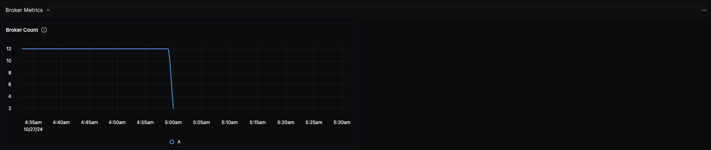
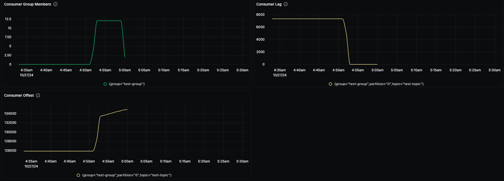
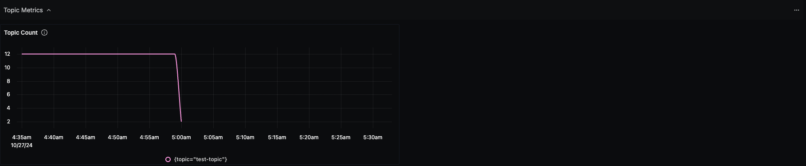
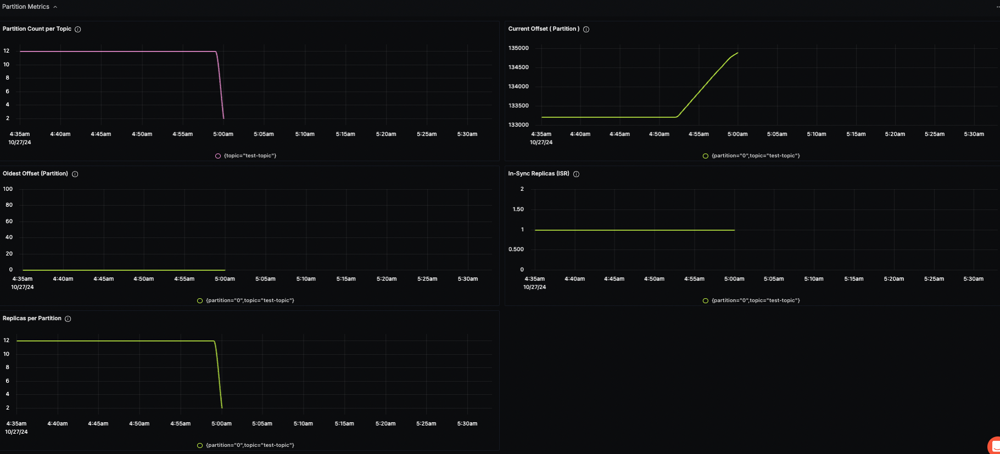

# Kafka Monitoring Dashboard - OTLP

## Data Ingestion

### Integrate KEDA with OpenTelemetry Collector

Add the following code to the receiver section of the OpenTelemetry Collector configuration file:

```
kafkametrics:
    brokers: <KAFKA_ENDPOINT>  # Ensure this is the correct address
    protocol_version: 2.0.0
    scrapers:
      - brokers
      - topics
      - consumers
```

and ```kafkametrics``` to the list of receivers in metrics/internal.


## Dashboard panels

## Variables

- `{{deployment.environment}}`: Development enviroment
- `{{kafka.cluster.alias}}`: Kafka cluster alias

### Sections

- Broker Metrics

  - Broker Count - kafka_brokers
- Consumer Metrics

   - Consumer Group Members - kafka_consumer_group_members
   - Consumer Lag - kafka_consumer_group_lag
   - Consumer Offset - kafka_consumer_group_offset
- Topic Metrics

  - Topic Count - kafka_topic_partitions
- Partition Metrics

  - Partition Count per Topic - kafka_topic_partitions
  - Current Offest (Partition) - kafka_partition_current_offset
  - Oldest Offset (Partition) - kafka_partition_oldest_offset
  - In-Sync Replicas (ISR) - kafka_partition_replicas_in_sync
  - Replicas per Partition - kafka_partition_replicas