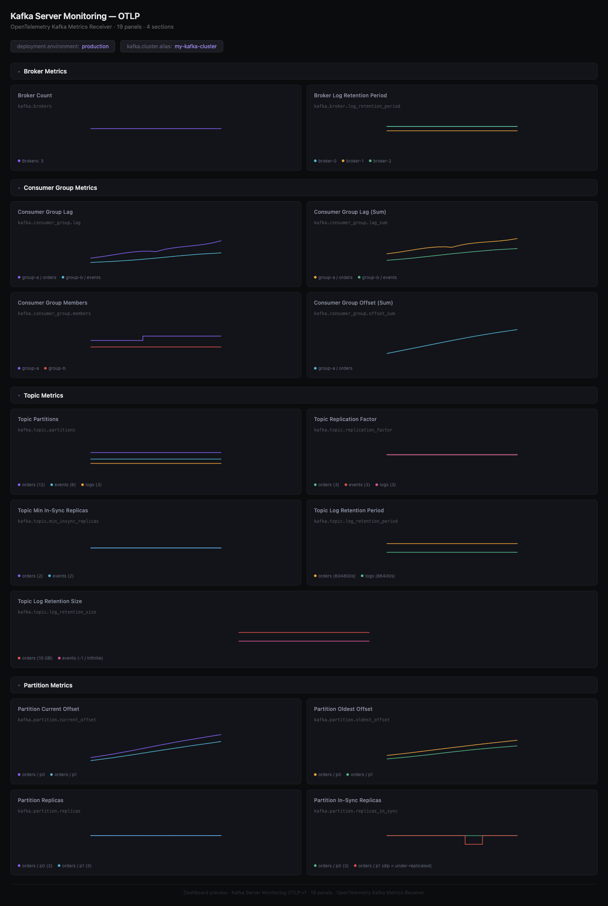

# Kafka Server Monitoring Dashboard - OTLP

## Dashboard Preview



## Metrics Ingestion

This dashboard uses metrics from the [OpenTelemetry Kafka metrics receiver](https://github.com/open-telemetry/opentelemetry-collector-contrib/tree/main/receiver/kafkametricsreceiver).

Add the Kafka metrics receiver to your `otel-config.yaml`:

```yaml
receivers:
  kafkametrics:
    brokers:
      - localhost:9092
    protocol_version: 2.0.0
    scrapers:
      - brokers
      - topics
      - consumers
    collection_interval: 30s

processors:
  resource/env:
    attributes:
    - key: deployment.environment
      value: production
      action: upsert

exporters:
  otlp:
    endpoint: "<signoz-otel-collector-endpoint>:4317"
    tls:
      insecure: true

service:
  pipelines:
    metrics:
      receivers: [kafkametrics]
      processors: [resource/env]
      exporters: [otlp]
```

To enable the optional `kafka.cluster.alias` resource attribute, add the following to your receiver config:

```yaml
receivers:
  kafkametrics:
    cluster_alias: my-kafka-cluster
```

## Variables

- `{{deployment.environment}}`: Deployment environment
- `{{kafka.cluster.alias}}`: Kafka cluster alias name

## Dashboard Panels

### Section: Broker Metrics
- **Broker Count** - Total number of brokers in the cluster (`kafka.brokers`)
- **Broker Log Retention Period** - Log retention time per broker (`kafka.broker.log_retention_period`)

### Section: Consumer Group Metrics
- **Consumer Group Lag** - Current approximate lag per consumer group and topic (`kafka.consumer_group.lag`)
- **Consumer Group Lag (Sum)** - Sum of lag across all partitions per consumer group and topic (`kafka.consumer_group.lag_sum`)
- **Consumer Group Members** - Number of members per consumer group (`kafka.consumer_group.members`)
- **Consumer Group Offset (Sum)** - Sum of offsets across partitions per consumer group and topic (`kafka.consumer_group.offset_sum`)

### Section: Topic Metrics
- **Topic Partitions** - Number of partitions per topic (`kafka.topic.partitions`)
- **Topic Replication Factor** - Replication factor per topic (`kafka.topic.replication_factor`)
- **Topic Min In-Sync Replicas** - Minimum in-sync replicas per topic (`kafka.topic.min_insync_replicas`)
- **Topic Log Retention Period** - Log retention period per topic (`kafka.topic.log_retention_period`)
- **Topic Log Retention Size** - Log retention size per topic (`kafka.topic.log_retention_size`)

### Section: Partition Metrics
- **Partition Current Offset** - Current offset per partition and topic (`kafka.partition.current_offset`)
- **Partition Oldest Offset** - Oldest offset per partition and topic (`kafka.partition.oldest_offset`)
- **Partition Replicas** - Number of replicas per partition and topic (`kafka.partition.replicas`)
- **Partition In-Sync Replicas** - Number of in-sync replicas per partition and topic (`kafka.partition.replicas_in_sync`)
