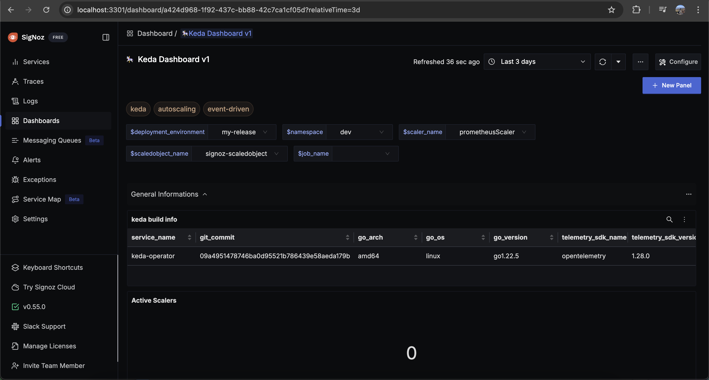
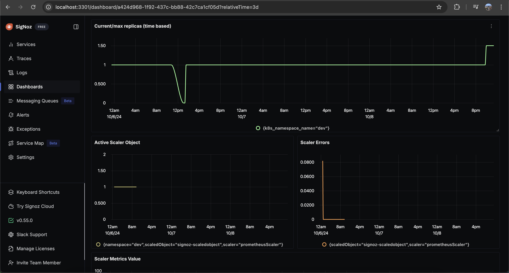
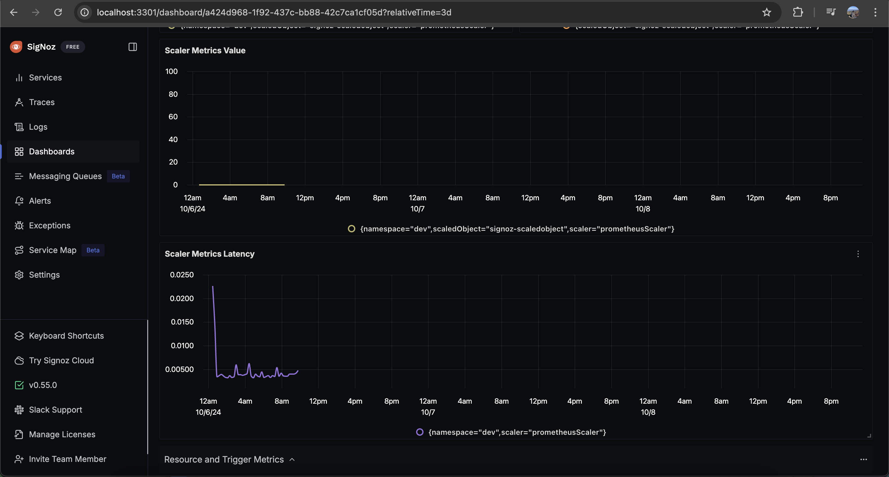
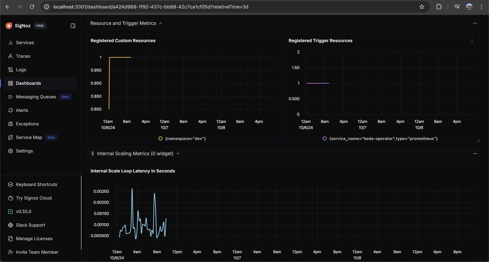

# keda-monitoring-otlp-v1

# Metrics Ingestion

1. Setup signoz cloud / selfhosted 
2. Integrate keda otel 


```yaml
apiVersion: apps/v1
kind: Deployment
metadata:
  name: keda-operator
  ...
      containers:
        - name: keda-operator
          image: ghcr.io/kedacore/keda:latest
          command:
            - /keda
          args:
            --enable-opentelemetry-metrics=true
            ...
          ...
          env:
            - name: OTEL_EXPORTER_OTLP_ENDPOINT
              value: "http://opentelemetry-collector.default.svc.cluster.local:4318"
```
Please follow the keda documentation about otel integration https://keda.sh/docs/2.15/integrations/opentelemetry/


## Dashboard panels

## Variables

- `{{deployment_environment}}`: Deployment environment
- `{{namespace}}`: kubernetes namespace
- `{{scaler_name}}`: Scaler name ( prometheus )
- `{{scaledobject_name}}`: Scaler Object 
- `{{job_name}}`: Scaler

### Sections

-  General Infomation -
     
-  Scaler Metrics
   
 - Trigger Metrics


