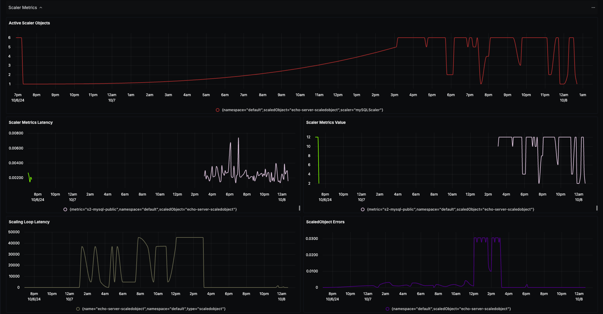
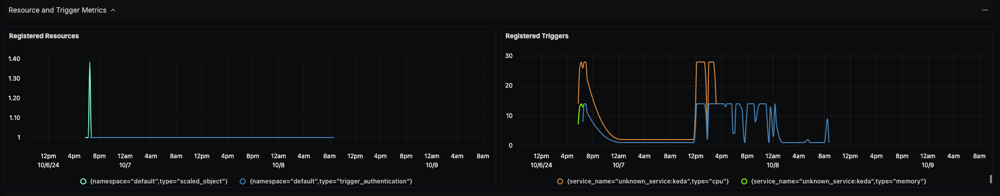

# KEDA Dashboard - OTLP

## Data Ingestion

### Integrate KEDA with OpenTelemetry Collector

Follow the instructions on the official KEDA website's [page](https://keda.sh/docs/2.15/integrations/opentelemetry/) about integrating OpenTelemetry with KEDA.

## Dashboard panels

## Variables

- `{{namespace}}`: Kubernetes namespace, with the default value as `default`
- `{{scaled_object}}`: Name of the ScaledObject

### Sections

- General Information
  - Build Info - `keda_build_info`
  - Number of Active Scaler Objects - `keda_scaler_active`
- Scaler Metrics
  - Active Scaler Objects - `keda_scaler_active`
  - Scaler Metrics Latency - `keda_scaler_metrics_latency_seconds`
  - Scaler Metrics Value - `keda_scaler_metrics_value`
  - Scaling Loop Latency - `keda_internal_scale_loop_latency_seconds`
  - ScaledObject Errors - `keda_scaled_object_errors`
  - Screenshot of Scaler Metrics Section - 
- Resource and Trigger Metrics
  - Registered Resources - `keda_resource_registered_count`
  - Registered Triggers - `keda_trigger_registered_count`
  - Screenshot of Resource and Trigger Metrics Section - 
- Cloud Event Metrics
  - CloudEventSource - Events Emitted - `keda_cloudeventsource_events_emitted_count`
  - CloudEventSource - Events Queued - `keda_cloudeventsource_events_queued`
