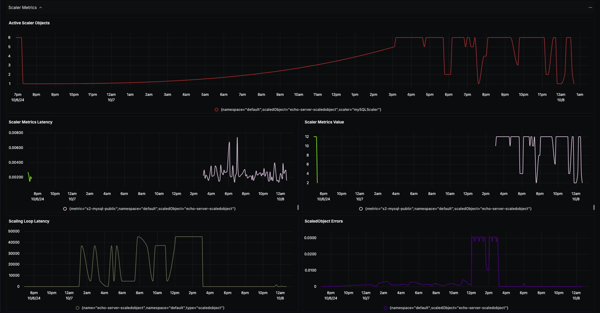
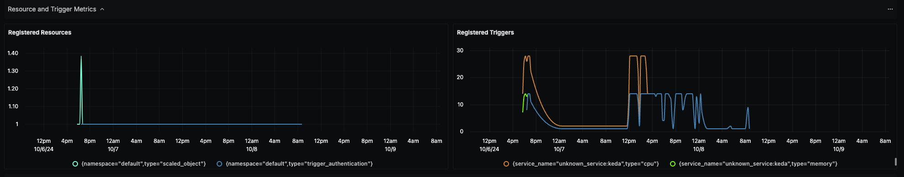

# KEDA Dashboard - OTLP

This dashboard visualizes KEDA operational metrics (scaler activity, scaling loop latency, scaler and ScaledObject errors, registered resources and triggers, and CloudEvent metrics) emitted by the KEDA operator over OpenTelemetry. It works with KEDA v2.12+ and is verified against KEDA v2.16+ metric names.

## Data Ingestion

### Integrate KEDA with OpenTelemetry Collector

Follow the instructions on the official KEDA website's [page](https://keda.sh/docs/latest/integrations/opentelemetry/) about integrating OpenTelemetry with KEDA. For the SigNoz-specific setup (Helm and `kubectl` paths) and the validate/troubleshoot flow, see [Send KEDA Metrics to SigNoz](https://signoz.io/docs/metrics-management/keda-metrics/).

## Variables

- `{{namespace}}`: Kubernetes namespace, with the default value as `default`
- `{{scaled_object}}`: Name of the ScaledObject

## Sections

- General Information
  - Active Scaler Objects - `keda_scaler_active`
  - Build Info - `keda_build_info`
  - Paused ScaledObjects - `keda_scaled_object_paused`
- Scaler Metrics
  - Scaler Objects - `keda_scaler_active`
  - Scaler Metrics Latency - `keda_scaler_metrics_latency_seconds`
  - Scaler Metrics Value - `keda_scaler_metrics_value`
  - Scaling Loop Latency - `keda_internal_scale_loop_latency_seconds`
  - ScaledObject Errors - `keda_scaled_object_errors`
  - Scaler Errors - `keda_scaler_errors`
  - Total Scaler Errors - `keda_scaler_errors_total`
  - Screenshot of Scaler Metrics Section - 
- ScaledJob Metrics
  - ScaledJob Errors - `keda_scaled_job_errors`
- Resource and Trigger Metrics
  - Registered Resources - `keda_resource_registered_count`
  - Registered Triggers - `keda_trigger_registered_count`
  - Screenshot of Resource and Trigger Metrics Section - 
- Cloud Event Metrics
  - CloudEventSource - Events Emitted - `keda_cloudeventsource_events_emitted_count`
  - CloudEventSource - Events Queued - `keda_cloudeventsource_events_queued`
