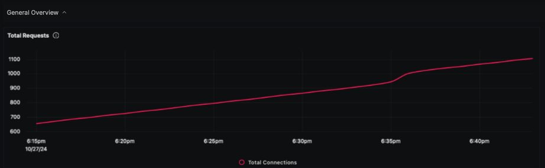
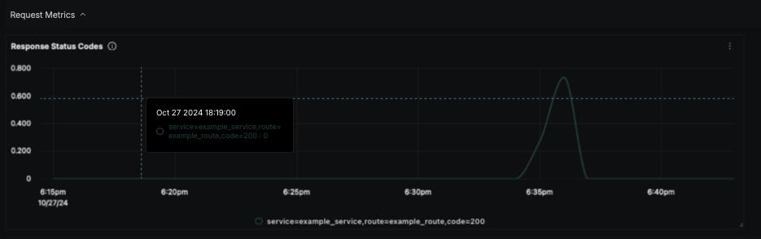
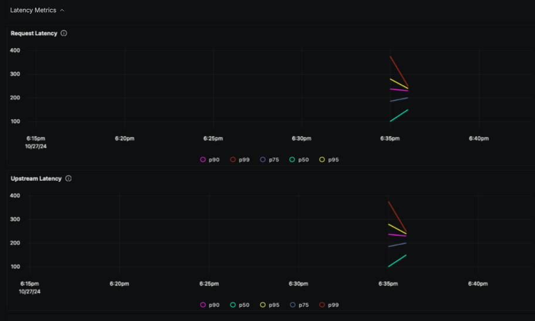
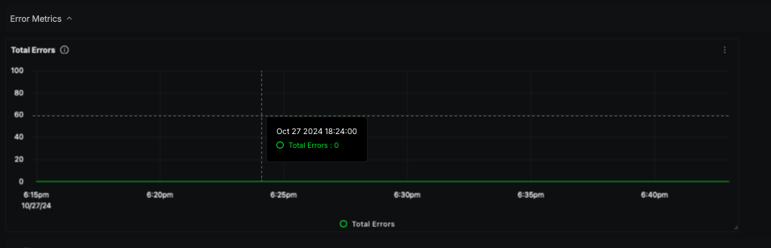
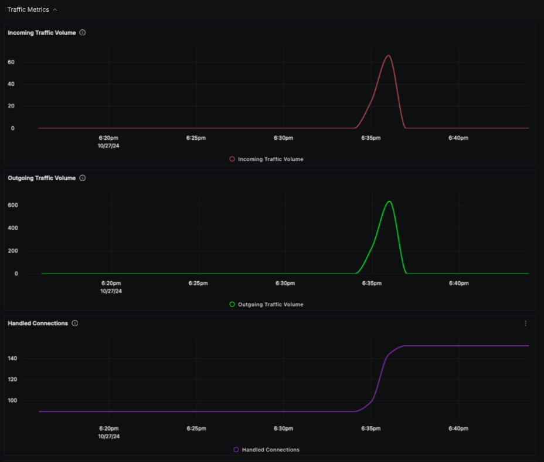
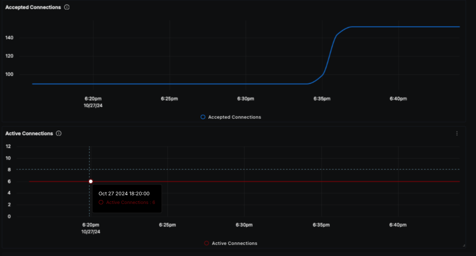

# Kong Gateway Monitoring Dashboard - OTLP

## Data Ingestion

### Use prometheus receiver with OpenTelemetry Collector

Add the following code to the collector metrics section of the OpenTelemetry Collector configuration file:

```
prometheus:
  config:
    scrape_configs:
      - job_name: "kong-otel-collector"
        scrape_interval: 30s
        static_configs:
          - targets: ["<KONG_GATEWAY_ADDRESS>:8001"]

```

## Dashboard panels

## Variables

- `{{service}}`: Service created in Kong Gateway
- `{{route}}`: Route created in Kong Gateway
- `{{code}}`: Service response code

### Sections

- General Overview

  - Total Requests
- Request Metrics

   - Response Status Codes
- Latency Metrics

  - Request Latency
  - Upstream Latency
- Error Metrics

  - Total Errors
- Traffic Metrics


  - Incoming Traffic Volume
  - Outgoing Traffic Volume
  - Handled Connections
  - Accepted Connections
  - Active Connections
- Resource Usage

  - Memory Usage - Kong

