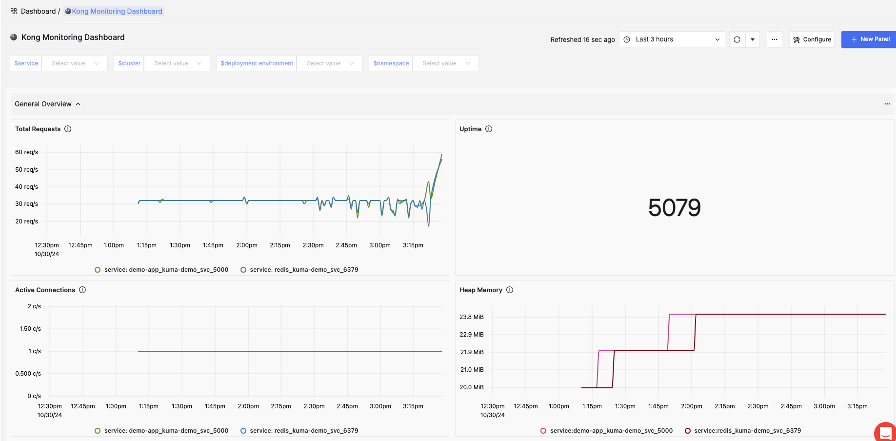
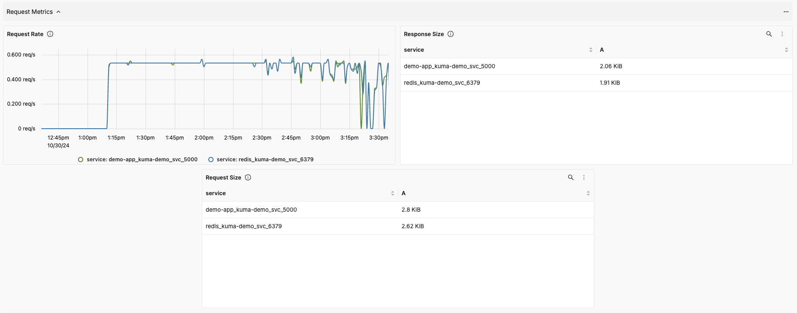
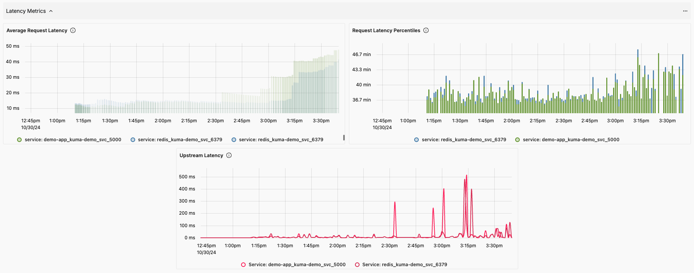
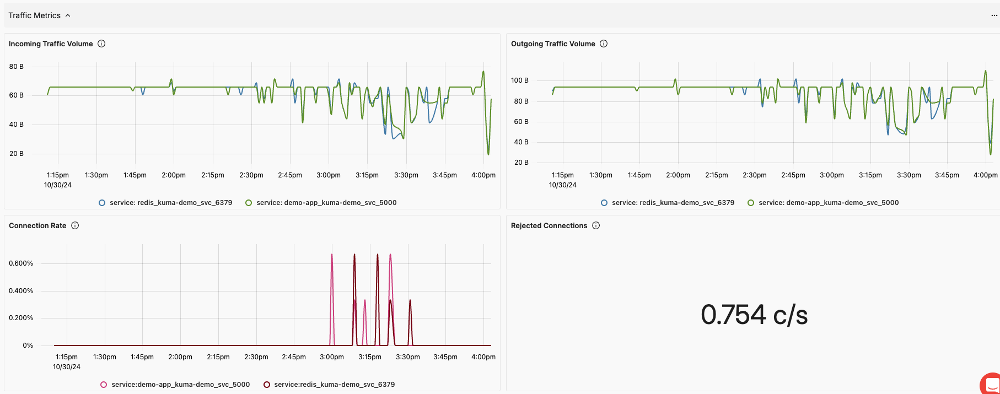

# Kong Monitoring Dashboard

## Metrics Ingestion

> [!NOTE]
> Make sure the Kubernetes Cluster installed (local or cloud)
### 1. Start Kubernetes Cluster

```bash
minikube start -p mesh-zone
```
Start a local k8s cluster with a named `mesh-zone`

### 2. Install Kong Mesh Control Plane 

```bash
helm repo add kong-mesh https://kong.github.io/kong-mesh-charts
helm repo update
helm install --create-namespace --namespace kong-mesh-system kong-mesh kong-mesh/kong-mesh
```
This installs the `Kong Mesh control plane` in your Kubernetes cluster.
### 3. Deploy your own application into Kong Mesh

### 4. Install OpenTelemetry Collector for `SigNoz`

#### Receiver:

This sample configuration `otel-config.yaml` export metrics to `SigNoz`

```yaml
mode: deployment
config:
  exporters:
    otlp:
      endpoint: "https://ingest.{region-code}.signoz.cloud:443" # replace {region} with your region if you are using signoz cloud, otherwise use localhost:4317 or wherever your collector is running
      headers:
        signoz-access-token: "<signoz-token>" # Obtain from https://{your-signoz-url}/settings/ingestion-settings (signoz-token is only required for signoz cloud)

  processors:
    resource/env:
      attributes:
      - key: deployment.environment
        value: Staging
        action: upsert

  receivers:
    otlp:
      protocols:
        grpc:
          endpoint: 0.0.0.0:4317
  service:
    pipelines:
      metrics:
        receivers: [otlp]        
        processors: [resource/env]
        exporters: [otlp]        
        
image:
  repository: "otel/opentelemetry-collector-contrib"
```

* Receivers: This section defines how the OpenTelemetry collector will receive metrics. In this case, it listens on port 4317 using the **OTLP gRPC protocol**
* Exporters: Metrics are forwarded to **SigNoz** at the specified endpoint with your access token.
* This defines how metrics flow from the receiver (OTLP) to the **exporter (SigNoz)**.

```bash
helm repo add open-telemetry https://open-telemetry.github.io/opentelemetry-helm-charts

helm install --create-namespace --namespace mesh-observability opentelemetry-collector open-telemetry/opentelemetry-collector -f otel-config.yaml
```
This installs the OpenTelemetry collector, configured to send metrics to SigNoz.

### 5. Enable OpenTelemetry metrics and check results
The following **MeshMetric policy** ensures that all Kong Mesh proxies forward their metrics to the **OpenTelemetry collector**.

```bash
echo '
apiVersion: kuma.io/v1alpha1
kind: MeshMetric
metadata:
 name: otel-metrics
 namespace: kong-mesh-system
 labels:
   kuma.io/mesh: default
spec:
 targetRef:
   kind: Mesh
 default:
   backends:
     - type: OpenTelemetry
       openTelemetry:
         endpoint: opentelemetry-collector.mesh-observability.svc:4317
' | kubectl apply -f -
```

## Dashboard Panels

### Variables
* `namespace` – Filter metrics based on the Kubernetes namespace where Kong is deployed.
* `service` – Select specific Kong services to filter metrics.
* `deployment.environment` – Filter metrics based on the deployment environment (e.g., production, staging).
* `cluster` - K8s clustername.

### Sections
- **General Overview**: This section provides a high-level overview of Kong's health and performance metrics, allowing for a quick assessment of the API gateway's current state.

    - `Total Requests` - Displays the total number of API requests handled by Kong - `envoy_http_downstream_rq_total`

    - `Uptime` - Displays the total uptime of the Kong instance since the last restart. - `envoy_server_uptime`

    - `Active Connections` - Shows the number of active connections currently managed by Kong. - `envoy_listener_downstream_cx_active`

    - `Heap Memory` - Tracks the amount of heap memory, useful for memory management and leak detection. - `envoy_server_memory_heap_size`



- **Request Metrics**: This section focuses on metrics related to API request handling, providing insights into request rates, response statuses, and processing times.

    - `Request Rate` - Displays the rate of incoming API requests per second/minute. - `rate(envoy_http_downstream_rq_total)`

    - `Request Size` - Illustrates the average and percentile sizes of incoming API requests. - `envoy_http_downstream_cx_rx_bytes_total`

    - `Response Size` - Displays the average and percentile sizes of responses sent by Kong. - `envoy_http_downstream_cx_tx_bytes_total`



- **Latency Metrics**: This section provides insights into the latency of API requests, helping identify performance bottlenecks and ensuring timely responses.

    - `Average Request Latency` - Shows the average time taken to process API requests. - `envoy_cluster_upstream_rq_time_sum / envoy_cluster_upstream_rq_time_count`

    - `Request Latency Percentiles` - Displays latency percentiles (90th) to highlight variations in request processing times. - `envoy_cluster_upstream_rq_time_bucket`

    - `Upstream Latency` - Illustrates the latency of upstream services that Kong communicates with during request processing. - `envoy_cluster_upstream_rq_time_sum`



- **Traffic Metrics**: This section provides insights into the traffic patterns managed by Kong, including data throughput and connection metrics.

    - `Incoming Traffic Volume` - Displays the amount of incoming traffic to Kong, measured in requests per second and data volume. - `envoy_cluster_upstream_cx_rx_bytes_total`

    - `Outgoing Traffic Volume` - Shows the amount of outgoing traffic from Kong to upstream services. - `envoy_cluster_upstream_cx_tx_bytes_total`

    - `Connection Rate` - Illustrates the rate of new connections being established with Kong. - `envoy_listener_downstream_cx_active`

    - `Rejected Connections` - Monitors the number of connection attempts rejected by Kong, highlighting potential overloads or misconfigurations. - `envoy_listener_downstream_cx_destroy`



## More Information
- [Deploy Kong Mesh on Kubernetes](https://docs.konghq.com/mesh/latest/quickstart/kubernetes-demo/)
- [Collect metrics with OpenTelemetry](https://docs.konghq.com/mesh/latest/guides/otel-metrics/#prerequisites)
- [Envoy Metrics](https://docs.datadoghq.com/integrations/envoy/?tab=host#metrics)