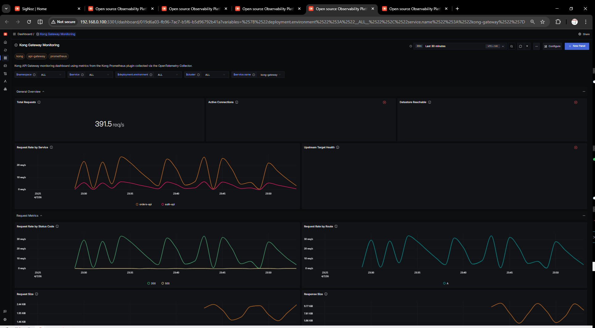

# Kong Gateway Dashboard - Prometheus

This dashboard provides a high-level overview of Kong's health and performance metrics, including RPS, Latency (P99), Bandwidth, and Kong Plugin Errors.

## Metrics Ingestion

To ingest metrics, install the `prometheus-plugin` on your Kong Gateway and configure the OpenTelemetry Collector to scrape the `:8001/metrics` endpoint. 

## Variables

- `{{instance}}`: The specific Kong Gateway instance endpoint.

## Dashboard Panels

* **RPS**: Total Request Per Second processed by Kong.
* **Latency**: P99 Response Latency.
* **Plugin Errors**: Errors separated by specific plugin failures.

## Screenshots

