# Microsoft Agent Framework Dashboard

## Details

This dashboard offers a clear view into Microsoft Agent Framework usage and performance. It highlights agent runs and model calls, token spend per model and per agent, latency percentiles for calls, agents and workflows, tool activity, workflows with their executors, and errors by type.

To start sending Microsoft Agent Framework telemetry to SigNoz, follow the [Microsoft Agent Framework observability guide](https://signoz.io/docs/microsoft-agent-framework-observability/).

## Dashboard panels

### Sections

### Agent Runs

Agent invocations, counted from `invoke_agent` spans. Agents that run inside a workflow count once each, so a three-agent concurrent workflow adds three runs here and one to Workflow Runs.

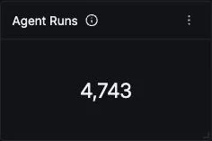

### LLM Calls

Model calls across every agent. Read it against Agent Runs to get calls per run: close to two is the normal shape for a tool-using agent (one call that requests tools, one that answers), and a ratio climbing well above that means agents are looping through more turns than the task needs.

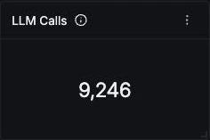

### Input Tokens

Prompt tokens, summed over `chat` spans only. The framework repeats the same totals on each parent `invoke_agent` span, so a query that sums every span reports double the real figure.

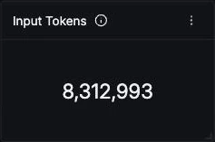

### Output Tokens

Completion tokens across all calls, with reasoning tokens included. The reasoning share is broken out separately in Token Usage Over Time.

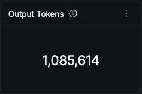

### Workflow Runs

Executions of sequential, concurrent, handoff and custom workflows, counted from `workflow.run` spans. Builds are recorded as separate `workflow.build` traces and are not counted here.

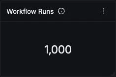

### Agent Error Rate

Share of agent invocations that ended in error. A failed tool call does not count: the agent sees the error, recovers and answers, so its span stays clean. Read this alongside Tool Error Rate.

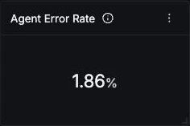

### Token Usage Over Time

Input, output, reasoning and cache-read tokens over the window. Input dominates because each turn resends the conversation and tool results. The cache-read line is the part of input the provider served from its prompt cache and billed at a discount, so a growing gap between it and input is a caching opportunity.

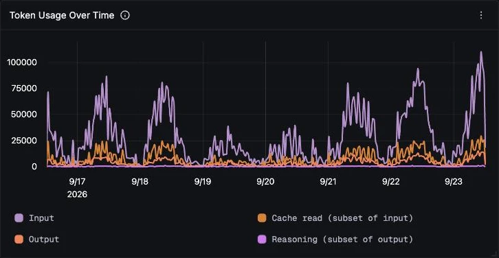

### LLM Calls by Model

Call volume per served model. Groups on `gen_ai.response.model`, which carries the dated snapshot the provider actually served, so a silent model upgrade shows up as a new series.

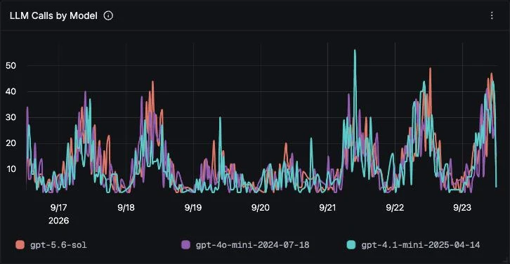

### Tokens by Model

Calls, input and output tokens per served model, with cache-read tokens further right in the table. Output tokens per call is the quickest cost signal here, since output is billed at several times the input rate.

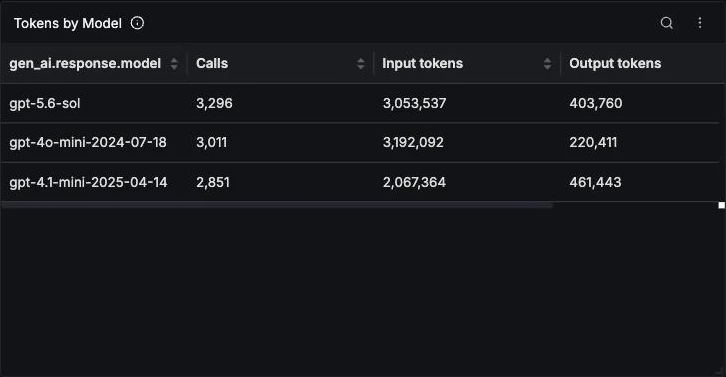

### Tokens by Agent

Runs and token totals per agent, read from `invoke_agent` spans, which roll up their own model calls. This is where to find the agent that dominates spend. Input tokens per run points at agents with long instructions or growing context.

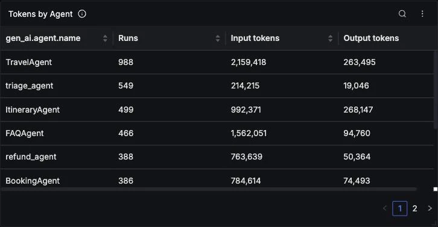

### LLM Call Latency

p50, p95 and p99 duration of model calls. A p99 that spikes while p50 stays flat usually means timeouts or rate-limit retries on a few calls, not a slower model.

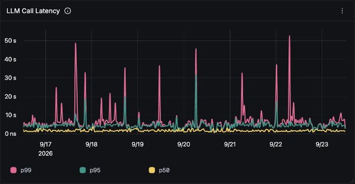

### Agent Latency (p95)

p95 end-to-end duration per agent, including its model calls and tools. Agents with booking or search tools sit well above chat-only agents, so compare each agent to its own baseline.

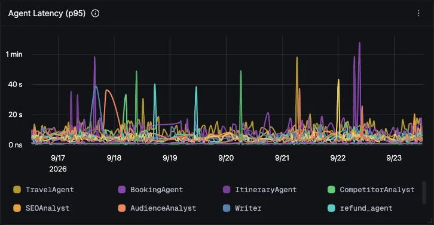

### Workflow Latency (p95)

p95 duration per workflow. A concurrent workflow is as slow as its slowest agent, and a handoff workflow varies with how many turns the specialist agent takes.

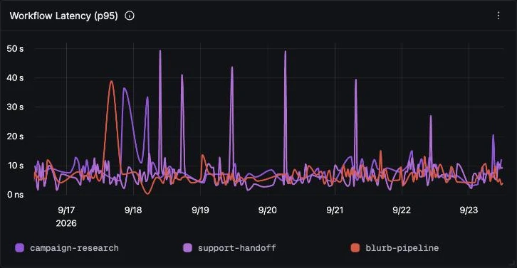

### Finish Reasons

Why each model call ended. An even split between `tool_calls` and `stop` is the normal shape for tool-using agents. A growing `length` slice means responses are being cut off at the token limit.

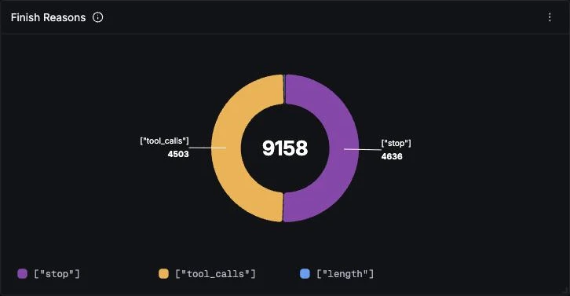

### Agents

Runs, errors and average latency per agent. Errors here are model call failures only, because tool failures leave the agent span clean.

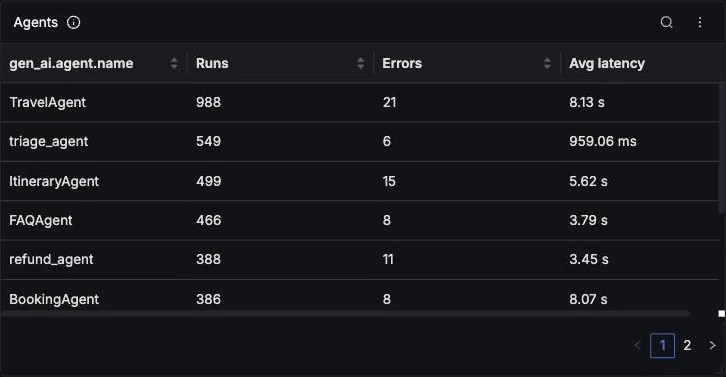

### Tools

Calls, failures and average latency per tool. Tool failures are invisible at the agent level, so this is the only place a flaky backend, like a booking service that fails a few percent of the time, shows up.

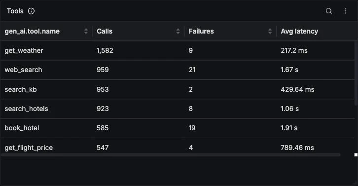

### Tool Calls Over Time

Tool invocations per tool. A sustained climb on one tool without a matching rise in Agent Runs is the usual early sign of an agent looping on a tool instead of answering.

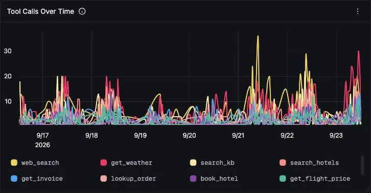

### Workflows

Runs and average duration per workflow. Workflow spans carry no token counts, so a workflow's cost is the sum of its agents in Tokens by Agent.

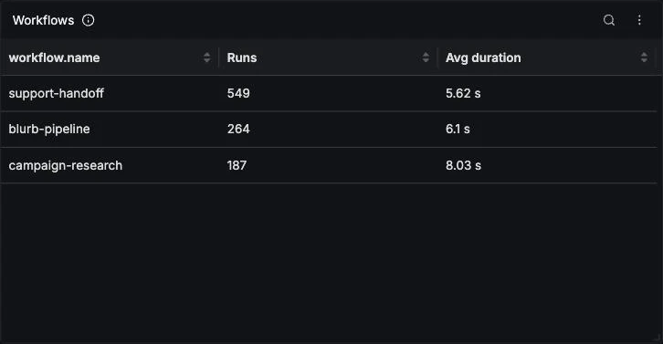

### Workflow Executors

Every executor step inside workflows, both agents and built-in steps such as `input-conversation`, `dispatcher` and `aggregator`. Handoff executors show more steps than their agent has runs, because each handoff briefly visits every participant. Built-in steps should take microseconds; if they don't, time is being lost in orchestration.

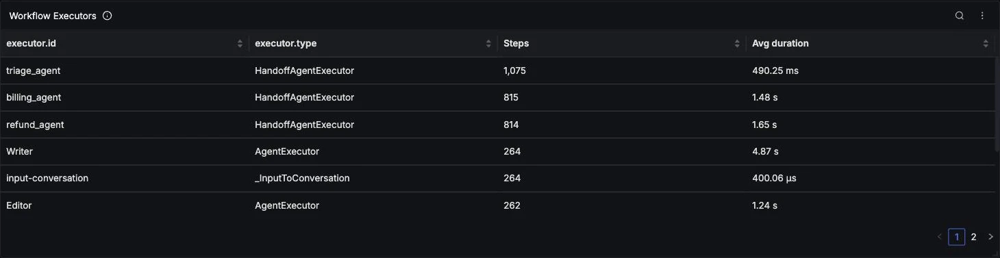

### Tool Error Rate

Share of tool executions that raised an exception. The agent usually recovers and answers, which is why this rate needs its own panel.

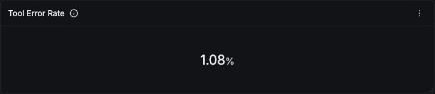

### LLM Error Rate

Share of model calls that failed with a rate limit, server error or timeout. Each of these also fails the parent agent span, and the workflow around it.

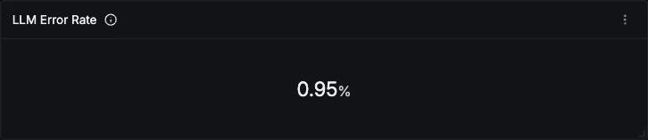

### Errors by Type

Errored spans over time by `error.type` and operation. A model failure appears twice, on the `chat` span and on its `invoke_agent` parent, so the two `ChatClientException` series overlap exactly. Read the chart per operation rather than summing it. A tall spike on one type in a short window, like a rate-limit storm, is the pattern to alert on.

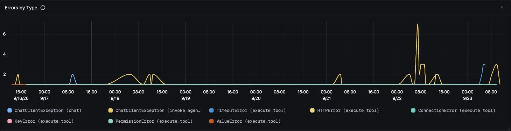

### Recent Errors

The latest errored spans, with their error class and message. The cascade is visible here: a failed `chat` span is followed by its `invoke_agent` parent at the same timestamp, and tool errors such as `ConnectionError` appear on their own.

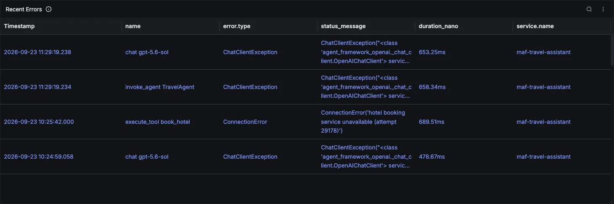
