# Meta Muse Code Dashboard

## Details

This dashboard gives visibility into Meta Muse Code, the terminal coding agent. It tracks session and turn volume, model-call token usage and prompt-cache efficiency, model and turn latency, and tool-call activity including failures. Every panel filters through the `service_name` variable, so one board covers as many services as your teams report under.

To start sending Muse Code telemetry to SigNoz, follow the [Muse Code monitoring guide](https://signoz.io/docs/muse-code-monitoring/).

## Dashboard panels

### Sections

### Sessions

One span per Muse Code TUI session. Read it next to Turns: a high turn-to-session ratio means people are holding a conversation with the agent, a ratio near one means they are firing one-shot prompts and leaving.

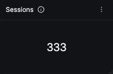

### Turns

A turn is one user prompt through to the agent's reply. This is the closest thing to a unit of work a developer would recognise, so it is the denominator to use when you want per-interaction cost rather than per-API-call cost.

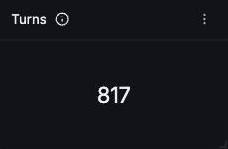

### Model Calls

Completed model calls. This runs several times higher than Turns and that is the normal shape: every tool the agent runs ends one call and starts another, so the ratio between the two is effectively the depth of the agent's tool loop.

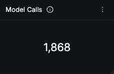

### Tool Calls

Tool executions across all sessions. Tracking close to Model Calls is expected, since most model calls in an agent loop exist to request a tool.

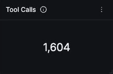

### Input Tokens

Input dominates total token spend for a coding agent, because every call replays the whole conversation plus any file content already read. It grows with turn depth, not with how much the user typed.

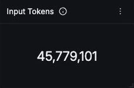

### Output Tokens

Two orders of magnitude smaller than input. Note that reasoning tokens bill as output but are reported separately, so this figure alone understates what the model generated.

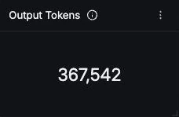

### Token Usage Over Time

Input, output, cache read and reasoning on one axis. Input dwarfs the others, which makes the smaller series hard to read here by design; use it to confirm cache read is tracking input rather than to measure output precisely.

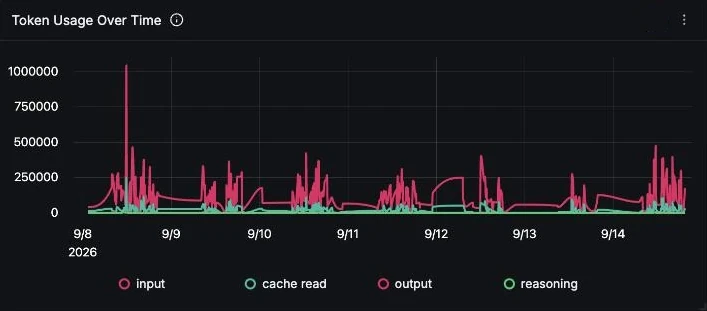

### Cache Read Ratio (%)

The single biggest cost lever. Cached input is far cheaper than fresh input, so a high ratio means the same work costs less. A low ratio at the start of a session is normal; a ratio that stays low across a whole day usually means prompts are being rebuilt in a way that defeats the cache.

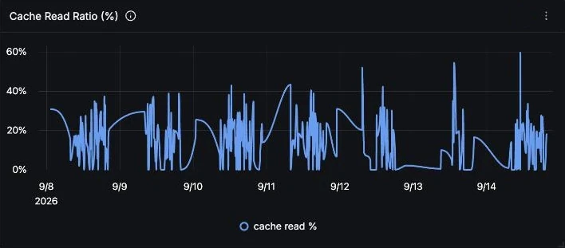

### Input Tokens by Model

Which model id is actually consuming the context. Worth watching after a default model change, since a model switch moves both cost per token and how many tokens a turn needs.

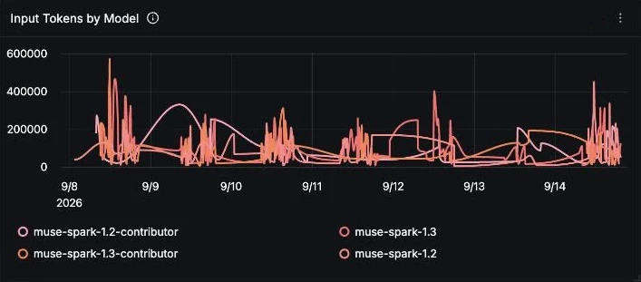

### Reasoning Tokens Over Time

Muse Spark reasoning tokens. These bill as output but never appear in the reply, so they are invisible in the transcript and easy to miss when estimating cost. Spikes line up with calls made at a higher reasoning effort.

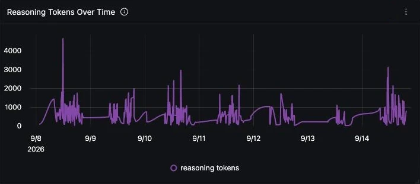

### Model Call Latency

p50, p95 and p99 for a single model call. p99 spikes on a coding agent are usually long reasoning on a hard step rather than network trouble, which is why this is worth reading next to the reasoning token panel.

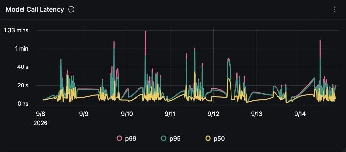

### Turn Duration

The full turn, prompt to reply. It sits well above Model Call Latency because one turn contains several model calls plus the tool time between them. The gap between the two panels is the agent's own overhead.

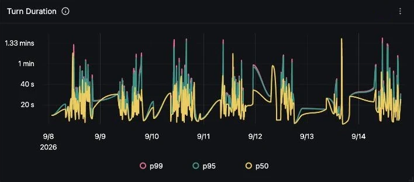

### Tool Calls by Tool

Execution count per tool. Read and search tools dominating is the normal shape for a coding agent; write and edit tools climbing towards them suggests the agent is being asked to make changes rather than answer questions.

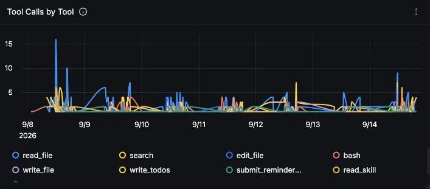

### Tool Duration p95 by Tool

p95 per tool. Subagent spawning sits far above everything else by construction, since it runs a whole child agent. Exclude it mentally when judging whether the ordinary file and search tools have regressed.

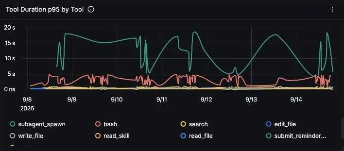

### Tool Outcomes

Success against failure across every tool execution. A few percent failing is healthy and expected: a search that matches nothing, or an edit whose anchor text moved. A sharp climb is the signal worth chasing.

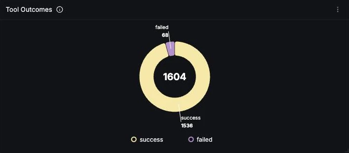

### Tool Failures Over Time

Failures on their own axis, which the outcome donut cannot show. Correlate a spike with a repo change or a tool policy change; a sustained step usually means the agent is retrying something it can no longer do.

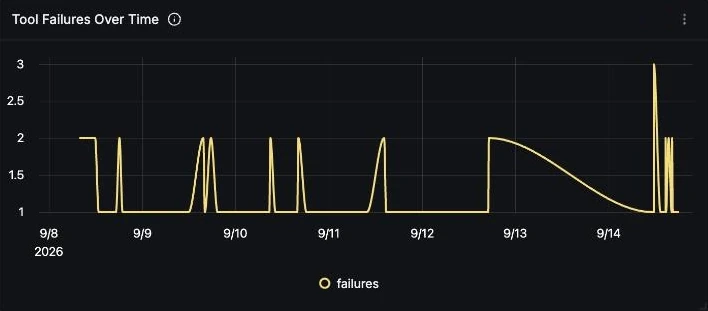

### Model Calls by Finish Reason

tool_calls dominating over stop is the normal shape for an agent, because every tool round trip ends a call with tool_calls and only the final answer ends with stop. The ratio is another read on tool-loop depth.

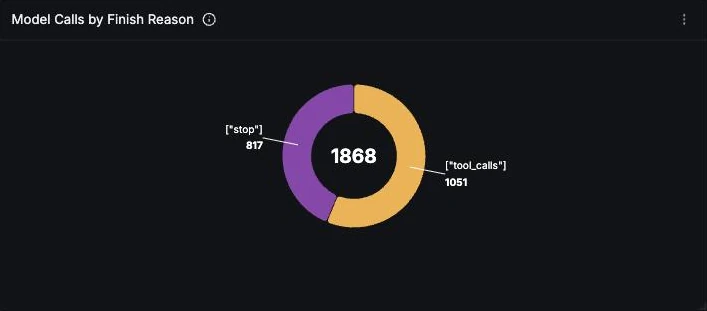

### Model Calls by Reasoning Effort

How the configured Muse reasoning effort is distributed. Since effort drives both reasoning tokens and latency, a shift towards high here explains a rise in the reasoning token and latency panels without anything else having changed.

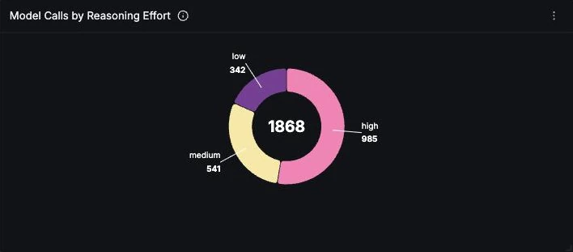
