# Meta Muse Spark Dashboard

## Details

This dashboard offers a clear view into Meta Muse Spark usage and cost via the Meta Model API. It covers true spend with caching priced correctly, reasoning share of output, cache hit rate, call duration against time to first chunk, request and error volume per model, and finish reason split.

To start sending Muse Spark telemetry to SigNoz, follow the [Muse Spark monitoring guide](https://signoz.io/docs/muse-spark-monitoring/).

## Dashboard panels

### Sections

### Total Cost

Sum of `gen_ai.cost.total_cost` across every call. This is only correct when your instrumentation prices cached input separately from fresh input. Cached input is roughly 8x cheaper on the standard tier, so a cost figure derived from input tokens alone overstates real spend by several times on any workload that reuses a system prompt.

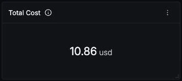

### Requests

Muse Spark calls in the selected window. Every panel here filters `gen_ai.provider.name = 'meta'`, which is what keeps this count honest: the wrapper span and the SDK's own client span both carry `gen_ai.request.model`, so counting on the model alone reports twice the real traffic.

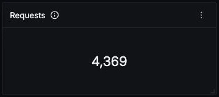

### Error Rate

Share of calls that ended in an error. Muse Spark's error spans drop to request attributes only, with no usage and no `error.type`, so an error costs you the token accounting for that call as well as the call itself. A step change here usually means rate limiting rather than a bad request.

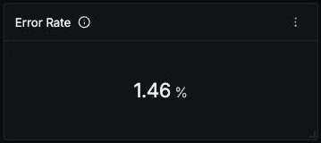

### Prompt Cache Hit Rate

Cache read tokens divided by input tokens. Agent and batch workloads that resend a stable system prompt settle high, often above 90 percent on repeat calls, while interactive chat sits lower. Read this next to Total Cost: it is the single biggest lever on spend, and it moves independently of latency because the time goes to reasoning rather than prefill.

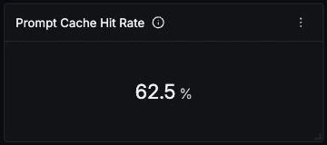

### Cost Over Time by Model

True cost per model id over time. Keeping the model split visible matters more here than on most providers because the contributor tier is roughly 12x cheaper than standard for a near-identical model name, so a single mistyped id is the difference between a cheap workload and an expensive one.

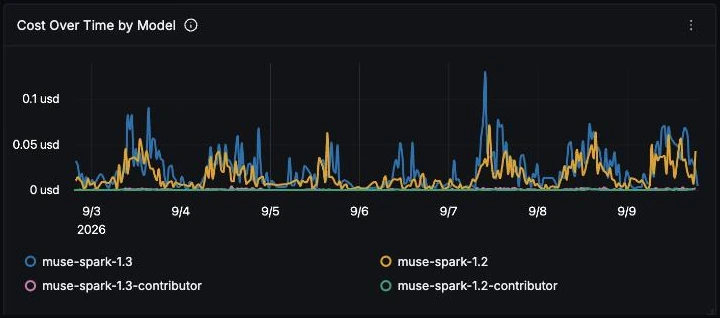

### Cost Share by Model

Which model id is actually spending the money. The normal shape is standard-tier models dominating the total while contributor-tier models carry a large share of the requests, since the two tiers differ by more than an order of magnitude in price rather than in usage.

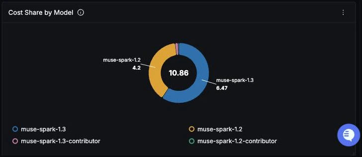

### Token Usage by Type

Input, output, reasoning and cache read tokens on one axis. Reasoning is a subset of output and cache read is a subset of input, so the pairs should track each other closely. Reasoning sitting at 90 percent or more of output is normal for Muse Spark across every version, not a sign of anything wrong.

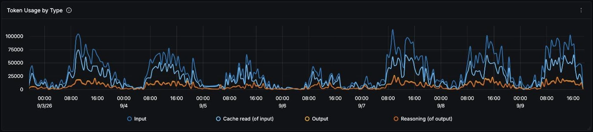

### Per-Model Usage and Cost

Requests, cost, tokens and average latency per model id in one table. The column to read across is Reasoning Tokens against Output Tokens, which shows how little of what you pay for on the output side ever reaches the caller. Average latency here separates the fast 1.2 line from the much slower 1.3 line.

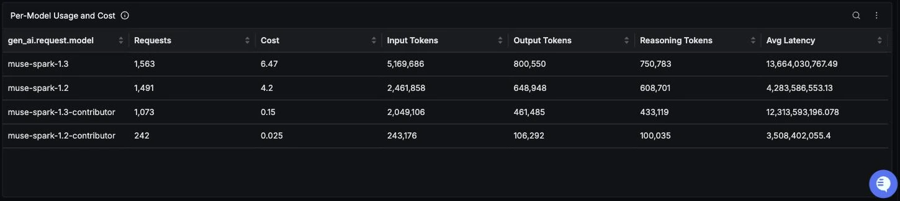

### Call Duration (p50 / p95 / p99)

End to end duration of each call. The p99 spikes are real rather than noise: they are calls that ran to a large `max_tokens` ceiling, and at roughly 40 output tokens per second an 8192 token ceiling is a call of several minutes. Read the median rather than the tail if you want the everyday experience.

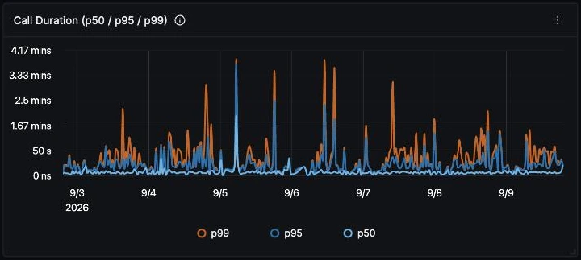

### Time to First Chunk (p50 / p95)

Seconds of reasoning before the first visible token on streaming calls. This is the number users actually feel, and on Muse Spark it accounts for most of the call: the model reasons to near completion before emitting anything. Total duration on its own hides that entirely, which is why the two panels sit side by side.

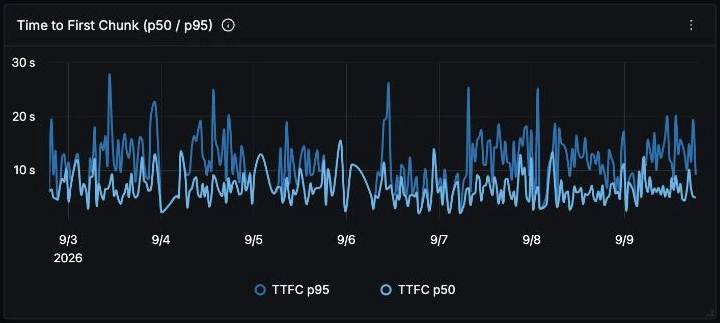

### Slowest Calls

Individual spans, slowest first, with output tokens, reasoning tokens and cost per call. The slowest rows are usually calls that ran to their `max_tokens` ceiling, so output tokens equal to a round number such as 8192 is the tell. Those are the calls the Finish Reasons panel counts as `length`.

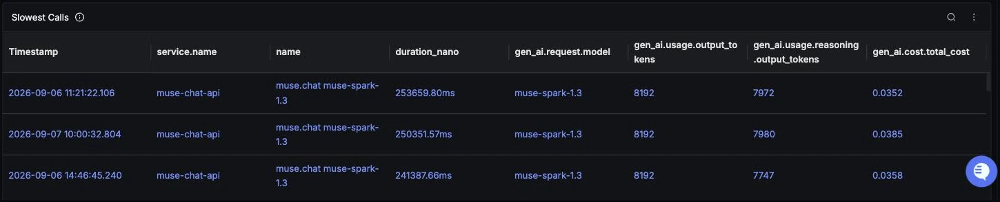

### Requests Over Time by Model

Call volume per model id. Useful for spotting a migration between versions, and for reading the other panels in context: a cost or latency change is only interesting once you know whether the traffic mix moved underneath it.

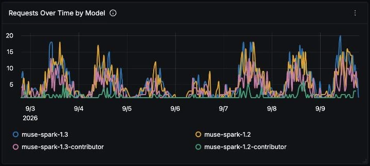

### Errors Over Time by Model

Errored calls per model id. Grouping by model is the only breakdown available, because the instrumentation records no `error.type` attribute: a 401, a 404 and a 400 are indistinguishable except by parsing the span status message. Use the Recent Errors panel below to see which is which.

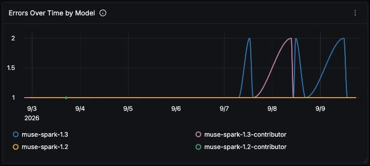

### Finish Reasons

The split across `stop`, `tool_calls` and `length`. A growing `length` slice is the leading indicator worth alerting on, because `max_tokens` caps reasoning and output together on this model family. When reasoning consumes the whole budget the caller gets empty content, and on a streaming call it gets no usage record either, so those failures disappear from the token panels above.

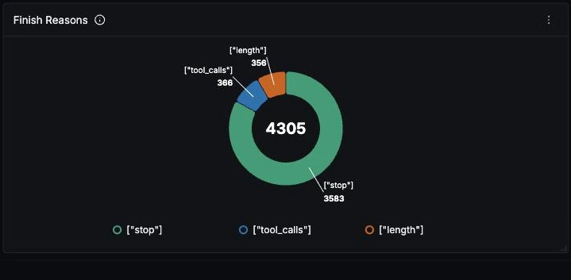

### Recent Errors

The latest errored spans with their service and model. Since error spans carry no usage attributes, this table is where you confirm what actually failed. Note that these rows are the only place the underlying provider error string survives.

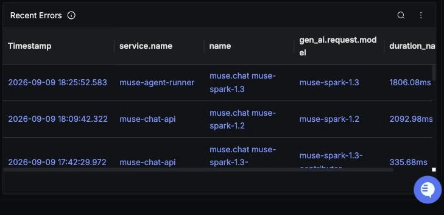
