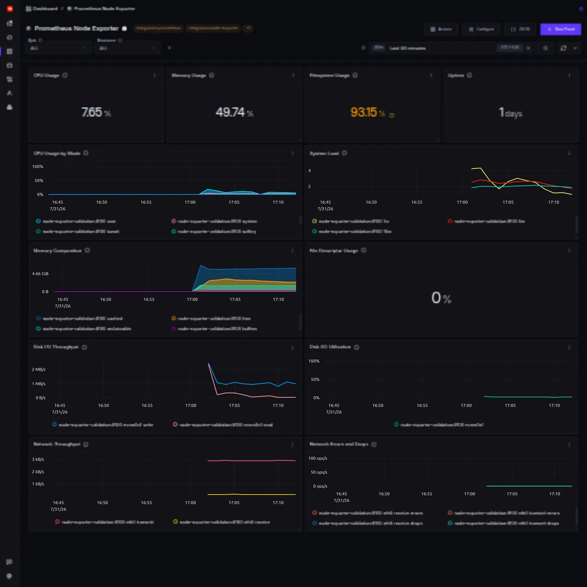

# Prometheus Node Exporter Dashboard

This dashboard monitors Linux hosts using metrics from [Prometheus Node Exporter](https://github.com/prometheus/node_exporter). It is intended for environments that already scrape Node Exporter and send those metrics to SigNoz through the OpenTelemetry Collector Prometheus receiver or Prometheus remote write.

The existing hostmetrics dashboards use OpenTelemetry host metric names. This dashboard uses the native `node_*` metric families exposed by Node Exporter.



## Metrics ingestion

Run Node Exporter on each Linux host and configure an [OpenTelemetry Collector Prometheus receiver](https://github.com/open-telemetry/opentelemetry-collector-contrib/tree/main/receiver/prometheusreceiver) to scrape it. Replace the target below with the address exposed by your Node Exporter deployment.

```yaml
receivers:
  prometheus/node-exporter:
    config:
      scrape_configs:
        - job_name: node-exporter
          scrape_interval: 30s
          static_configs:
            - targets:
                - ${env:NODE_EXPORTER_ENDPOINT}

service:
  pipelines:
    metrics:
      receivers:
        - prometheus/node-exporter
```

Add your existing SigNoz metrics exporter to the metrics pipeline. The Prometheus receiver follows OpenTelemetry's compatibility conventions and maps the Prometheus `job` and `instance` labels to the `service.name` and `service.instance.id` resource attributes. The dashboard queries these resource attributes while retaining `job` and `instance` as its variable names.

After the collector starts sending data, confirm that `node_uname_info` and the other `node_*` metrics are available in SigNoz with `service.name` and `service.instance.id` resource attributes before importing the dashboard.

## Variables

- `job`: one or more Prometheus scrape jobs, populated from `service.name` on `node_uname_info`.
- `instance`: one or more Node Exporter targets, populated from `service.instance.id` and limited to the selected jobs.

Every panel applies both variables. Series legends include the instance and, where relevant, the device, mountpoint, or CPU mode.

## Dashboard panels

### Overview

- **CPU Usage**: non-idle CPU time averaged across cores.
- **Memory Usage**: used memory calculated as `1 - MemAvailable / MemTotal`.
- **Filesystem Usage**: used capacity calculated from available and total bytes for each physical filesystem.
- **Uptime**: elapsed time since the host booted.

### CPU and load

- **CPU Usage by Mode**: non-idle CPU usage split by mode.
- **System Load**: one, five, and fifteen minute load averages.

### Memory

- **Memory Composition**: free, cached, buffered, and reclaimable memory.
- **File Descriptor Usage**: allocated file descriptors as a percentage of the system maximum.

### Disk

- **Disk I/O Throughput**: bytes read and written per second by block device.
- **Disk I/O Utilization**: percentage of wall time spent processing I/O by device.

### Network

- **Network Throughput**: bytes received and transmitted per second by interface.
- **Network Errors and Drops**: receive and transmit errors and dropped packets per second.

The filesystem panels exclude `tmpfs`, `devtmpfs`, `overlay`, `squashfs`, `proc`, `sysfs`, and cgroup filesystems. Disk panels exclude loop, RAM, and device-mapper control devices. Network panels exclude the loopback interface.

Some panels may be empty when the corresponding Node Exporter collector is disabled or unsupported by the host kernel.

## Import the dashboard

1. Download [`node-exporter-prometheus-v1.json`](node-exporter-prometheus-v1.json).
2. In SigNoz, open **Dashboards** and select **Import JSON**.
3. Import the downloaded file.
4. Select a `job` and one or more `instance` values.
