# OpenAI Agents SDK Dashboard

## Details

This dashboard offers a clear view into OpenAI Agents SDK usage and performance. It highlights agent run and model call volume, input and output token spend per model, call and per-agent latency percentiles, tool activity, handoffs between agents, guardrail checks, and an error breakdown by operation.

To start sending OpenAI Agents SDK telemetry to SigNoz, follow the [OpenAI Agents SDK observability guide](https://signoz.io/docs/openai-agents-sdk-observability/).

## Dashboard panels

### Sections

### Agent Runs

Completed `Runner.run()` invocations, counted from root `Agent workflow` spans. Counting `invoke_agent` spans instead would overstate this, because a guardrail nests a full agent run of its own inside the run it is checking.

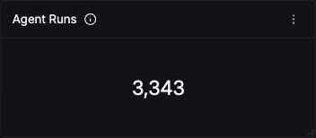

### LLM Calls

Model calls across every agent. Read it against Agent Runs to get calls per run: a ratio well above two suggests agents are looping through more turns than the task needs, which is the cheapest early warning of a runaway agent.

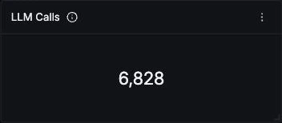

### Input Tokens

Prompt tokens across all calls. This instrumentation does not report cache-served tokens separately, so a workload that leans on prompt caching is billed for meaningfully less than this figure implies. Treat it as an upper bound, not a spend number.

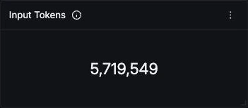

### Output Tokens

Completion tokens across all calls. Reasoning tokens are folded in here with no separate breakdown, so a reasoning model looks like a verbose chat model rather than an expensive one.

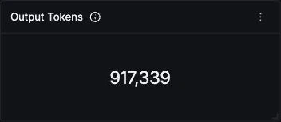

### Token Usage Over Time

Input and output tokens over the window. Input normally dwarfs output by an order of magnitude, because each agent turn resends the accumulated conversation and tool results. A sudden rise in the input line alone usually means prompt or context construction changed, not that traffic grew.

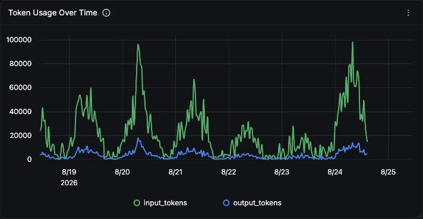

### LLM Calls by Model

Call volume per served model. Useful after a model migration to confirm traffic actually moved, and to spot an agent still pinned to an old model while the rest of the fleet has moved on.

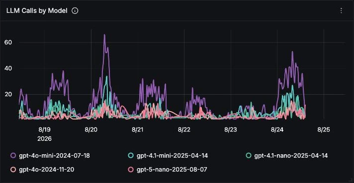

### Tokens by Model

Calls and token totals per model, the table to multiply against your own per-model rates when you want a spend figure. The call counts here sum to slightly less than the LLM Calls scorecard, because calls that were cancelled before a response arrived carry no model and drop out of this grouping.

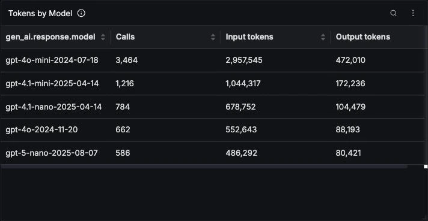

### Model Distribution

Share of calls per model. A small model holding the large majority of calls is the healthy shape for an agent fleet, since most turns are routing and tool selection rather than generation.

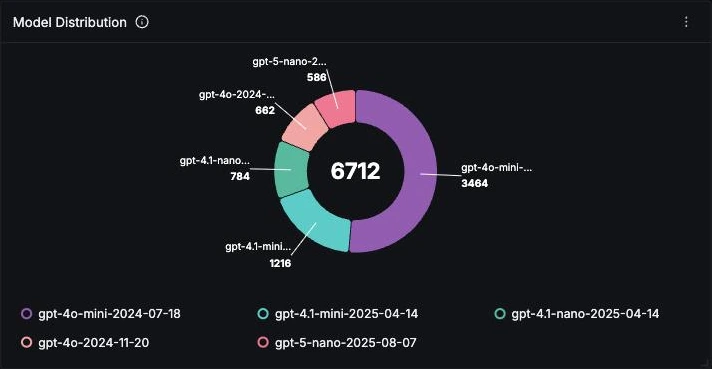

### LLM Call Latency

p50, p95 and p99 of model call duration. LLM latency is bimodal and driven by output length, so the gap between p50 and p99 is wide by nature. Watch the shape of that gap rather than any single line: p99 pulling away while p50 holds steady points at a few very long generations, not a general slowdown.

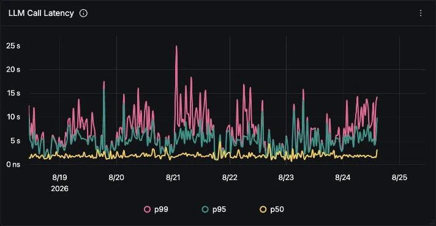

### Agent Latency (p95)

p95 duration per agent, covering the whole agent turn rather than one model call, so it includes tool execution and any nested guardrail run. Guardrail agents appear here as their own series. An agent consistently slower than its peers is usually doing more turns, not slower ones.

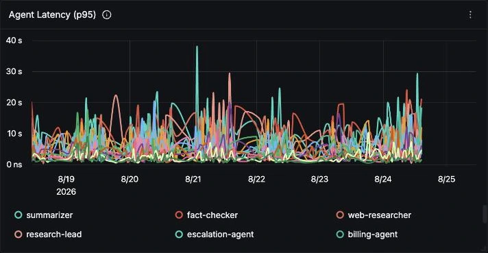

### Agents

Requests and average latency per agent. This panel is scoped to `invoke_agent` spans on purpose: `gen_ai.agent.name` is the literal default string `OpenAI Agent` on chat, tool, handoff and guardrail spans, so grouping anywhere else collapses every agent into one row. Latency is reported in raw nanoseconds.

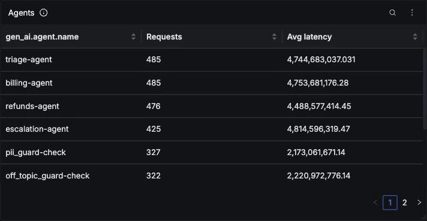

### Tools

Calls and average latency per tool. Tool spans measure your own function, not the model, so anything here in the hundreds of milliseconds is your I/O and is usually the cheapest latency to fix. Latency is reported in raw nanoseconds.

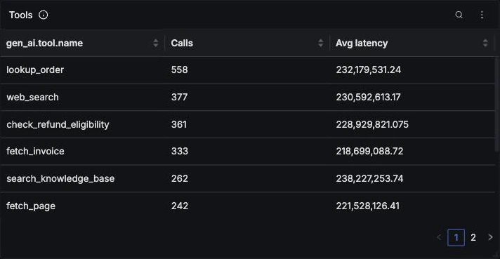

### Tool Calls Over Time

Tool invocation volume per tool. A sustained climb without matching growth in Agent Runs is the clearest early signal of an agent loop that is not terminating, and it shows up in spend well before anyone files a complaint.

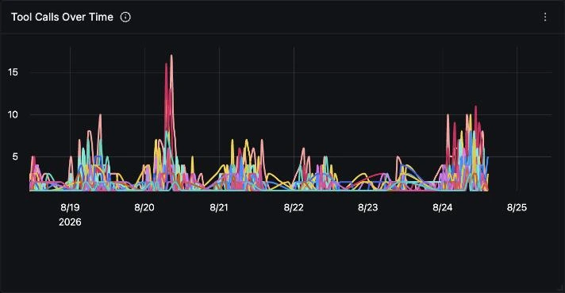

### Agent Handoffs

Counts for each from-agent to to-agent pair. In a triage design most handoffs should flow outward from the router; a pair that starts flowing back the other way, or a loop between two specialists, means the routing prompt is no longer deciding cleanly.

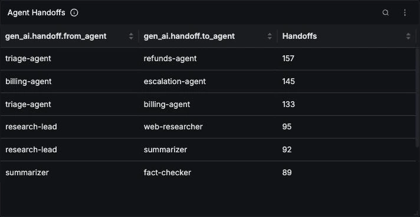

### Error Rate

Errored spans as a share of all spans. The denominator is every span rather than the non-errored ones, because `has_error` is absent rather than false on success, which makes negative filters unreliable on this data.

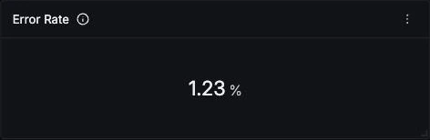

### Tool Error Rate

Share of tool executions that failed. Tool failures are non-fatal: the SDK hands the model a sanitized message and lets the run continue, so a tool can fail steadily without the run ever erroring. The real failure text is on the span's status message, not in `gen_ai.tool.call.result`.

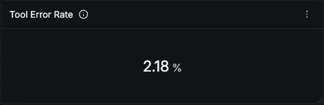

### Aborted LLM Calls

Model calls that closed with no model and no tokens, which is what an in-flight call looks like when a guardrail tripwire cancels it. These spans carry an Ok status, so they never reach the error panels and quietly disappear from any breakdown grouped by model. A rising count means guardrails are firing more often.

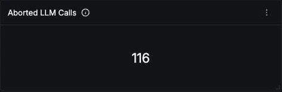

### Errors by Operation

Errored spans over time split by operation, which separates a provider problem on `chat` from a broken tool on `execute_tool`. Note that errors do not propagate to the root span: `Agent workflow` stays Ok even when a child fails, so counting failed runs from root status returns zero.

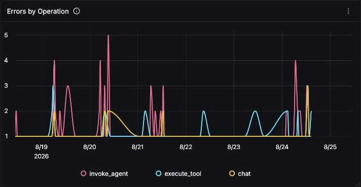

### Guardrails

Each guardrail and how often it tripped, split by the triggered flag. Read the true rows as a share of that guardrail's total: a rate near zero means the guardrail is probably not earning its cost, and a high rate on an input guardrail means users are routinely hitting a wall.

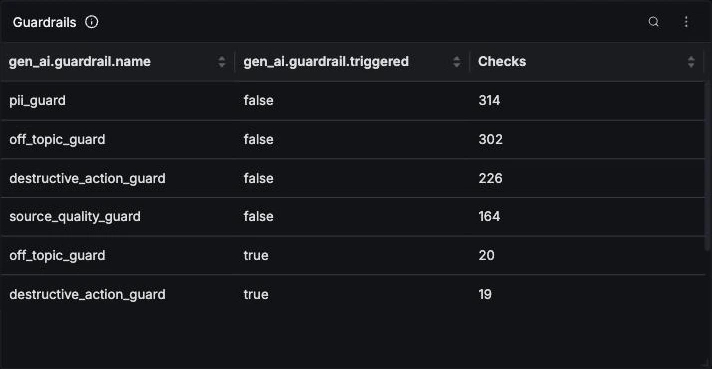

### Recent Errors

The latest errored spans with their status message. This instrumentation emits no `error.type` attribute and no exception events, so this free-text message is the only place the failure class lives, and reading it is how you separate a rate limit from a context-length overflow.

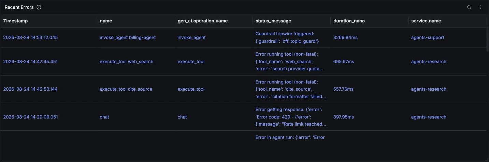
