# OpenWebUI Dashboard

## Details

This dashboard monitors [OpenWebUI](https://docs.openwebui.com/) instrumented with OpenTelemetry: application golden signals (throughput, latency, errors), database query performance, and end-to-end LLM/GenAI observability. It combines two telemetry sources OpenWebUI can emit — the backend's **native OpenTelemetry** auto-instrumentation of FastAPI, SQLAlchemy, and HTTP clients (server spans carrying `http.route`, DB spans carrying `db.system`/`db.operation`), and **OpenLIT** GenAI instrumentation for model calls (chat spans carrying the OpenTelemetry `gen_ai.*` semantic conventions: `gen_ai.request.model`, `gen_ai.usage.input_tokens`/`output_tokens`, `gen_ai.usage.cost`). Every panel keys off these attributes and filters through the `service_name` picker, so you can scope to one or more services (for example the app service and the OpenLIT LLM service).

## Dashboard panels

### Sections

#### Total Requests

Total inbound HTTP requests (FastAPI server spans) handled by the selected OpenWebUI services over the selected time range. A quick pulse on overall traffic.

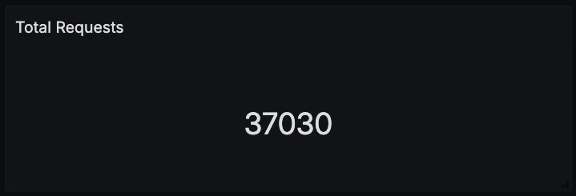

#### Error Rate

The fraction of server requests that ended in an error status. An at-a-glance health signal for the application.

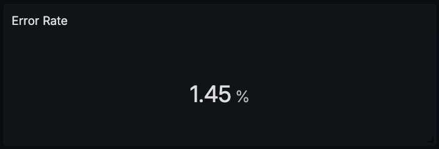

#### Latency p95

95th-percentile request duration across all endpoints. Surfaces the tail latency that shapes worst-case experience.

#### Latency p99

99th-percentile request duration across all endpoints. The worst-case latency signal.

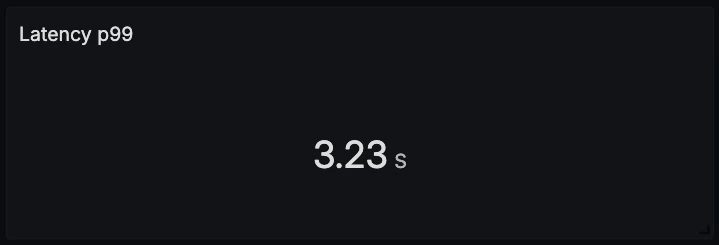

#### Request Rate by Endpoint

Request volume over time, split by `http.route`. Shows the traffic mix and which endpoints dominate.

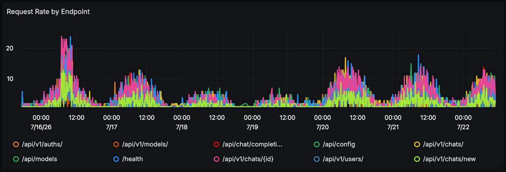

#### Latency Percentiles (p50 / p95 / p99)

p50 / p95 / p99 request duration over time. Typical performance and tail latency at a glance.

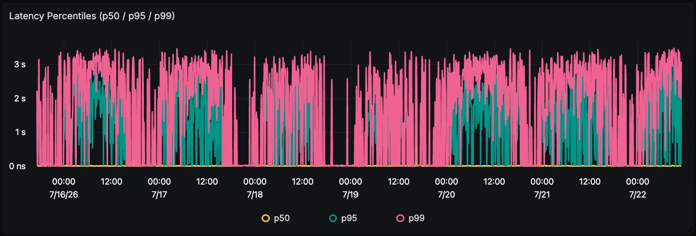

#### Error Rate Over Time

The error fraction of server requests over time. Reveals incident windows and regressions.

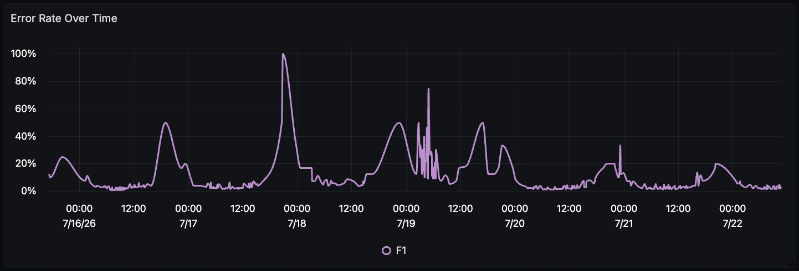

#### Request Distribution by Endpoint

Share of requests per endpoint (`http.route`). A clear view of where traffic concentrates.

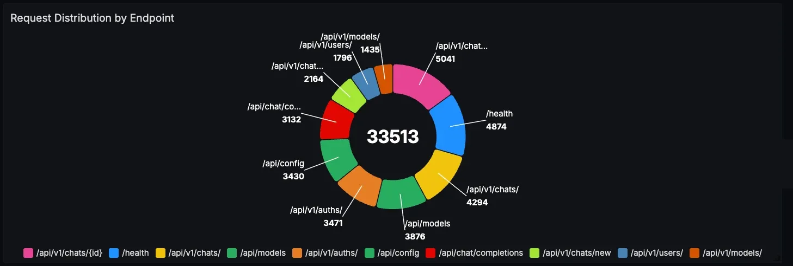

#### Endpoint Performance

A table of endpoints with request count and p95 / p99 latency. A side-by-side comparison to find the slow routes.

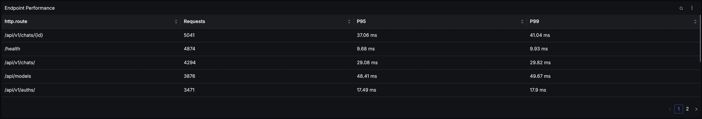

#### DB Query Latency (p95 / p99)

p95 / p99 duration of database (SQLAlchemy) query spans over time. Surfaces database-driven slowness.

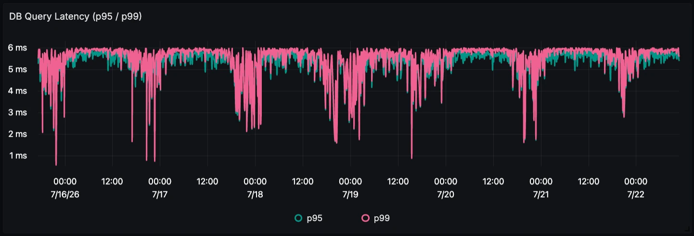

#### Database Operations

A table of database operations grouped by `db.operation`, with query count and average latency. Shows which queries run most and which are slowest.

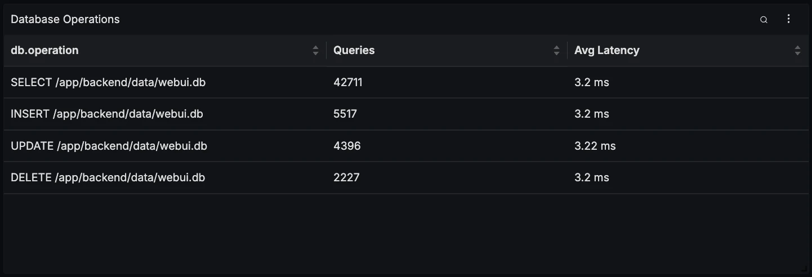

#### LLM Requests

Count of LLM chat requests captured by the OpenLIT-instrumented `gen_ai` spans. Raw model-invocation volume.

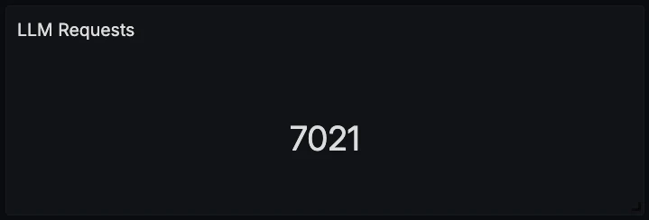

#### Input Tokens

Total prompt/input tokens consumed across LLM calls (`gen_ai.usage.input_tokens`).

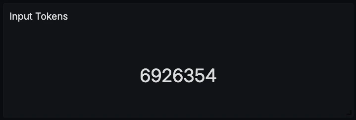

#### Output Tokens

Total completion/output tokens generated across LLM calls (`gen_ai.usage.output_tokens`).

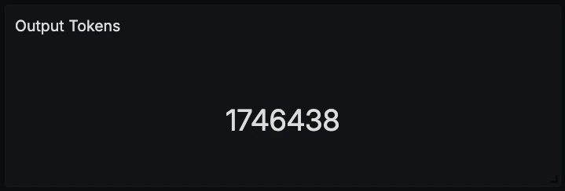

#### Total Cost (USD)

The summed OpenLIT-computed cost of LLM calls (`gen_ai.usage.cost`) over the selected range.

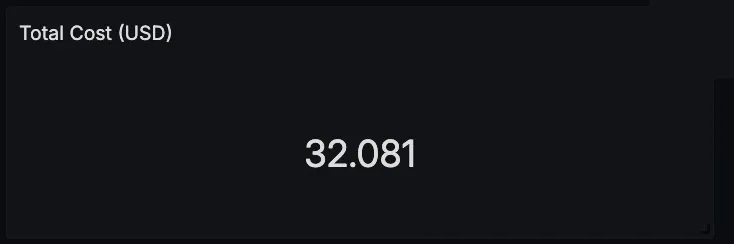

#### LLM Latency Percentiles (p50 / p95 / p99)

p50 / p95 / p99 duration of LLM chat spans over time. Model-call latency, both typical and tail.

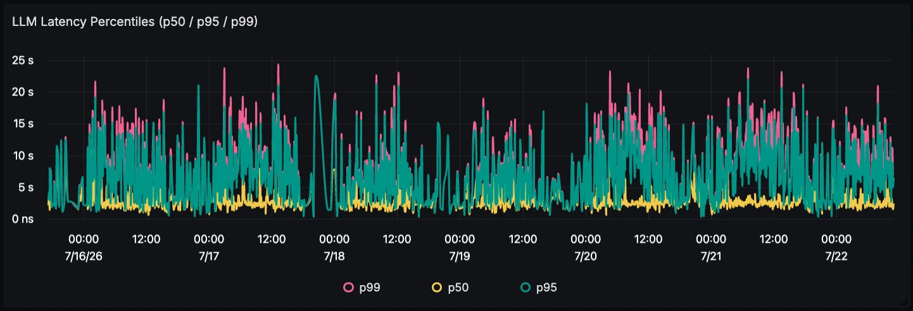

#### Token Usage Over Time

Input vs output token volume over time. Shows demand and how prompt/response sizes trend.

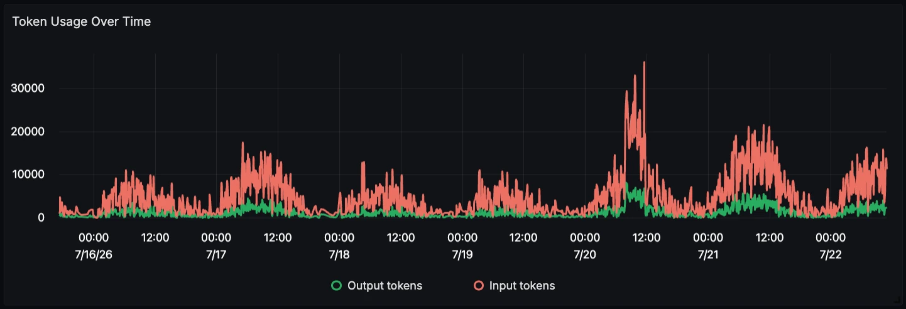

#### LLM Cost Over Time (USD)

LLM spend over time. Spot cost spikes and trends before they surprise the bill.

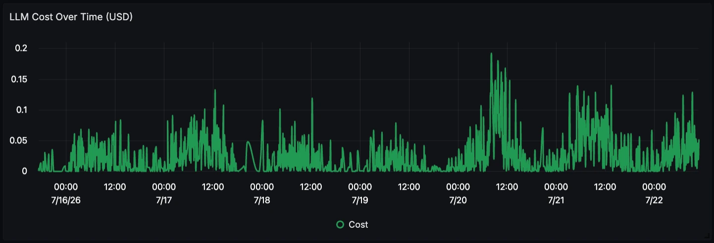

#### Requests by Model

Share of LLM requests per model (`gen_ai.request.model`). Shows which models carry the load.

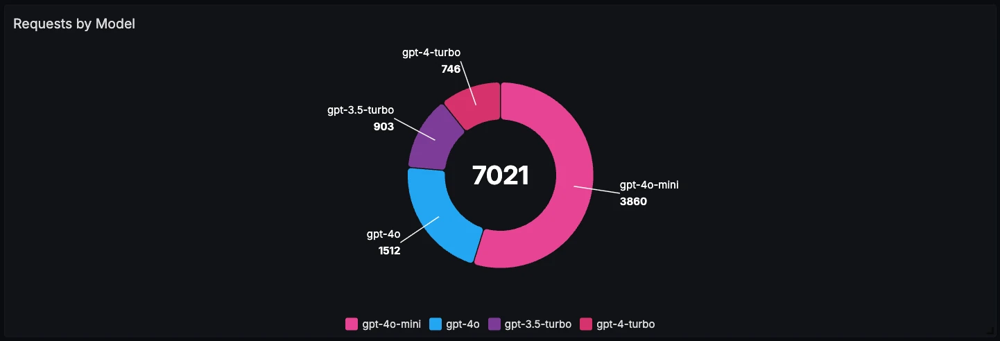

#### Model Breakdown

A table of models with request count, input/output tokens, cost, and average latency. The cost and usage comparison across models.

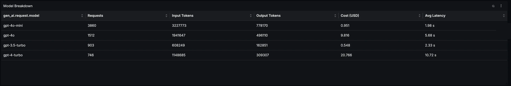

#### Errors Over Time by Service

Error span count over time, grouped by service. Pinpoints which service is failing and when.

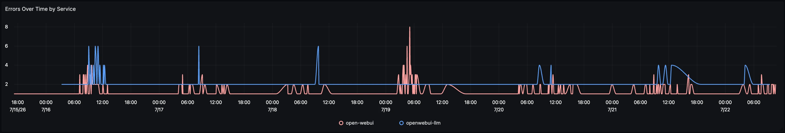

#### Recent Error Traces

A list of the latest errored spans across the selected services, newest first. Useful for jumping straight to failures when the error rate climbs.

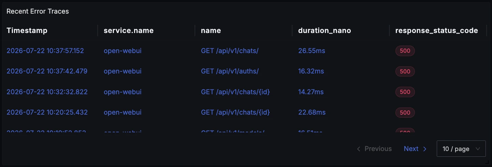

#### Recent Logs

A list of the most recent logs from the selected services. Quick log context to read alongside the traces.

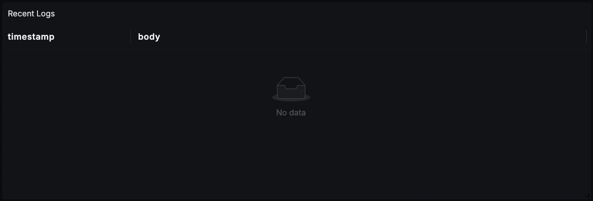
